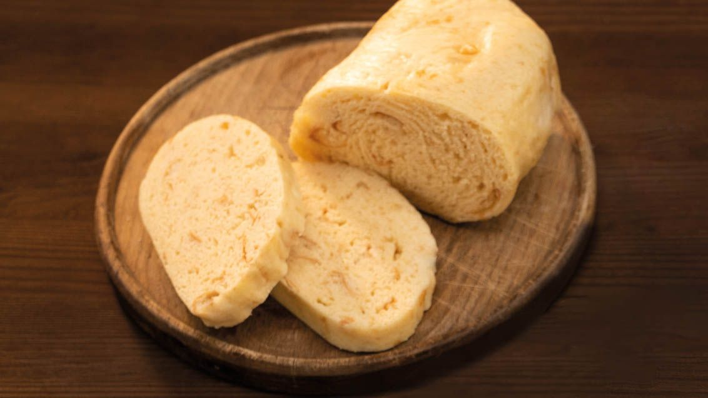

# Houskové Knedlíky (Czech Bread Dumplings)

*The Czech bread dumpling: a yeasted dough enriched with milk and egg, studded with diced bread cubes, boiled as a long log, then sliced into rounds. Soaks up gravy, sits next to roast pork, sliced cold next day. Czechia's essential carbohydrate.*

**Serves:** 6 (makes 2 large logs, sliced into rounds)

**Prep Time:** 30 minutes (plus 90 minutes proving)

**Cook Time:** 25 minutes

## Overview
Houskové knedlíky (literally "bread dumplings") are the Czech carbohydrate that defines the country's plates. Unlike potato dumplings (bramborové knedlíky), these are a yeasted-dough dumpling: a sweet-savoury bread dough studded with cubes of stale bread, shaped into long thick logs, boiled in salted water, then sliced into rounds with a thread or sharp knife. The rounds sit on the plate next to svíčková, goulash, vepřo-knedlo-zelo and any saucy stew, soaking up the gravy and providing structural ballast. The texture is fluffier than a roll and more bread-like than a noodle. They can be made fresh, but more often a family makes a big batch on Sunday and uses through the week - leftover knedlíky panfried in butter with eggs is the Monday breakfast (knedlíky se sázenými vejci).

## Ingredients

### Bread cubes
- 100 g day-old white bread (rohlík, bread roll, or any slightly stale white loaf), cut into 1 cm cubes

### Dough
- 500 g plain flour (or half plain, half coarse semolina for a denser knedlík)
- 1 tsp fine sea salt
- 1 tsp caster sugar
- 7 g (1 sachet) instant dried yeast
- 1 large egg
- 280 ml whole milk, warmed to body temperature
- 2 tbsp unsalted butter, melted

### For boiling
- 4 L water
- 2 tsp salt

## Method

### Stage 1 - Mix the dough
1. In the bowl of a stand mixer with a dough hook (or in a large bowl by hand), combine the flour, salt, sugar and yeast.
2. Add the egg, warm milk and melted butter.
3. Mix on low speed until a soft, slightly sticky dough forms.
4. Knead 6-8 minutes on medium speed (or 10 minutes by hand) until smooth and elastic.

### Stage 2 - Add the bread cubes
1. Tip the bread cubes into the dough.
2. Knead briefly on low speed (or fold in by hand) just until distributed - the cubes should be visible throughout.

### Stage 3 - First prove
1. Cover with a tea towel; rise in a warm spot 1 hour until doubled.

### Stage 4 - Shape into logs
1. Knock back the dough on a lightly floured surface.
2. Divide into 2 equal pieces.
3. Roll each piece into a long log about 6 cm thick and 25 cm long.
4. Place on a floured tray.

### Stage 5 - Second prove
1. Cover; rise 30 minutes until puffy.

### Stage 6 - Boil
1. Bring the salted water to a gentle simmer in a wide pot (the logs need room).
2. Lower the logs in carefully with a slotted spatula.
3. Cook 20 minutes; they float to the surface within a minute.
4. Halfway through, gently turn each log over so both sides cook evenly.
5. Test with a skewer; it should come out clean and the dumpling should bounce back lightly when pressed.

### Stage 7 - Steam release
1. Lift the cooked logs out onto a board.
2. Pierce each log a few times with a skewer to release internal steam (without this, they go soggy from trapped moisture).
3. Brush the surface with a little melted butter (stops a skin forming).

### Stage 8 - Slice
1. Wait 5 minutes for the dumplings to firm up slightly.
2. Slice into 2 cm thick rounds with a piece of strong thread (held taut between two hands, slid down through the log) - the Czech traditional method - or a serrated knife with a sawing motion.
3. Don't squash with a chef's knife; bread dumplings are fragile.

### Stage 9 - Serve
1. Arrange 2-3 rounds per plate alongside roast pork, svíčková, goulash, sauerkraut or any saucy main.

## Notes
- **Bread cubes are essential:** They give the knedlík its characteristic texture - some squishy, some firm. Pure dough is too uniform.
- **Steam release piercing:** Skip this and the dumplings reabsorb their steam as they sit; they go from light and fluffy to gluey. A skewer in 4-5 places does it.
- **Cut with thread:** A Czech kitchen has a long strong thread specifically for cutting dumplings. A serrated knife works but the thread gives a cleaner slice without compressing the fluffy interior.

## Serving
- The bedrock side dish under every Czech sauce. Take 2-3 slices per plate; soak up gravy aggressively; never leave a wet plate.

## Storage
- Refrigerates 4 days; reheat by steaming 5 minutes, or pan-frying slices in butter.
- Freezes whole logs 3 months; thaw and reheat by steaming.
- Leftover slices fried in butter with eggs is breakfast (knedlíky se sázenými vejci).
