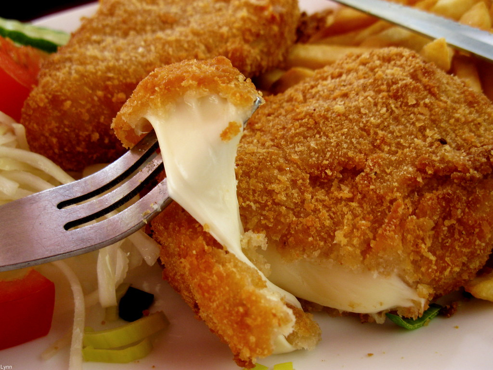

# Smažený Sýr (Czech Fried Cheese)

*Czech fried cheese: a thick block of Edam or Hermelín breaded in flour-egg-breadcrumbs and deep-fried golden. Served with tartare sauce, potato salad and a wedge of lemon. The pub classic, the post-night-out comfort, the vegetarian alternative to schnitzel.*

**Serves:** 4

**Prep Time:** 15 minutes (plus 30 minutes freeze)

**Cook Time:** 10 minutes

## Overview
Smažený sýr - fried cheese - is the Czech pub-food classic that turns a thick block of melty cheese into the vegetarian equivalent of schnitzel. The cheese (traditionally Eidam, the Czech version of Edam; or Hermelín, the Czech brie-like white-rinded cheese) is cut into thick slabs, frozen briefly to firm up, then dipped in flour-egg-breadcrumbs and deep-fried until the crust is deeply golden and the inside has melted into a flowing centre. Served with hranolky (chips), potato salad or rice, tartare sauce in a small dish, and a wedge of lemon. The combination is heavy, salty, satisfying, and the food that Czech students and workers eat after the pub closes. The technique is straightforward; the eating is glorious.

## Ingredients

### Cheese
- 600 g block Edam cheese (or Czech Eidam, or Hermelín), cut into 4 thick slabs (each about 2 cm thick, 8 x 10 cm)

### Breading
- 100 g plain flour
- 2 large eggs, beaten
- 200 g dried breadcrumbs (panko or fine breadcrumbs)
- 1 tsp paprika (optional, adds colour and flavour)

### For frying
- 500-700 ml vegetable or sunflower oil

### Tartare sauce
- 200 ml mayonnaise
- 2 tbsp finely chopped cornichons
- 2 tbsp finely chopped capers
- 1 tbsp Dijon mustard
- 1 small shallot, finely diced
- 1 tbsp finely chopped flat-leaf parsley
- 1 tsp lemon juice
- Salt and pepper

### To serve
- 4 generous portions of chips (hranolky) or boiled new potatoes
- 4 lemon wedges
- Pickled gherkins
- A small green salad

## Method

### Stage 1 - Freeze the cheese
1. Cut the cheese into 4 thick slabs of equal size.
2. Place on a plate; freeze 30 minutes (firms the cheese so it doesn't melt before the crust forms).

### Stage 2 - Make the tartare sauce
1. In a small bowl, combine all the tartare ingredients.
2. Stir; taste; chill until serving.

### Stage 3 - Three-stage breading
1. Set up three shallow bowls: one with flour, one with beaten egg, one with breadcrumbs (mixed with the paprika if using).
2. Take a slab of cold cheese; dredge thoroughly in flour, shake off excess.
3. Dip in beaten egg, coating all surfaces.
4. Press into the breadcrumbs, ensuring every surface is well-coated.
5. **Repeat the egg and breadcrumb steps** - a double coating is essential to seal in the cheese during frying.
6. Set on a tray.
7. Continue with the remaining cheese slabs.

### Stage 4 - Heat the oil
1. Pour the oil into a deep heavy pot to about 5 cm depth.
2. Heat to 180°C (or until a piece of breadcrumb dropped in browns in 15 seconds).

### Stage 5 - Fry
1. Lower 2 slabs into the hot oil (don't crowd - they need space).
2. Fry 2-3 minutes per side until deeply golden.
3. The crust is the seal; if any cracks open during frying, the cheese will leak out.
4. Lift onto kitchen paper to drain.
5. Continue with the remaining slabs.

### Stage 6 - Plate
1. Set a slab of fried cheese on each warm plate.
2. A pile of chips or boiled potatoes alongside.
3. A small bowl of tartare sauce.
4. A wedge of lemon to squeeze.
5. A few pickled gherkins.
6. A small green salad.
7. Serve immediately - the molten centre cools fast.

## Notes
- **Freeze the cheese:** A briefly frozen cheese block doesn't melt before the breadcrumb crust forms, which is what keeps the fry intact. Skip this step and you'll often blow out a leak.
- **Double-bread:** Standard breading (flour-egg-crumb) leaks. The two-pass egg-and-crumb gives a thicker shell that holds the molten cheese inside.
- **Right oil temperature:** Too cold and the breading absorbs oil and goes soggy; too hot and the crust burns before the cheese has melted. 180°C is the target.

## Serving
The classic Czech pub dinner. A glass of Pilsner Urquell, a small jug of tartare sauce, a side of potato salad. Late-night Prague: the post-pub fried-cheese roll (smažák v housce - the fried cheese in a bread roll) is the equivalent of the British kebab.

## Storage
- Best fresh and crisp from the fryer.
- Leftover cooled smažený sýr can be sliced and refried, but never as good as fresh.
- The breaded uncooked slabs freeze 1 month wrapped tightly; fry from frozen, adding 1-2 minutes per side.
