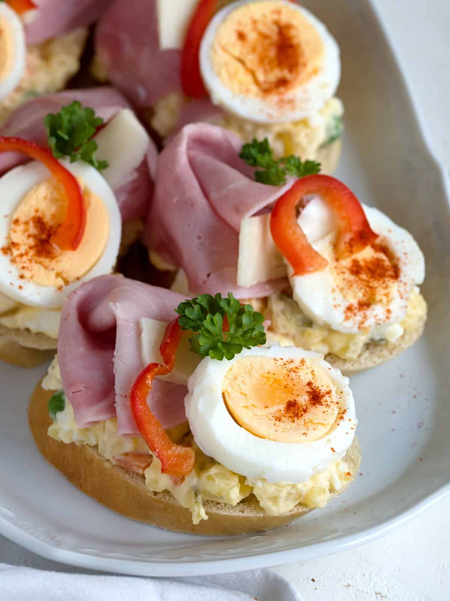

# Chlebíčky (Czech Open-Faced Sandwiches)

*The Czech open-faced sandwich: a small oval slice of white bread spread with a thick savoury mayonnaise base, topped with carefully arranged ham, egg, pickle, sausage and garnish. Buffet centrepiece, birthday tradition, holiday standard.*

**Serves:** 8 (makes 16 chlebíčky)

**Prep Time:** 45 minutes

**Cook Time:** 10 minutes

## Overview
Chlebíčky (the diminutive plural of chléb, "bread") are the Czech open-faced sandwich tradition - small oval slices of white bread (sliced from a special long oval loaf called veka) spread thickly with a savoury base of potato or egg mayonnaise, then topped with a careful composition: a slice of ham, half a hard-boiled egg, a cornichon, a slice of Czech sausage, a piece of pickled herring, a sprig of parsley. Each chlebíček is a small individual plate, finished in two or three bites with the fingers. They're served at every Czech birthday, namesday, holiday, wedding, baptism and funeral; bakeries (lahůdky) sell them by the piece across glass counters. The composition is the art - bakery chlebíčky compete on creative toppings; home versions tend simpler.

## Ingredients

### Base
- 16 oval slices of veka (long oval white loaf, 1 cm thick) - or substitute slices from a baguette or any small white sandwich loaf
- 50 g unsalted butter, softened (for buttering before the mayo - prevents soggy bread)

### Egg-and-potato mayo (Czech standard)
- 4 hard-boiled eggs, finely chopped
- 200 g cooked waxy potato, finely diced
- 4 tbsp mayonnaise
- 2 tsp Dijon mustard
- 1 small shallot, finely diced
- Salt and white pepper

### Toppings - select for variety; use 4-5 varieties across the platter
- 8 slices of ham (Prague ham ideal; substitute any quality cooked ham)
- 4 hard-boiled eggs, sliced into rounds (or half-cut)
- 16 cornichons or thin gherkin slices
- 8 slices Czech klobása sausage (or any small smoked sausage like saucisson)
- 4 slices smoked salmon, halved (more upmarket)
- 8 thin slices Edam cheese, quartered (vegetarian option)
- 80 g pickled herring rollmops, quartered (Christmas tradition)

### Garnish (essential for the visual character)
- A small handful of fresh parsley leaves
- A few sprigs of dill
- 2 tomatoes, cut into 16 thin slices or wedges
- 1 red pepper, cut into thin strips
- 16 black olives, halved
- 50 g caviar or lumpfish roe (optional, for special occasions)

## Method

### Stage 1 - Make the mayo base
1. In a medium bowl, combine the chopped boiled egg, diced potato, mayonnaise, mustard and shallot.
2. Season generously with salt and white pepper.
3. Mix thoroughly into a thick spreadable paste.
4. Refrigerate 30 minutes.

### Stage 2 - Prep the bread
1. Lay the bread slices flat on a board.
2. Spread each thinly with softened butter (a thin barrier; prevents the mayo soaking the bread).
3. Spread a generous tablespoon of the egg-potato mayo on top of the butter, mounding slightly in the centre.

### Stage 3 - Decide on toppings
Plan 4-5 varieties across your tray. Suggested combinations:

- **Ham + egg slice + cornichon + parsley**
- **Klobása slice + egg + red pepper strip + parsley**
- **Smoked salmon + dill + lemon wedge + caviar dot**
- **Edam quarter + tomato slice + olive + dill**
- **Herring roll + pickled onion + parsley + black pepper**

### Stage 4 - Build each chlebíček
1. Lay the chosen topping(s) over the mayo base.
2. Each chlebíček gets one main element (the protein), one supporting element (egg, pickle, cheese), and one garnish (herb, vegetable).
3. Arrange neatly - chlebíčky are about the visual composition as much as taste.
4. Continue across all 16 slices, varying so the platter has variety.

### Stage 5 - Plate
1. Arrange the chlebíčky on a flat platter or board in rows.
2. Cover loosely with cling film if waiting more than 30 minutes (they dry out otherwise).
3. Don't refrigerate uncovered; the bread goes stale fast in cold dry fridge air.

### Stage 6 - Serve
1. Serve at room temperature.
2. Take one per round; eat in 2-3 bites.

## Notes
- **Butter under the mayo:** Skipping this gives soggy bread in under an hour. The butter is the moisture barrier.
- **Veka bread is the right shape:** A long oval loaf sliced into oval pieces with a small footprint. If unavailable, slice a baguette diagonally for similar shape.
- **Visual matters:** Czech chlebíčky compete on appearance. Take the time to arrange each one carefully; the geometric look is part of the dish.

## Serving
The buffet centrepiece for any Czech celebration. A namesday party, a baptism, a wedding - chlebíčky are always present. At a child's birthday, 2-3 per person; at a wake, several alongside other foods.

## Storage
- Best fresh; the bread softens within 4-6 hours.
- Refrigerate covered up to 8 hours if assembled in advance.
- The egg-potato mayo refrigerates 2 days made ahead; assemble within 2 hours of serving.
