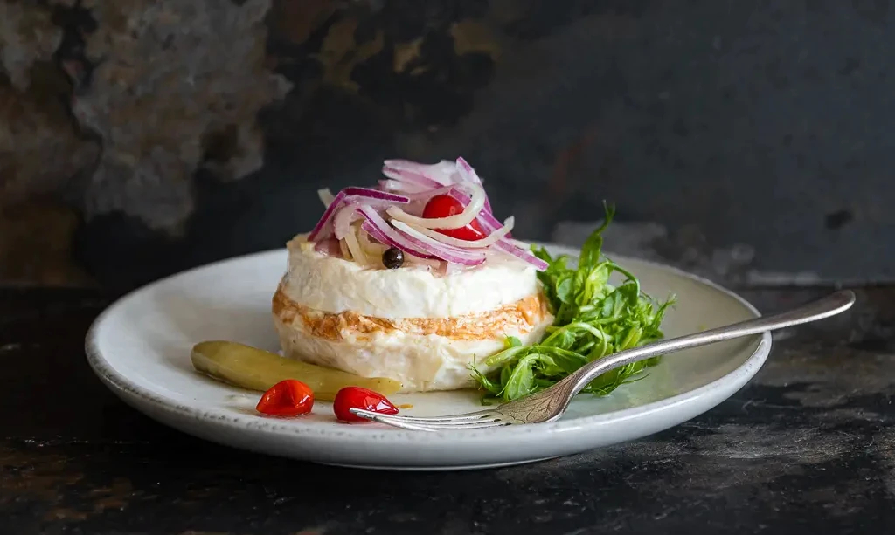

# Nakládaný Hermelín (Czech Pickled Cheese)

*Czech pickled cheese: whole rounds of Hermelín (Czech brie) sliced horizontally and stacked with onion, garlic and paprika between the layers, drowned in oil with peppercorns and bay. Two weeks in the jar and the cheese transforms into a soft, garlicky, faintly tangy pub-food masterpiece.*

**Serves:** 8 as a snack

**Prep Time:** 20 minutes

**Cook Time:** None (plus 2 weeks marinating)

## Overview
Nakládaný Hermelín ("pickled Hermelín") is the Czech bar snack that takes a wheel of Hermelín cheese (the Czech equivalent of camembert - white-rinded, soft, bloomed) and transforms it through a slow marination in oil with garlic, onion, paprika and peppercorns. The cheese is sliced horizontally into thin discs and reassembled in a jar with seasoning between each slice, then covered with oil and left in the fridge for two weeks. The cheese softens, absorbs the garlic and paprika, and develops an intense flavour with a slight tang. Sliced and served on dark bread with the pickled onion alongside and a glass of pilsner, it's the universal Czech pub snack alongside utopenci. The technique is mostly waiting; the active prep is twenty minutes.

## Ingredients

### Cheese
- 2 whole rounds Hermelín cheese (or substitute small whole camemberts, 200g each)

### Pickling fillings
- 2 medium onions, very thinly sliced into rings
- 1 small red bell pepper, very thinly sliced
- 6 cloves garlic, thinly sliced
- 1 fresh red chilli, thinly sliced (optional)
- 2 tbsp sweet Hungarian paprika
- 1 tsp hot paprika (optional)
- 2 tsp whole black peppercorns
- 4 whole allspice berries
- 4 bay leaves
- 2 tbsp white wine vinegar (or apple cider vinegar)

### Oil
- 600-800 ml mild olive oil (or half olive, half sunflower) - enough to fully submerge

### Equipment
- A 1.5 L glass preserving jar (clean, sterilised)

## Method

### Stage 1 - Sterilise the jar
1. Wash the jar in hot soapy water; rinse thoroughly.
2. Place upside down in a 120°C oven for 15 minutes.
3. Cool before filling.

### Stage 2 - Prep the cheese
1. With a sharp knife, slice each round of Hermelín horizontally into 3 thin discs (top, middle, bottom).
2. The rind stays on each disc; the cheese inside is exposed on the cut faces.

### Stage 3 - Layer in the jar
1. Place 1-2 bay leaves at the bottom of the jar.
2. Add a layer of sliced onion (a generous handful).
3. Sprinkle some peppercorns, allspice and a pinch of paprika.
4. Add a few slices of garlic and pepper.
5. Lay a cheese disc on top, cut-side up.
6. Continue layering: cheese disc, onion-garlic-paprika-spices, cheese disc, etc.
7. Pack snugly but not crushed.
8. Finish with onion and a final bay leaf at the top.

### Stage 4 - Add vinegar
1. Pour the vinegar evenly over the layers in the jar.
2. The vinegar slowly penetrates the cheese during the marination.

### Stage 5 - Fill with oil
1. Pour the oil over the cheese, fully submerging everything.
2. Tap the jar gently to release any trapped air bubbles.
3. The cheese should be completely covered by oil; if not, top up.

### Stage 6 - Seal and chill
1. Seal with a sterilised lid.
2. Refrigerate.
3. Once a day for the first week, turn the jar upside down gently to redistribute the oil.

### Stage 7 - Wait
1. Wait minimum 1 week; 2 weeks is significantly better.
2. The cheese softens; the rind absorbs colour from the paprika.
3. The flavour deepens into a rich, garlicky, savoury bite.

### Stage 8 - Serve
1. Lift a slice of cheese out with a fork.
2. Place on a plate with some of the pickled onion.
3. Sprinkle with a little extra paprika.
4. Bring out the dark rye bread, butter and a cold pilsner.
5. Tear bread, smear with cheese (rind and all), top with onion. Eat.

## Notes
- **Hermelín or camembert:** Hermelín is the Czech original. A 250g whole camembert from a French supermarket gives almost the same result.
- **Slice horizontally:** Cutting horizontally exposes the soft interior to the oil and aromatics. Cutting vertically (into wedges) is wrong; the cheese marinates unevenly.
- **Use the oil:** The infused oil left in the jar after the cheese is gone is fantastic for dressing salads, drizzling over bread, or as the base of a vinaigrette.

## Serving
Czech pub snack with utopenci, dark rye bread, butter, pickled gherkins, and a glass of pilsner. The four corners of a Czech bar plate.

## Storage
- Refrigerated submerged in oil: 1 month after the initial 2-week marination.
- Once a slice has been removed, push the remaining cheese back under the oil.
- The infused oil keeps refrigerated indefinitely; reuse for another batch or for cooking.
