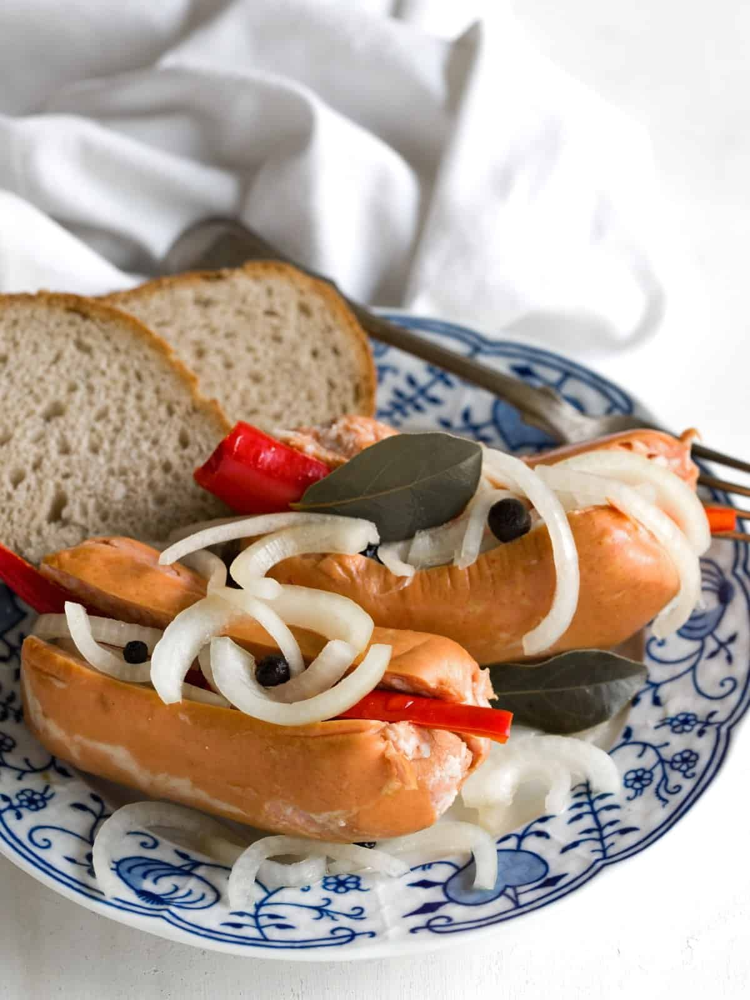

# Utopenci (Czech Pickled Sausages)

*"Drowned men": Czech sausages pickled in a sweet-sour vinegar brine with onion, peppercorns and bay leaves. Two weeks in the jar and they're ready to eat cold with rye bread and a glass of pilsner. The pub snack that defines Czech bar food.*

**Serves:** 8 as a snack (makes 1 large jar)

**Prep Time:** 20 minutes

**Cook Time:** 10 minutes (plus 2 weeks pickling)

## Overview
Utopenci - literally "drowned men" - are the Czech pickled sausage tradition: long thin Czech špekáčky (paprika-spiked smoked pork sausages) split lengthways, packed into a glass jar with sliced onion and aromatic spices, then drowned in a hot sweet-sour vinegar brine. After two weeks in the fridge, the sausages soak up the brine, the onion mellows, and the spices marry. Serve cold with thick slices of Czech rye bread and unsalted butter, accompanied by a half-litre of Pilsner. The dish appears on every Czech pub menu and is the standard accompaniment to beer drinking. The name comes from the visual of the sausages floating submerged in the brine like little drowned figures.

## Ingredients

### Sausages and aromatics
- 8 long thin Czech špekáčky sausages (smoked pork sausages with paprika; substitute frankfurters or any smoked pork sausage)
- 3 large onions, very finely sliced into rings
- 1 small red bell pepper, sliced (optional)
- 1 small red chilli, sliced (optional - for spicy version)
- 4 cloves garlic, lightly smashed
- 2 bay leaves
- 2 tsp whole black peppercorns
- 4 whole allspice berries
- 1 tsp yellow mustard seeds
- 1 small dried chilli (optional)

### Brine
- 500 ml white wine vinegar (5% acidity)
- 500 ml water
- 3 tbsp caster sugar
- 1.5 tbsp fine sea salt

### Equipment
- A 2 L glass preserving jar (clean, sterilised)

## Method

### Stage 1 - Sterilise the jar
1. Wash the jar in hot soapy water; rinse thoroughly.
2. Place upside down in a 120°C oven for 15 minutes to sterilise.
3. Cool slightly before filling.

### Stage 2 - Prep the sausages
1. With a small sharp knife, cut each sausage lengthways down the middle without going all the way through (so the sausage opens like a book).
2. This lets the brine penetrate the meat from the inside.

### Stage 3 - Pack the jar
1. Place a few onion rings at the bottom of the jar.
2. Add a sausage, opened, with another layer of onion stuffed inside the slit.
3. Continue layering: sausages and onions, with the garlic, bay leaves, peppercorns, allspice, mustard seeds, sliced pepper and chilli distributed throughout.
4. Pack snugly but not crushed.

### Stage 4 - Make the brine
1. Combine the vinegar, water, sugar and salt in a saucepan.
2. Bring to a boil; stir until the sugar and salt dissolve.
3. Simmer 1 minute.

### Stage 5 - Fill the jar
1. Pour the hot brine slowly into the jar over the sausages, fully submerging them.
2. The sausages must be completely under the brine.
3. If they float, weight them down with a small clean plate or a sealed water-filled bag pressed on top.
4. Leave 1 cm of headspace.

### Stage 6 - Seal and chill
1. Seal the jar with a sterilised lid.
2. Let cool at room temperature 30 minutes.
3. Refrigerate.

### Stage 7 - Wait
1. Wait minimum 1 week (2 weeks is much better).
2. The sausages absorb the brine; the onions go silky; the spices marry.
3. The brine clouds slightly; this is normal.

### Stage 8 - Serve
1. Lift a sausage out with tongs.
2. Place on a small plate; spoon some of the pickled onion alongside.
3. A slice of dark rye bread and butter; a pickled gherkin or two.
4. A glass of cold Pilsner.

## Notes
- **Sterile jar:** Pickles last weeks in a properly clean jar, days in a dirty one. Don't skip the sterilisation.
- **Fully submerge the sausages:** Any part exposed to air can grow mould. Weight if floating; top up brine if it dips below.
- **Wait the full two weeks:** Eating utopenci after a few days gives raw vinegar-soaked sausages. Two weeks is when the flavours soften into the round mellow snack that's the point.

## Serving
Czech pub snack. A plate of utopenci, a basket of dark rye bread, a slab of butter, mustard, gherkins, and a glass of pilsner. The whole arrangement, no shortcuts.

## Storage
- Refrigerated in the brine: 2 months.
- The flavour peaks at weeks 2-3; starts to soften too far after week 6.
- The leftover brine after the sausages are eaten is also excellent for quick-pickling raw onion or cucumber slices.
