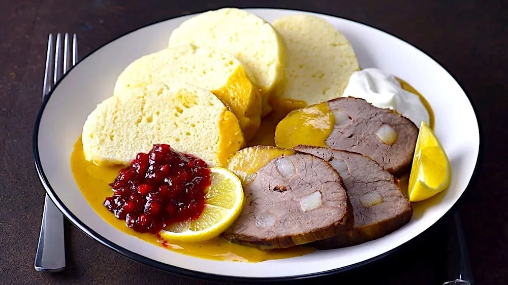

# Svíčková na Smetaně (Czech Beef Sirloin in Cream Sauce)

*The Czech national dish: beef sirloin marinated then slow-cooked with carrots, parsnips, celeriac and onions, the cooking vegetables blended into a silky cream sauce. Served with sliced bread dumplings, a swirl of cream, a slice of lemon and a spoon of cranberry sauce.*

**Serves:** 6

**Prep Time:** 30 minutes (plus 24 hours marinade)

**Cook Time:** 2 hours 30 minutes

## Overview
Svíčková (full name svíčková na smetaně - "sirloin in cream") is the dish Czechs nominate as their national dish above all others. The technique is old-school: a piece of beef sirloin (or topside if sirloin is expensive) is larded with bacon, marinated in vinegar with root vegetables for a day, then slow-braised with carrots, parsnips, celeriac and onion plus a small handful of spices. After cooking, the meat is sliced; the cooking vegetables and juices are puréed with cream into a thick velvety sauce poured over the sliced meat. The signature plating is unmistakable: rounds of sliced houskové knedlíky (Czech bread dumplings) on the side; a slice of lemon on top; a swirl of unwhipped cream over the sauce; a small spoon of cranberry preserves to one side. Served at Sunday lunches, restaurant menus, and family celebrations across the Czech Republic.

## Ingredients

### Beef and lard-in
- 1.2 kg beef sirloin or topside, in one piece
- 100 g smoked bacon or pancetta, cut into long strips (for larding)
- 2 tsp fine sea salt
- 1 tsp freshly ground black pepper

### Marinade vegetables
- 2 large carrots, roughly chopped
- 1 large parsnip, roughly chopped
- 250 g celeriac (about a quarter), roughly chopped
- 2 large onions, roughly chopped
- 4 cloves garlic, smashed
- 4 tbsp white wine vinegar
- 250 ml water

### Aromatics for the braise
- 4 whole allspice berries
- 8 whole black peppercorns
- 4 whole cloves
- 2 bay leaves
- 1 small sprig of thyme

### Braise
- 4 tbsp vegetable oil (or lard)
- 1 tsp brown sugar
- 500 ml beef stock
- 1 tbsp tomato paste

### Sauce
- 300 ml double cream
- 2 tbsp plain flour
- 1 tbsp lemon juice
- A pinch of grated nutmeg
- Salt to taste

### To plate
- 12 slices Czech bread dumplings (houskové knedlíky - see separate recipe)
- 6 thin lemon slices
- 6 tbsp cranberry sauce or lingonberry preserves
- A few extra tablespoons of unwhipped double cream (for finishing swirl)
- A handful of flat-leaf parsley, chopped

## Method

### Stage 1 - Lard the beef
1. With a sharp knife, make 8-10 deep slits into the beef from different angles.
2. Push a strip of bacon into each slit with the help of the knife tip.
3. Season the surface with salt and pepper.

### Stage 2 - Marinate
1. Place the larded beef in a deep dish.
2. Scatter the chopped vegetables, garlic, vinegar and water around (not on top of) the meat.
3. Cover; refrigerate 24 hours, turning the meat once.

### Stage 3 - Sear and start the braise
1. Lift the beef out; pat dry.
2. Reserve the vegetables and marinade liquid.
3. Heat 2 tbsp oil in a large heavy casserole (Dutch oven) over high heat.
4. Sear the beef on all sides until deeply browned - 8-10 minutes total. Set aside.

### Stage 4 - Cook the vegetables
1. In the same casserole, reduce heat to medium; add the remaining 2 tbsp oil.
2. Tip in the marinated vegetables (drained).
3. Cook 8-10 minutes, stirring, until golden at the edges.
4. Add the brown sugar; cook 1 minute (it caramelises).
5. Stir in the tomato paste.
6. Add the allspice, peppercorns, cloves, bay leaves and thyme.

### Stage 5 - Braise
1. Pour in the beef stock and the reserved marinade liquid.
2. Return the seared beef to the pot, sitting on top of the vegetables.
3. The liquid should come halfway up the meat.
4. Bring to a simmer; cover.
5. Transfer to a 160°C oven; braise 2 hours, turning the meat halfway, until fork-tender.

### Stage 6 - Lift the beef
1. Lift the cooked beef onto a plate; cover with foil to keep warm.

### Stage 7 - Make the sauce
1. Discard the bay, thyme stem and whole spices (or fish them out as best you can).
2. Tip the cooking vegetables and juices into a blender (or use a stick blender directly in the pot).
3. Whisk the flour into the cold cream (a thickener); pour into the vegetable mix.
4. Blend until completely smooth.
5. Return to the pot over medium heat; whisk in the lemon juice and nutmeg.
6. Simmer 5 minutes, stirring, until thickened to a coating consistency.
7. Taste; salt as needed. The sauce should be silky, slightly sweet-sour, and a uniform light orange.

### Stage 8 - Slice and plate
1. Slice the beef against the grain into 1 cm slices.
2. On each warm plate, lay 2-3 slices of beef and 2 rounds of bread dumpling.
3. Ladle the sauce generously over the meat.
4. Place a thin slice of lemon on top of the sauce.
5. Drizzle a swirl of unwhipped cream over the sauce.
6. Spoon a small amount of cranberry sauce to the side.
7. Scatter parsley.

## Notes
- **Lard the beef:** Lean cuts like sirloin and topside dry out in a long braise. The bacon strips melt during cooking, basting the inside of the meat from within.
- **24-hour marinade:** Not optional. The vinegar tenderises the meat and the vegetables flavour it from the surface in.
- **Smooth sauce, not chunky:** Blend the sauce completely - chunky vegetable bits ruin the texture. A standard kitchen blender gives the silkiest result.

## Serving
- Sunday lunch with extended family. A bottle of Czech Pilsner or a glass of dry Moravian red wine. The plate composition is fixed by tradition - don't omit the lemon, cream swirl or cranberry, even if the combination seems unusual.

## Storage
- Refrigerates 4 days; reheat the sliced meat in the sauce in a covered pan.
- Freezes 2 months (sauce and meat together); thaw in the fridge.
- The sauce alone is excellent over pasta or pierogi as a leftover dish.
