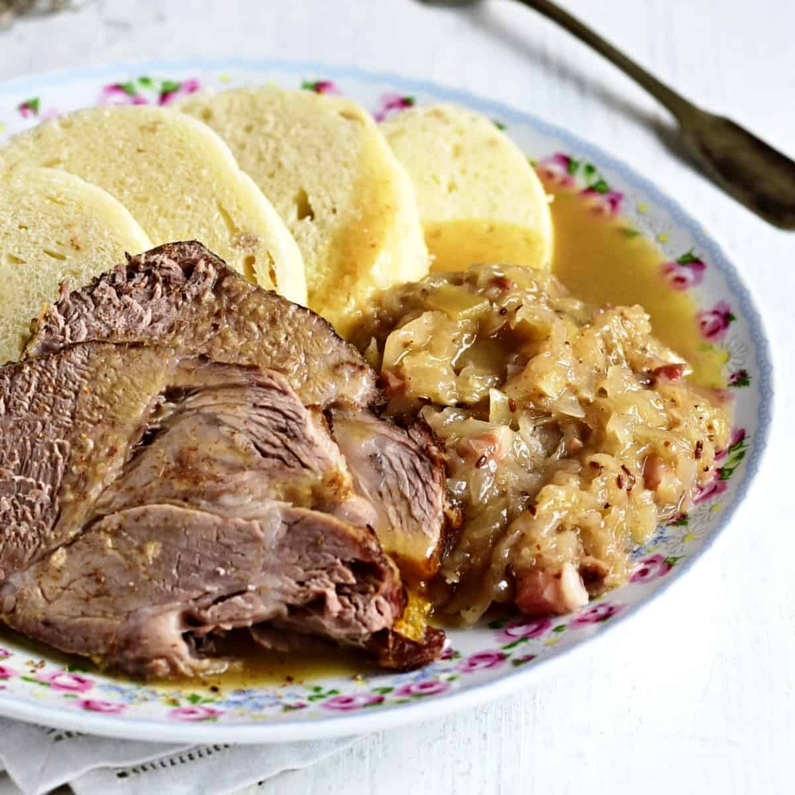

# Vepřo-Knedlo-Zelo (Czech Roast Pork with Dumplings and Sauerkraut)

*The Czech holy trinity: roast pork (vepřo), bread dumplings (knedlo), sauerkraut (zelo). Three components on one plate, each pulling its weight. The Sunday lunch every Czech household repeats with small family variations.*

**Serves:** 6

**Prep Time:** 25 minutes

**Cook Time:** 2 hours 30 minutes

## Overview
Vepřo-knedlo-zelo is the dish abbreviated into a single name because the combination is inseparable: roast pork shoulder seasoned simply with caraway, garlic and salt, cooked slow until tender; bread dumplings (houskové knedlíky) sliced into rounds that catch the pan juices and gravy; and braised sauerkraut sweetened slightly with sugar, sharpened with vinegar, and enriched with caraway and a drop of bacon fat. The plate is direct: pork in the centre, dumpling rounds on one side, sauerkraut on the other, gravy poured over all three. It's the most-cooked Sunday lunch in the Czech Republic and the dish every Czech grandmother (babička) makes from memory.

## Ingredients

### Pork
- 1.5 kg pork shoulder (with skin on, or boneless if preferred)
- 4 cloves garlic, minced
- 2 tbsp caraway seeds, lightly crushed
- 2 tsp fine sea salt
- 1 tsp freshly ground black pepper
- 1 tbsp Dijon mustard
- 2 tbsp vegetable oil
- 1 large onion, sliced
- 400 ml beef or chicken stock
- 200 ml dark beer (a Czech lager, or any pilsner)

### Gravy
- 2 tbsp plain flour
- A pinch of brown sugar
- 100 ml stock or water (if needed)

### Sauerkraut
- 800 g sauerkraut (drained from the jar but with some brine reserved)
- 1 small onion, finely diced
- 50 g smoked bacon lardons (or 1 tbsp lard)
- 1 tsp caraway seeds
- 2 tsp soft brown sugar
- 1 tbsp plain flour
- 200 ml water or stock
- 1 tsp white wine vinegar (or reserved sauerkraut brine)
- Salt and pepper

### Dumplings
- 12 slices houskové knedlíky (Czech bread dumplings - see separate recipe) - or use shop-bought, available in some delis

## Method

### Stage 1 - Season the pork
1. With a sharp knife, score the pork skin (if attached) in a diamond pattern.
2. Rub the meat all over with the garlic, crushed caraway, salt, pepper and Dijon mustard.
3. Let rest 30 minutes at room temperature (or refrigerate overnight for deeper flavour).

### Stage 2 - Sear and start braising
1. Preheat the oven to 160°C.
2. Heat the oil in a large heavy roasting tin or Dutch oven over medium-high heat on the hob.
3. Sear the pork all over until deeply golden, 8-10 minutes total.
4. Lift out; scatter the sliced onion in the pan.
5. Place the pork back on top.
6. Pour the stock and beer around (not over) the pork.

### Stage 3 - Roast slow
1. Cover the pan (with a lid or foil); transfer to the oven.
2. Roast 2 hours, basting twice with the pan juices.
3. Remove the lid; increase oven to 200°C; roast a further 20 minutes to crisp the skin.
4. The meat should be fork-tender, pulling apart easily.
5. Lift to a board; rest 15 minutes loosely tented with foil.

### Stage 4 - Make the gravy
1. Tip most of the fat out of the pan, leaving the dark juices and onion.
2. Place the pan over medium heat on the hob.
3. Sprinkle the flour over the juices; stir into a paste.
4. Cook 1 minute.
5. Whisk in any extra stock or water gradually; bring to a simmer.
6. Cook 3-4 minutes until smooth and gravy-thick.
7. Strain through a sieve into a jug; keep warm.

### Stage 5 - Braise the sauerkraut (parallel to the pork)
1. In a heavy saucepan, fry the bacon lardons until the fat renders, about 5 minutes.
2. Add the diced onion; cook 5 minutes until soft.
3. Stir in the caraway seeds and brown sugar; cook 30 seconds.
4. Sprinkle the flour over; cook 1 minute, stirring.
5. Pour in the water/stock gradually, stirring to a smooth roux-thickened liquid.
6. Add the drained sauerkraut; stir.
7. Simmer 20-25 minutes uncovered, stirring occasionally, until the kraut is silky and the liquid is mostly absorbed.
8. Stir in the vinegar; taste for salt, sugar and acid.

### Stage 6 - Slice and plate
1. Slice the rested pork against the grain into 1 cm slices.
2. On each warm plate, lay 2-3 slices of pork in the centre.
3. Place 2 rounds of bread dumpling on one side.
4. Spoon a generous portion of braised sauerkraut on the other side.
5. Ladle gravy over the pork (and a little over the dumplings - they're designed to soak it up).

## Notes
- **Skin-on pork shoulder:** The skin crisps in the final blast and adds the second pleasure of the dish. If using boneless skinless pork, you'll miss the crackling but the meat itself stays good.
- **Don't drown the kraut:** Czech sauerkraut is silky but not soupy. Cook uncovered to let the liquid reduce; the texture should hold its shape on the plate.
- **Make ahead:** Both the pork and the sauerkraut improve overnight. Make on Saturday for Sunday lunch; the dumplings are the only thing that need to be fresh.

## Serving
Czech Sunday lunch. A glass of Pilsner Urquell (the local pilsner) on the side. A small green salad or pickled gherkins if you want a third element.

## Storage
- Refrigerates 4 days.
- The sauerkraut keeps a week; reheats beautifully.
- The pork freezes 2 months sliced and stored in gravy.
- Dumplings refrigerate 3 days; pan-fry leftover slices in butter for a different snack.
