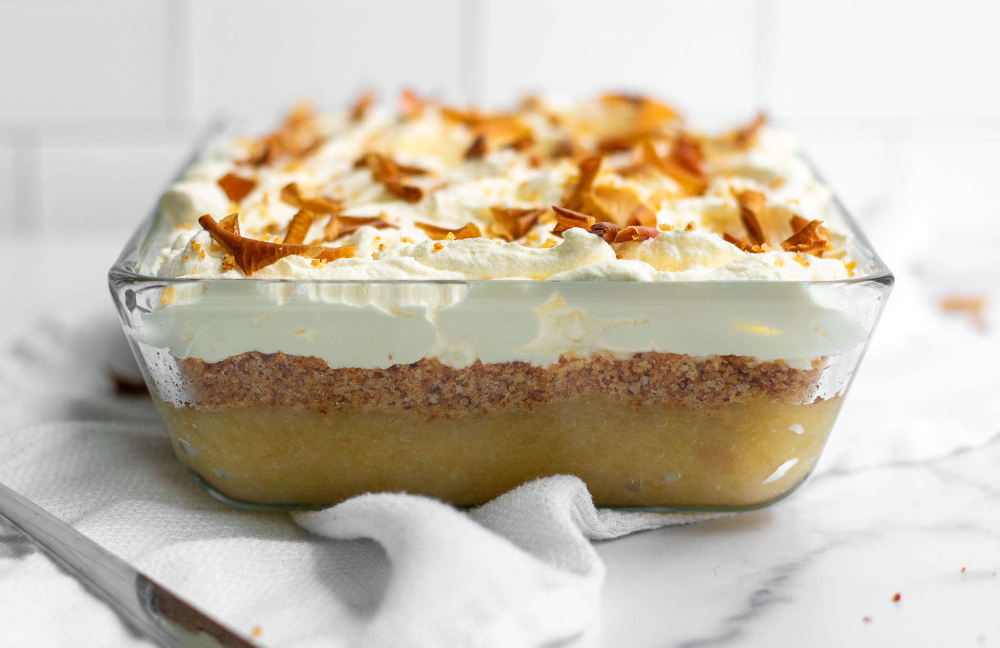

# Æblekage (Danish Apple Trifle)

*Denmark's apple "cake" that isn't a cake at all: a glass dish layered with stewed apple compote, crushed macaroon biscuits (or buttery toasted breadcrumbs), and whipped cream, served chilled. The Danish autumn-and-winter dessert that's been turning up at Danish dinner tables since the 1800s; cool, light, sweet-tart, and assembled in minutes.*

**Serves:** 6

**Prep Time:** 20 minutes (plus chilling time)

**Cook Time:** 25 minutes (apple compote) + 5 minutes (toasting crumbs if making)

## Overview
Æblekage (literally "apple cake") is one of Denmark's most beloved everyday desserts, and the name is a glorious misnomer because there's no actual cake involved. It's a layered cold dessert: stewed apple compote (peeled apples cooked down with sugar, lemon and a touch of vanilla into a soft jammy sauce), crushed macaroon biscuits (the traditional Danish version uses ratafia biscuits / makroner, small almond meringue cookies; many home cooks substitute with toasted buttered breadcrumbs spiked with brown sugar and cinnamon for the "rasp" version), and lightly sweetened whipped cream, all layered in a clear glass dish or individual glasses so the strata show through. Often topped with a small spoon of redcurrant jelly or a few fresh red berries for the traditional Danish flourish of red on white. The dish is designed for utility: it uses up windfall apples in autumn, comes together in minutes once the apple stew is ready, and looks beautiful in a glass bowl on the dinner table.

## Ingredients

### Apple compote
- 1 kg cooking apples (Bramley, Granny Smith, or any tart cooking apple; peeled, cored, chopped into 2cm cubes)
- 80 g caster sugar (less if apples are sweet, more if very tart)
- 50 ml water
- 1 tablespoon lemon juice
- 1 teaspoon vanilla extract
- ½ teaspoon ground cinnamon (optional)

### The "crumb" layer (choose one)
- **Option A (Danish traditional, macaroon version):** 200 g ratafia / amaretti biscuits OR Danish makroner (almond meringue cookies), coarsely crushed
- **Option B (rustic Danish, toasted breadcrumb version):** 200 g coarse breadcrumbs from day-old white bread + 50g butter + 50g brown sugar + 1 teaspoon ground cinnamon, all toasted in a dry pan till deeply golden and crisp

### Whipped cream
- 500 ml double cream (cold)
- 2 tablespoons icing sugar
- 1 teaspoon vanilla extract

### Topping
- 4 tablespoons redcurrant jelly (or raspberry jam)
- A small handful of fresh raspberries OR redcurrants (optional)
- A few sprigs of fresh mint

### To serve
- A clear glass dish or 6 individual glass dessert bowls (sundae glasses, wine glasses, or jam jars work)
- Strong coffee or a small glass of dessert wine

## Method

### Stage 1 - Make the apple compote
1. In a heavy saucepan, combine the chopped apples, sugar, water, lemon juice, vanilla, and cinnamon (if using).
2. Cover; cook over medium heat 12-15 minutes, stirring occasionally, till the apples soften and start to break down.
3. Remove the lid; cook another 10-12 minutes, mashing gently with a wooden spoon, till the compote is thick and jammy.
4. Taste; adjust sugar if needed.
5. Cool to room temperature.
6. Refrigerate till fully cold.

### Stage 2A - Option A: Crush the macaroons
1. Place the macaroons in a sealed bag; crush coarsely with a rolling pin.
2. You want a mix of larger crumbs and finer dust, not pulverised to powder.

### Stage 2B - Option B: Make toasted breadcrumbs
1. In a wide pan, melt the butter over medium heat.
2. Add the breadcrumbs, brown sugar, and cinnamon.
3. Toast 5-6 minutes, stirring constantly, till the breadcrumbs are deeply golden, crispy, and fragrant.
4. Cool completely on a plate. (Cooling makes them properly crispy.)

### Stage 3 - Whip the cream
1. In a cold bowl, whip the double cream with icing sugar and vanilla till it holds firm peaks (medium-stiff).

### Stage 4 - Layer in glass
1. Find a clear glass dish (about 1.5 litres) or 6 individual glass bowls.
2. Layer 1: a generous spoon of crushed macaroons (or toasted breadcrumbs) at the bottom of the dish.
3. Layer 2: half the cold apple compote spread over.
4. Layer 3: a layer of whipped cream.
5. Layer 4: another layer of crumbs.
6. Layer 5: the remaining apple compote.
7. Layer 6: the top layer of whipped cream (mound generously, this is the visual top).

### Stage 5 - Top
1. Warm the redcurrant jelly briefly to loosen (10 seconds in microwave).
2. Drizzle the jelly over the whipped cream, let it puddle in attractive blobs.
3. Add a few fresh raspberries or redcurrants if you have them.
4. A small sprig of mint.

### Stage 6 - Chill
1. Refrigerate 30 minutes minimum (longer is fine, up to 2 hours).
2. The crumbs stay crunchy in the first 2-3 hours; longer storage softens them.

### Stage 7 - Serve
1. Scoop down through the layers with a long spoon at the table.
2. Each portion should show the strata.
3. With strong coffee or a small glass of dessert wine.

## Notes
- **Apple compote:** cook till jammy, not just stewed. Watery compote makes a soggy dessert.
- **Crushed macaroons vs toasted breadcrumbs:** both traditional. Macaroons more elegant; breadcrumbs more rustic.
- **Layered in a CLEAR glass dish:** the visual strata are essential. A solid bowl ruins the dish's identity.
- **Don't pre-assemble too far ahead:** the crumbs go soggy after 3-4 hours. Best assembled an hour before serving.
- **Sweet-tart apple:** Bramley or Granny Smith. Sweet eating apples make a duller compote.

## Variations
**With brandy or rum:** add a splash to the apple compote.
**With salted caramel:** layer a thin stripe of salted caramel between the apple and cream.
**Plum or rhubarb æblekage:** swap apples for stewed plums or rhubarb; same technique.
**With granola:** swap the crumbs for crunchy granola for a modern breakfast-dessert version.
**Vegan:** swap whipped cream for whipped coconut cream; macaroons for crushed amaretti (check for egg whites, some are vegan).
**Individual jam-jar version:** layer in small jam jars for a picnic / party portable version.

## Serving
At a Danish family Sunday dinner finale · at a julefrokost (Christmas lunch) buffet alongside risalamande and ris à l'amande · at a Danish 50th birthday dessert table · at a Copenhagen café for a mid-afternoon treat · at home with windfall apples in autumn.

## Storage
- Æblekage best within 2-3 hours of assembly (the crumbs stay crisp).
- Refrigerates 24 hours, but the crumbs soften (still tasty; different texture).
- The components separately keep longer: apple compote refrigerates 1 week; toasted breadcrumbs/macaroon crumbs refrigerate 5 days; whipped cream best fresh.
- Don't freeze (cream and crumb textures both suffer).
