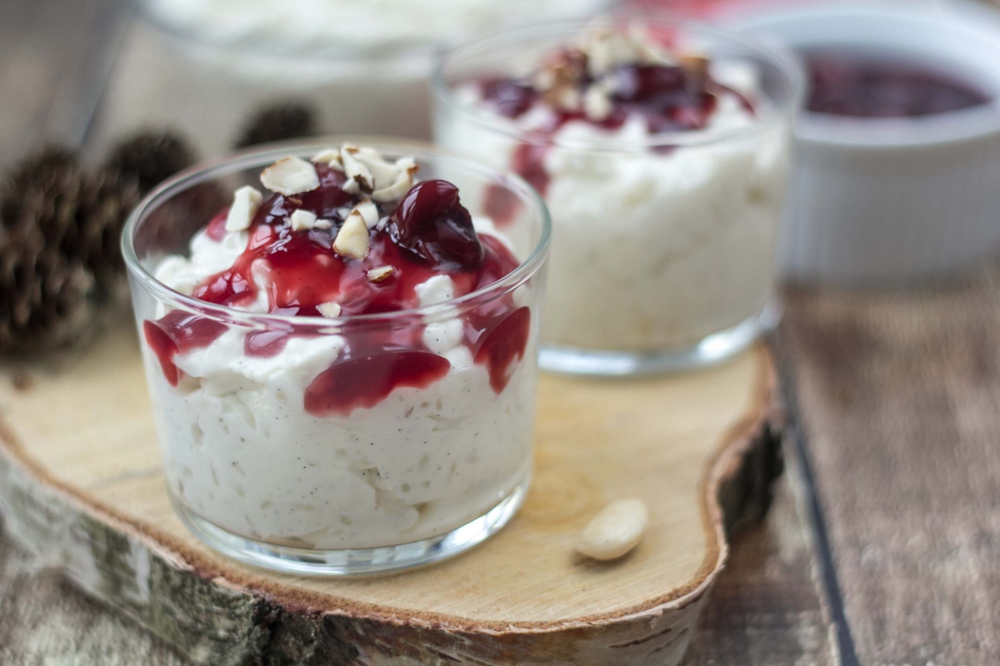

# Risalamande (Danish Almond Rice Pudding)

*Denmark's Christmas Eve dessert: a creamy cold rice pudding folded with whipped cream, chopped almonds and vanilla, topped with a vivid red warm cherry sauce. Eaten at every Danish Christmas Eve dinner - and ritualised by the tradition of hiding a single whole almond in the pot; whoever finds it wins the mandelgaven (almond gift).*

**Serves:** 8

**Prep Time:** 30 minutes (plus overnight chilling)

**Cook Time:** 45 minutes (rice pudding base) + 15 minutes (cherry sauce)

## Overview
Risalamande (or ris à l'amande - Danish-French for "rice with almonds") is Denmark's most iconic Christmas Eve dessert and one of the most ritualised dishes in the Danish food calendar. The construction is layered: first, a thick slow-cooked rice pudding (risengrød - short-grain pudding rice + whole milk + a vanilla pod, simmered for 35 minutes till the rice softens and the mixture thickens into a soft porridge); it's cooled completely, then folded with lightly whipped cream, chopped blanched almonds, vanilla and sugar to lighten it into the dessert form. Served cold in individual glass dishes or one large bowl, topped at the table with a generous ladle of warm cherry sauce (kirsebærsauce - a syrupy cherry-and-red-wine sauce made from morello cherries or kirsch-soaked sweet cherries). The Christmas Eve ritual: a single whole almond is hidden in the pot before serving; whoever finds it in their portion wins the mandelgaven (the almond gift - traditionally a marzipan pig, a small wrapped present, or in modern households a bottle of something nice). The game stretches the eating; people will keep going back for more rice pudding hoping to find the almond. Three details: thick rice pudding base (slow-cooked the day before), folded with whipped cream the day of serving, the warm cherry sauce IS the dish (don't skip).

## Ingredients

### Rice pudding base (risengrød - make a day ahead)
- 200 g short-grain pudding rice (Italian risotto rice works as substitute; Carnaroli or Arborio)
- 800 ml whole milk
- 200 ml double cream
- 1 vanilla pod (split and scraped; reserve the pod)
- 2 tablespoons caster sugar
- ½ teaspoon fine sea salt

### Folding-in
- 400 ml double cream (cold)
- 80 g blanched whole almonds (chopped coarsely; reserve 1 WHOLE almond for the hidden one)
- 100 g caster sugar
- 1 teaspoon vanilla extract
- 4 tablespoons cherry brandy (kirsch) or sherry - optional but canonical

### Cherry sauce (kirsebærsauce)
- 500 g pitted morello cherries (fresh, frozen, or from a jar - Aalborg or Den Gamle Fabrik brand is the Danish canonical)
- 200 ml cherry juice (from the jar, or apple juice)
- 100 ml red wine (or extra juice)
- 80 g caster sugar
- 1 tablespoon lemon juice
- 1 vanilla pod (split; or 1 teaspoon vanilla extract)
- 2 tablespoons cornflour (mixed with 4 tablespoons cold water)
- 2 tablespoons kirsch or cherry brandy (optional)

### To serve
- 1 whole blanched almond (THE hidden one)
- A mandelgave (almond gift) - wrapped, small, ready to award to the winner

## Method

### Stage 1 - Make the rice pudding base (the day before)
1. Rinse the rice briefly under cold water.
2. In a heavy pan, combine rice, milk, cream, vanilla pod and scrapings, sugar, and salt.
3. Bring to a gentle simmer over medium heat, stirring occasionally to prevent sticking.
4. Reduce heat to lowest; cook 35-40 minutes, stirring every 5 minutes, till the rice is fully soft and the mixture is a thick porridge.
5. Add a splash more milk if it gets too thick before the rice is cooked.
6. Cool to room temp.
7. Cover; refrigerate overnight.

### Stage 2 - Make the cherry sauce (can be done day before)
1. In a saucepan, combine cherries, cherry juice, red wine, sugar, lemon juice, and vanilla pod.
2. Bring to a gentle simmer; cook 8-10 minutes.
3. Whisk the cornflour-water slurry into the bubbling sauce; cook 2 minutes till thickened to a syrup that coats the back of a spoon.
4. Off heat, stir in the kirsch (if using).
5. Remove the vanilla pod.
6. Cool to room temp; refrigerate. Reheat gently before serving.

### Stage 3 - Whip the cream
1. On the day of serving, pour the cold double cream into a chilled bowl.
2. Whip with electric beaters till it holds firm peaks (medium-stiff, not stiff-stiff).

### Stage 4 - Combine
1. Remove the vanilla pod from the cold rice pudding.
2. In a large mixing bowl, beat the rice pudding briefly to loosen it.
3. Add the sugar, vanilla extract, and kirsch (if using); stir.
4. Add the chopped almonds; stir.
5. Fold in the whipped cream gently - about 4-5 strokes; you want airy folds, not full incorporation.

### Stage 5 - Hide THE almond
1. Take the one whole blanched almond.
2. Bury it deep in the bowl, somewhere mid-mixture.
3. Don't tell anyone where it is.
4. (Some Danish families allow a tiny giveaway hint to a child who's been particularly good.)

### Stage 6 - Chill
1. Cover; refrigerate at least 1 hour before serving.
2. The rice pudding will firm up as the cream sets.

### Stage 7 - Plate at the table
1. Bring the chilled bowl of risalamande to the table.
2. Bring the warm cherry sauce in a small jug.
3. Spoon a generous portion of risalamande into individual glass dishes.
4. Pour warm cherry sauce over each.
5. Hand out spoons.

### Stage 8 - The almond hunt
1. Diners eat slowly, hoping to find the whole almond.
2. When someone finds it, they win the mandelgave.
3. The canonical Danish protocol: if the finder doesn't immediately announce, they're supposed to keep eating and let everyone else continue searching (some Danes hide the find to extend the game).
4. After the prize is awarded, the eating continues.

## Notes
- **Make the rice pudding the day before:** essential. Cold rice pudding folds with cream beautifully; warm doesn't.
- **Don't overwork the folding:** want soft folds, not full mixing. The cream should still be visible as streaks.
- **Cherry sauce is the dish:** warm, vivid red, sweet-tart. Don't skip or substitute strawberry; cherry is canonical.
- **One single whole almond:** the canonical Danish hide. Some Norwegian families hide several; that's a different tradition.
- **Eat slowly, dig around:** the ritual is the point.

## Variations
**With raspberry sauce instead of cherry:** less canonical, equally good with raspberries.
**With orange-vanilla cream:** add orange zest to the cream for a brighter version.
**Vegan risalamande:** swap milk + cream for oat milk + whipped coconut cream; almond extract for flavour.
**Made the entire day before:** the rice pudding base is done the day before; the cream is folded in 2-3 hours before serving.
**Boozier:** double the kirsch.
**Mini glass jars (cocktail size):** for a Christmas-party canapé buffet.

## Serving
At Danish Christmas Eve dinner (the canonical Dec 24 evening, served after the julestege main course) · at a Danish Christmas Day lunch · at a winter Sunday-roast finale · at a Danish New Year's Eve dinner as a substantial finale.

## Storage
- Risalamande refrigerates 3-4 days (gets denser as the cream firms; still excellent).
- Cherry sauce refrigerates 1 week; freezes 3 months.
- Rice pudding base alone refrigerates 4 days (folds with fresh cream when needed).
- Don't freeze the assembled risalamande (cream texture suffers).
