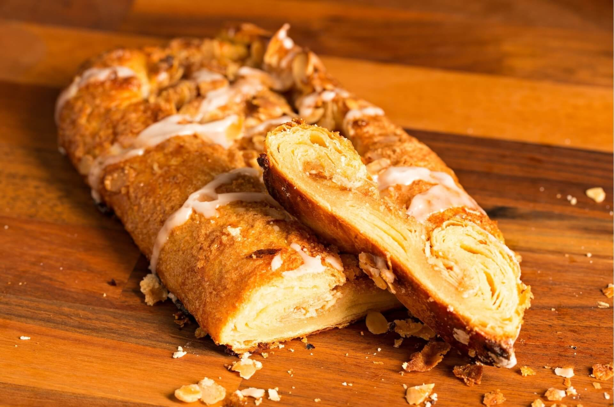

# Wienerbrød (Danish Pastry - the Real Thing)

*Denmark's most-exported baked good (the world calls it "Danish pastry"; Danes call it Wienerbrød - "Vienna bread" - because Austrian bakers brought the technique to Copenhagen in 1850): a buttery laminated dough (multiple folds of butter through yeasted dough, like puff pastry but with yeast) shaped into spirals, knots and braids, filled with vanilla custard, cinnamon-sugar, almond paste or apple, baked till deep golden and crisped at the edges, topped with sugar glaze and flaked almonds. The Danish breakfast pastry; eaten with strong coffee.*

**Serves:** Makes 12 pastries (varied shapes)

**Prep Time:** 1.5 hours (active) + overnight resting + 1.5 hours rising

**Cook Time:** 18 minutes

## Overview
Wienerbrød is one of the world's most copied baked goods and the most internationally famous Danish food - though confusingly, in English-speaking countries it's called "Danish pastry" while the Danes themselves call it Wienerbrød ("Vienna bread"), a name dating from the 1850s when Austrian bakers came to Copenhagen during a Danish bakers' strike and brought the laminated-dough technique with them. The Danes adapted it (more butter, more egg in the dough, more elaborate fillings) and made it their own. The construction is the same laminated-dough principle as croissants: a yeasted dough is wrapped around a block of butter, then rolled and folded multiple times (typically 3-4 single folds OR 1 single + 1 double fold) to create dozens of paper-thin alternating layers of dough and butter. When baked, the butter releases steam that pushes the dough layers apart, creating the canonical shattering flaky texture. The dough is shaped into various Danish forms: spandauer (square pastries with a vanilla-custard centre), kanelsnegle (cinnamon snails - the canonical Danish pastry shape), almond braids, fruit-topped pinwheels. Topped after baking with an icing-sugar glaze and flaked almonds. Three details: laminated yeasted dough (the technique IS the dish), overnight cold rest between the lamination folds and the shaping (essential for the layers to be defined), bake at high heat (220°C) for proper rise.

## Ingredients

### Dough (the base, makes about 900g of dough)
- 500 g strong bread flour
- 80 g caster sugar
- 1 sachet (7 g) instant yeast
- 1 teaspoon fine sea salt
- 2 teaspoons ground cardamom
- 200 ml cold whole milk
- 2 large eggs (cold)
- 50 g butter (softened; for the dough itself)

### Lamination butter (the butter block)
- 250 g cold high-fat butter (Lurpak or any 82%+ butterfat butter; this needs to be a single block)

### Vanilla custard filling (for spandauer; makes ~400ml)
- 400 ml whole milk
- 1 vanilla pod (split and scraped)
- 4 large egg yolks
- 80 g caster sugar
- 3 tablespoons cornflour
- 1 tablespoon butter

### Cinnamon-sugar filling (for kanelsnegle)
- 100 g butter (softened)
- 100 g brown sugar
- 50 g caster sugar
- 2 tablespoons ground cinnamon
- 1 teaspoon ground cardamom

### Almond paste filling (for the deluxe variant)
- 200 g good-quality marzipan
- 50 g butter (softened)
- 1 egg yolk

### Egg wash
- 1 egg (beaten with 1 tablespoon milk)

### Sugar glaze (for finishing)
- 200 g icing sugar
- 3-4 tablespoons hot water
- 1 teaspoon vanilla extract

### Topping
- 50 g flaked almonds (sliced)
- Pearl sugar (optional; for kanelsnegle)

### To serve
- Strong Danish coffee
- Or hot tea
- Best fresh, mid-morning

## Method

### Stage 1 - Make the dough (the day before)
1. In a stand mixer with the dough hook, combine the flour, sugar, yeast, salt, and cardamom.
2. In a jug, whisk the cold milk and eggs.
3. Add the wet to the dry; knead 4 minutes on low speed.
4. Add the softened 50g butter; knead 6-8 minutes more till smooth but slightly tacky.
5. Roll the dough into a rectangle about 25cm × 35cm.
6. Wrap in cling film; refrigerate 1 hour.

### Stage 2 - Prep the lamination butter block
1. Cut the cold 250g butter into thick slabs.
2. Lay them on a sheet of cling film in a single layer, slightly overlapping.
3. Cover with another sheet of cling film.
4. With a rolling pin, beat the butter into a uniform rectangle about 20cm × 25cm and 1cm thick.
5. Refrigerate the butter slab.

### Stage 3 - Lock the butter in (encase)
1. Roll the chilled dough out into a rectangle slightly bigger than the butter slab (about 25cm × 40cm).
2. Place the butter slab on the lower two-thirds of the dough.
3. Fold the top third of the dough down over the butter.
4. Fold the bottom third up over (like folding a letter).
5. You now have 3 layers of dough alternating with 2 layers of butter.

### Stage 4 - First fold (and a 30-minute rest in the fridge)
1. Turn the dough 90 degrees so the open seam faces you.
2. Roll out into a long rectangle about 25cm × 50cm.
3. Fold into thirds again (letter fold).
4. This is fold #1. Wrap; refrigerate 30 minutes.

### Stage 5 - Second and third folds
1. Take the chilled dough out.
2. Turn 90 degrees; roll into a long rectangle again.
3. Letter-fold. Refrigerate 30 minutes.
4. Repeat for fold #3.
5. After the 3rd fold, wrap tightly and refrigerate OVERNIGHT - this is essential.

### Stage 6 - Make the vanilla custard (next day)
1. Heat the milk with the split vanilla pod till just below boiling.
2. Cool 5 minutes; remove the pod.
3. Whisk the egg yolks with sugar and cornflour till pale.
4. Slowly pour the warm milk into the yolks, whisking constantly.
5. Return to the saucepan; cook 4-5 minutes, whisking, till thickened to a heavy custard.
6. Off heat, whisk in the butter.
7. Cover with cling film pressed onto the surface; cool fully.

### Stage 7 - Make the cinnamon-sugar filling
1. Beat the softened butter with the brown sugar, caster sugar, cinnamon, and cardamom till smooth and spreadable.

### Stage 8 - Make the almond paste filling
1. Crumble the marzipan with the softened butter and egg yolk in a bowl; mix till smooth.

### Stage 9 - Shape (multiple Danish forms)
1. Take the rested overnight dough out of the fridge; rest 15 minutes at room temp.
2. Roll out into a large rectangle about 40cm × 60cm and 5mm thick.
3. **Spandauer (vanilla square):** cut 10cm squares. Spread a small spoon of vanilla custard in the centre of each. Fold the 4 corners into the centre to make a pinwheel-square. Press the corners down.
4. **Kanelsnegle (cinnamon snails):** spread the cinnamon-sugar filling across the entire surface. Roll into a tight long log. Cut into 3cm slices. Lay flat (cut-side-up) on a baking sheet.
5. **Almond braids:** cut long strips 8cm × 30cm. Place a stripe of almond paste down the centre. Cut diagonal slits along both sides of the strip. Braid the strips over the filling.

### Stage 10 - Second rise (proofing the shaped pastries)
1. Place the shaped pastries on parchment-lined baking sheets, spaced well apart.
2. Cover loosely with cling film.
3. Rise in a warm spot 60-90 minutes till visibly puffy.

### Stage 11 - Bake
1. Preheat oven to 220°C (425°F).
2. Brush each pastry with egg wash.
3. Sprinkle with flaked almonds (or pearl sugar for kanelsnegle).
4. Bake 15-18 minutes till deep golden brown and visibly flaky.

### Stage 12 - Glaze
1. Whisk the icing sugar with hot water and vanilla till smooth and just-pourable.
2. While the pastries are warm but not hot (about 5 minutes out of the oven), drizzle the glaze over the tops.
3. The glaze will set into a thin white-sugar coating.

### Stage 13 - Cool slightly and serve
1. Cool on a rack 5-10 minutes.
2. Serve warm with strong coffee.

## Notes
- **Cold lamination butter:** the butter and dough need to be a similar temperature. Both at ~10-15°C is right.
- **3 single folds OR 1 + 1 double:** the canonical Danish lamination.
- **Overnight rest between lamination and shaping:** essential for the layers to be defined and the dough to relax.
- **High heat for the bake:** 220°C minimum; the steam needs to push the layers apart hard.
- **Glaze while warm, not hot:** the glaze sets right; hot pastries melt it into the surface.

## Variations
**Kanelsnegle (cinnamon snails) only:** the most popular Danish form. Cut into thicker (4cm) slices for a more substantial bun.
**Tebirkes:** topped with poppy seeds instead of almonds (less canonical but a Danish standard).
**Apple-filled (æbleskiver styles):** spread cooked apple compote in place of the cinnamon-sugar.
**Apricot-jam pinwheels:** swap the vanilla custard for apricot jam in the spandauer.
**Vegan version:** use plant butter (high-fat); soy milk; flax egg. Works but the lamination is harder.
**Smaller cocktail-size:** all the shapes scaled to half-size for a Danish-pastry canapé spread.

## Serving
At a Danish bakery counter at 7am · at a Copenhagen hotel breakfast buffet · at a Danish workplace fika · at home for a Sunday brunch · at a celebratory breakfast (christenings, weddings, big birthdays).

## Storage
- Wienerbrød best within 2 hours of baking.
- Room temp covered 1 day; the flake softens but is still good.
- Freeze cooked 1 month (without glaze); thaw, refresh in 180°C oven 5 min, then glaze.
- Dough (after the 3 folds) can rest in the fridge 24-48 hours before shaping - actually improves the flavour.
- Vanilla custard refrigerates 4 days.
