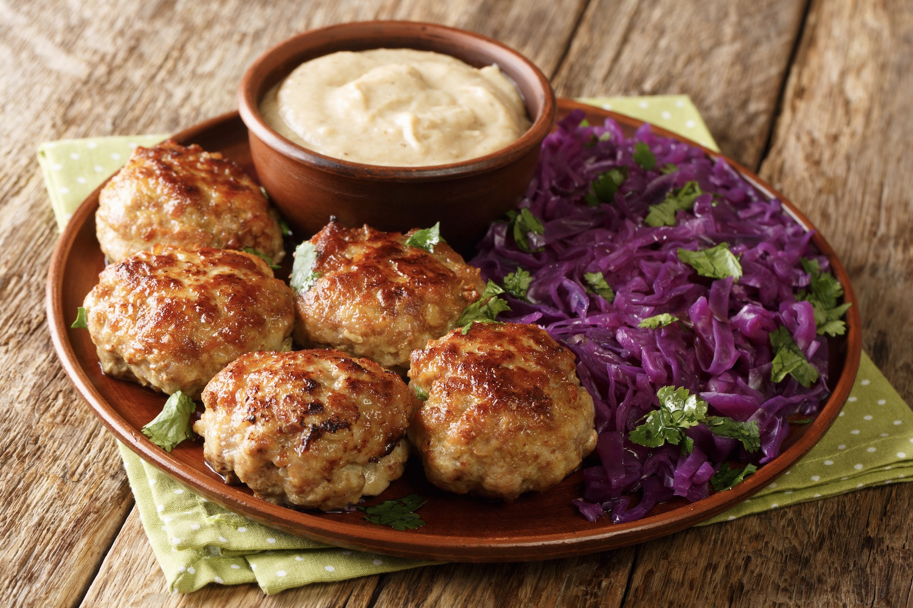

# Frikadeller (Danish Meatballs)

*Denmark's flat pork meatballs: a mix of ground pork and veal bound with grated onion, egg, milk-soaked flour and a touch of nutmeg, shaped into oval patties (not round balls) and pan-fried in butter till deeply browned. Served with boiled potatoes, brunede kartofler, rødkål and Danish brown sauce. The canonical Danish home-dinner staple, eaten weekly in every Danish household.*

**Serves:** 4-6

**Prep Time:** 25 minutes (plus 30 min resting)

**Cook Time:** 25 minutes

## Overview
Frikadeller are Denmark's national meatballs and a fixture of every Danish family kitchen, eaten as a weeknight dinner with potatoes and gravy, packed cold into lunchboxes the next day, or piled onto a slice of rye bread for smørrebrød. The defining structural difference from Swedish köttbullar: frikadeller are larger and flat (oval-shaped patties about 6cm long and 2cm thick, formed with a wet spoon dipped between portions), not round balls. The mix is also distinct: a 70/30 ground pork-and-veal blend (pork dominant; some recipes use beef in place of veal), bound with grated onion, a beaten egg, milk-soaked flour (the panade - flour mixed with milk rather than breadcrumbs), and a Scandinavian-canonical touch of grated nutmeg and white pepper. Salted lightly, rested 30 minutes for the flour to hydrate, then shaped into ovals and pan-fried hard in butter till deeply browned and just-cooked-through. Served with boiled or roasted potatoes, brunede kartofler (sugar-glazed potatoes; see [recipe](side-dishes/brunede-kartofler.md)), rødkål (Danish red cabbage; see [recipe](side-dishes/rodkal.md)), and a brown sauce (brun sovs) made from the pan drippings.

## Ingredients

### Meatballs
- 500 g ground pork
- 200 g ground veal (or substitute with extra pork; or ground beef for a beefier version)
- 1 small onion (finely grated - use a microplane or fine box-grater)
- 1 large egg (beaten)
- 4 tablespoons plain flour
- 150 ml whole milk
- 1 teaspoon fine sea salt
- 1 teaspoon ground white pepper (or black)
- ½ teaspoon ground nutmeg (freshly grated if possible)
- 60 g butter (for frying)
- 1 tablespoon vegetable oil

### Brown sauce (brun sovs) - optional but canonical
- 40 g butter
- 4 tablespoons plain flour
- 600 ml beef or chicken stock
- 200 ml double cream
- 1 tablespoon soy sauce (for depth and colour)
- 1 tablespoon redcurrant jelly (optional; balances)
- ½ teaspoon fine sea salt
- ¼ teaspoon ground white pepper
- A few drops of kulør (Danish browning sauce) for the canonical dark colour, optional

### To serve
- Boiled small potatoes (with butter and chopped dill) OR brunede kartofler (sugar-glazed potatoes)
- Rødkål (Danish red cabbage)
- Agurkesalat (Danish cucumber salad)
- A small dish of strong Dijon mustard
- A glass of cold pilsner (Carlsberg, Tuborg)

## Method

### Stage 1 - Mix the meat
1. In a wide bowl, combine the ground pork and veal.
2. Add the finely grated onion, beaten egg, salt, white pepper, and nutmeg.

### Stage 2 - Make the flour-milk panade
1. In a separate small bowl, whisk the flour with the milk till smooth (no lumps).
2. Pour the flour-milk into the meat mixture.
3. Mix thoroughly with your hand or a wooden spoon - beat the mixture for 2-3 minutes to develop a slight chew.

### Stage 3 - Rest
1. Cover the bowl with cling film.
2. Rest in the fridge 30 minutes minimum (the flour hydrates and the mixture firms up).

### Stage 4 - Shape with a wet spoon
1. Have a small bowl of cold water beside you.
2. Take a tablespoon (the canonical Danish dessert spoon).
3. Dip the spoon in the water, then scoop a heaped tablespoon of mixture.
4. Using a second wet spoon (or your wet free hand), shape the scoop into an oval patty about 6cm long and 2cm thick.
5. Slide off onto a plate.
6. Repeat for all the mixture - about 16-20 frikadeller.
7. The wet-spoon technique keeps the mixture from sticking and gives the canonical oval shape.

### Stage 5 - Fry
1. Heat butter and oil in a wide cast-iron pan over medium-high heat.
2. When the butter foams, lower in the frikadeller (don't crowd; cook in batches).
3. Cook 4-5 minutes till deeply browned underneath.
4. Flip; cook 4-5 minutes on the other side.
5. The internal temperature should reach 72°C (160°F).
6. Transfer to a warm plate; keep warm.

### Stage 6 - Make the brown sauce (optional)
1. Don't wipe the pan - the drippings make the gravy.
2. Add 40g butter to the pan over medium heat.
3. Whisk in the flour; cook 2 minutes till golden.
4. Gradually whisk in the stock.
5. Bring to a gentle simmer; cook 4 minutes till thickened.
6. Stir in the cream, soy sauce, redcurrant jelly, salt, white pepper.
7. Add a drop of kulør if you want the canonical deep brown colour.
8. Return the frikadeller to the sauce briefly to coat.

### Stage 7 - Serve
1. Plate the frikadeller with the brown sauce alongside or over.
2. Boiled small potatoes (with butter and dill).
3. A generous heap of rødkål.
4. A small mound of agurkesalat.
5. A spoonful of Dijon mustard at the side of the plate.
6. Cold pilsner to drink.

## Notes
- **Pork-and-veal blend:** the canonical Danish ratio. All-pork works but is less complex.
- **Milk-soaked flour binder, not breadcrumbs:** the Danish difference from Swedish meatballs.
- **Wet spoon shaping:** the canonical Danish technique that gives the oval shape.
- **Flat oval patties, not round balls:** the visual signature of frikadeller.
- **Rest 30 minutes:** the flour needs to hydrate; the patties hold together better.

## Variations
**Kogt frikadeller:** poached frikadeller (boiled in stock instead of fried) - used as the base for boller i karry (see [recipe](boller-i-karry.md)).
**Fiskefrikadeller:** fish-frikadeller (with cod or similar white fish in place of pork) - equally Danish; pan-fried the same way.
**Hønsefrikadeller:** chicken frikadeller - lighter; same technique.
**With minced beef only:** less canonical but works.
**Cold for lunchbox / smørrebrød:** the next day, sliced cold frikadeller on rye bread with mustard and pickled cucumber is the canonical Danish lunch.

## Serving
At a Danish family weeknight dinner with potatoes and gravy · cold the next day on rye bread for lunch · at a Danish Christmas julefrokost (Christmas lunch) buffet · at IKEA-restaurant-style cafeterias across Denmark · at home with a cold pilsner.

## Storage
- Cooked frikadeller refrigerate 4 days; reheat gently in the gravy.
- Cold leftover frikadeller are excellent for smørrebrød.
- Frikadeller freeze 3 months; thaw fully before reheating.
- The mixture (uncooked) can be made up to 24 hours ahead and refrigerated.
