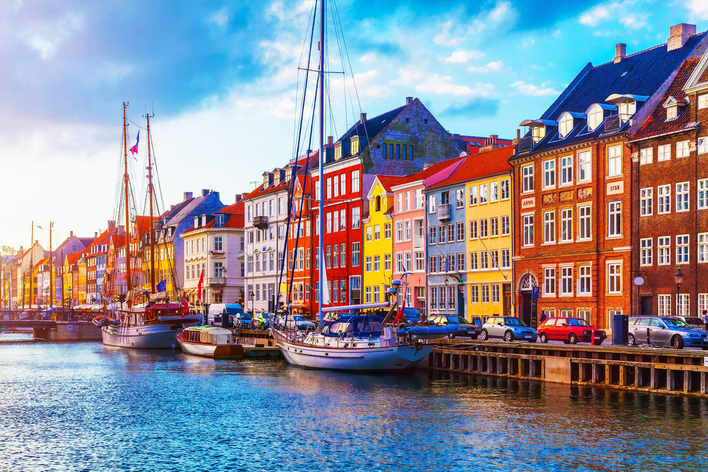

# Danish Cuisine

Denmark's smørrebrød (open-faced rye bread sandwiches with herring, smoked salmon, liver pâté and pickled herring), the pølsevogn hot-dog cart, frikadeller pork meatballs, the Christmas tradition of risalamande almond rice pudding, the dairy-rich pastries (wienerbrød). Rye bread is the carb of record; pickled, smoked and cured fish run the savoury side.
