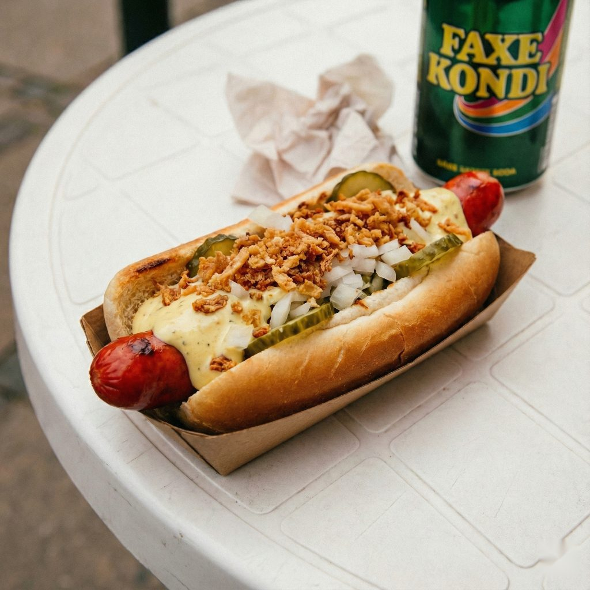

# Danish Hot Dog "Med Det Hele" (With the Works)

*Denmark's national street food: a long red wienerwurst in a soft white bun, smothered in a triple-sauce stripe of ketchup, remoulade and mustard, scattered with chopped raw onion, crispy fried onions and a row of sliced sweet pickle. Sold from polsevogn (sausage wagons) across Copenhagen since the 1920s; the Danish "med det hele" (with the works) is the iconic full-loaded version.*

**Serves:** 4

**Prep Time:** 20 minutes

**Cook Time:** 10 minutes

## Overview
The Danish hot dog (called "den ristede hotdog" when grilled, or simply "med det hele" - "with the works" - when ordered fully loaded) is one of Europe's great street foods and the national hot dog of Denmark, sold from the iconic pølsevogn (sausage wagon) carts that have stood on Copenhagen and Aarhus street corners since the 1920s. The defining elements are three: the sausage (a long red wienerwurst - the "rød pølse" or red sausage, dyed bright red with food colouring and slightly smoky-sweet); the bun (a soft white slightly-sweet pølsebrød bun, longer than American buns and slightly oval-shaped); and the topping set - the canonical "med det hele" stack of yellow mustard, Heinz ketchup, Danish remoulade (the yellow herb-and-pickle Danish mayonnaise-based sauce that's a national obsession), chopped raw white onion, crispy fried onion bits (ristede løg, the Danish onion sprinkle sold in cardboard tubes in every supermarket), and a row of sliced sweet pickle (agurkesalat - Danish cucumber salad pickles). The result is layered, saucy, oniony, sweet-tangy. Three details: red wienerwurst (rød pølse), Danish remoulade (a distinctive yellow herb-mayo, not French remoulade), both raw chopped AND crispy fried onions.

## Ingredients

### Sausages
- 4 long red wienerwurst sausages (or substitute with long Frankfurter-style sausages; tint with red food colouring if you want the Danish look)
- 1 tablespoon vegetable oil

### Buns
- 4 long oval Danish pølsebrød buns (or any soft slightly-sweet hot dog buns; longer than standard)

### Danish remoulade (the yellow Danish version)
- 200 g mayonnaise
- 4 tablespoons sweet pickle relish (or finely chopped sweet gherkins)
- 2 tablespoons capers (finely chopped)
- 2 tablespoons Dijon mustard
- 2 tablespoons curry powder (the yellow colour comes from this; canonical)
- 1 tablespoon white vinegar
- 1 teaspoon caster sugar
- 1 small bunch fresh tarragon (chopped; or 1 teaspoon dried)
- 1 small bunch fresh parsley (chopped)
- ½ teaspoon fine sea salt

### Toppings
- 1 medium white onion (very finely chopped)
- 8 tablespoons ristede løg (Danish crispy fried onions; or use store-bought French-fried onions)
- 16 sliced sweet pickle rounds (Danish agurkesalat-style sweet cucumber pickles; or any sweet pickle slices)
- Yellow mustard
- Heinz ketchup

### To serve
- A cold Tuborg or Carlsberg beer
- Or a cold soda

## Method

### Stage 1 - Make Danish remoulade
1. Whisk mayonnaise, pickle relish, capers, Dijon mustard, curry powder, vinegar, sugar, tarragon, parsley, salt.
2. Refrigerate 30 minutes for the flavours to develop (the curry powder gives the yellow colour as it sits).

### Stage 2 - Cook the sausages
1. Heat the vegetable oil in a wide pan over medium-high heat.
2. Cook the wienerwurst 6-8 minutes, turning, till lightly browned with slightly split casing.
3. Alternative (canonical pølsevogn method): boil in a pan of water 5 minutes; for the grilled version, finish 2 minutes in a hot dry pan for char marks.

### Stage 3 - Warm the buns
1. Briefly steam buns over hot water 30 seconds till soft (or microwave wrapped in damp paper towel 15 seconds).

### Stage 4 - Build "med det hele"
1. Place a warm sausage in each bun.
2. Stripe 1: a zigzag of yellow mustard down the length of the dog.
3. Stripe 2: a zigzag of ketchup alongside the mustard.
4. Stripe 3: a generous zigzag of Danish remoulade across the top.
5. A heap of chopped raw white onion piled on top.
6. A generous scatter of crispy fried onions over the chopped onion.
7. 4 sweet pickle rounds laid in a row across the top.

### Stage 5 - Serve immediately
1. Wrap in a small paper napkin or hot-dog paper sleeve (pølsevogn style).
2. Eat standing at the cart, leaning slightly forward (to catch drips).
3. A cold Danish beer.

## Notes
- **Red sausage:** the canonical Danish look; sub with regular sausage tinted with a few drops of red food colouring if needed.
- **Danish remoulade is yellow, not white:** the curry powder is the colour and the Danish signature.
- **BOTH chopped raw AND crispy fried onions:** double-onion is canonical.
- **Sweet pickle slices in a row:** the canonical Danish topping.
- **Stand at the cart:** the pølsevogn ritual.

## Variations
**Fransk hotdog (French dog):** the bun is tunnel-cut from one end like a baguette; the remoulade is squeezed inside, then the dog inserted. Less topping, more bread-and-sauce.
**Pølse i svøb:** the sausage wrapped in bacon, then in the bun.
**Without sweet pickles:** for those who dislike the sweet note.
**With chili-remoulade:** add a teaspoon of sriracha or chopped fresh chilli to the remoulade for heat.
**Pølsemix:** order the dog with the toppings plus a generous portion of fries (pommes frites) on the same plate, the fries mixed in with the toppings.

## Serving
At a Copenhagen pølsevogn at lunch; at an Aarhus street stand at midnight; at a Danish Christmas-market stall in winter; at home with a cold Tuborg.

## Storage
- Remoulade refrigerates 2 weeks (gets better in the first 24 hours).
- Cooked sausages refrigerate 4 days.
- Crispy fried onions: keep dry in the tin/jar.
- Don't assemble in advance.
