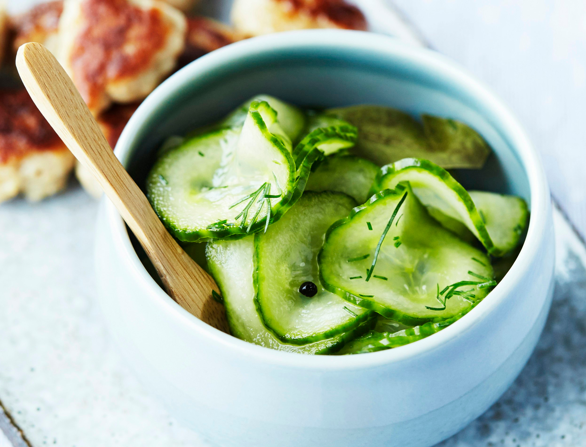

# Agurkesalat (Danish Cucumber Salad)

*Denmark's quick pickled cucumber salad: paper-thin cucumber slices steeped briefly in a sweet-tangy vinegar-sugar brine with chopped dill. Sits in a small glass bowl at every Danish dinner; the cool sweet-acid lift on the plate alongside meatballs, roast pork, and the rest of the heavy Danish savoury menu.*

**Serves:** 6 (generous side portions)

**Prep Time:** 10 minutes (plus 20 minutes brining)

**Cook Time:** None

## Overview
Agurkesalat (Danish cucumber salad) is the canonical lighter side dish that turns up on every Danish dinner table - alongside frikadeller, stegt flæsk, julestege, smørrebrød herring, or anything where the meat-and-potato richness needs a bright cool counterpoint. The construction is essentially a quick pickle: paper-thin cucumber slices (mandoline ideal) salted briefly to draw out water, drained, then steeped in a 1:2:3 vinegar-sugar-water brine (the same Scandinavian canonical ratio used for inlagd sill and Swedish pressgurka - see [pressgurka recipe](../../swedish/side-dishes/pressgurka.md) for the Swedish cousin) with a generous handful of chopped fresh dill, sometimes with thinly sliced red onion, sometimes with a touch of mustard seed. Unlike the Swedish pressgurka, the Danish version doesn't press the cucumber under weights - it's a quicker version that brines in 20 minutes.

## Ingredients

- 1 large English cucumber (about 400g)
- 1 teaspoon fine sea salt (for the initial salting)

### Brine (1:2:3 ratio)
- 50 ml white wine vinegar (or distilled vinegar)
- 100 g caster sugar
- 150 ml cold water

### Aromatics
- 1 small bunch fresh dill (chopped fine; about 30g; reserve sprigs for garnish)
- ½ small red onion (sliced into thin half-rings; optional)
- 1 teaspoon yellow mustard seeds (optional)
- ½ teaspoon ground white pepper

### To serve
- Alongside Frikadeller (Danish meatballs)
- Alongside stegt flæsk (fried pork belly)
- Alongside smørrebrød with herring or roast beef
- At every Danish weeknight dinner where the main course is heavy

## Method

### Stage 1 - Slice the cucumber
1. Wash and dry the cucumber.
2. Don't peel (the skin is part of the texture).
3. With a mandoline (or very sharp knife and care), slice into PAPER-THIN rounds, about 1-2mm thick.
4. The slices should be almost translucent.

### Stage 2 - Salt and draw out water
1. Place the slices in a colander set over a bowl.
2. Sprinkle the salt evenly between the layers.
3. Let stand 10 minutes - water will drip into the bowl below.
4. Gently squeeze the cucumber slices with your hands or pat dry with a clean kitchen towel.
5. (The Swedish pressgurka uses a heavier press for 30 min; the Danish agurkesalat is quicker.)

### Stage 3 - Make the brine
1. In a small bowl, whisk the vinegar, sugar, and water together till the sugar fully dissolves.

### Stage 4 - Combine
1. Place the drained cucumber in a clean bowl.
2. Pour the brine over.
3. Add the chopped dill, sliced red onion (if using), mustard seeds (if using), and white pepper.
4. Toss gently.

### Stage 5 - Brine
1. Cover; refrigerate 20 minutes minimum (the agurkesalat is quick).
2. Up to 24 hours is fine.

### Stage 6 - Serve
1. Lift portions into small glass dishes (the canonical Danish serving vessel).
2. Top with a reserved dill sprig.
3. Serve cold alongside warm savoury Danish dishes.

## Notes
- **Paper-thin slices:** the Danish texture. Mandoline ideal.
- **1:2:3 brine:** the Scandinavian canonical ratio. Tastes sweeter than English pickle but milder than Asian pickle.
- **Quick brine - 20 min minimum:** unlike Swedish pressgurka which presses for 30 minutes, agurkesalat is a quick steep.
- **Masses of dill:** Danish recipes use far more dill than you'd expect.
- **Small glass dish presentation:** the canonical Danish vessel.

## Variations
**With red onion:** the optional addition gives a sharper pink colour and bite.
**With mustard seeds:** for a senap-pickled note.
**Spicier:** add a pinch of cayenne or chopped fresh chilli (less canonical).
**Sweeter:** increase the sugar slightly for the Danish-Christmas-style sweeter version.
**Without sugar (modern):** for a more savoury vinegar-cucumber salad; loses the canonical Danish balance.

## Serving
At every Danish dinner where the main course is rich or heavy (frikadeller, stegt flæsk, julestege) · at a Christmas julefrokost as one of many small side dishes · at a Danish summer lunch alongside cold cuts · at home with leftover meatballs on rye.

## Storage
- Refrigerates 4-5 days; the cucumber gets softer and more pickled over time.
- Don't freeze (texture collapses).
- Always serve cold.
