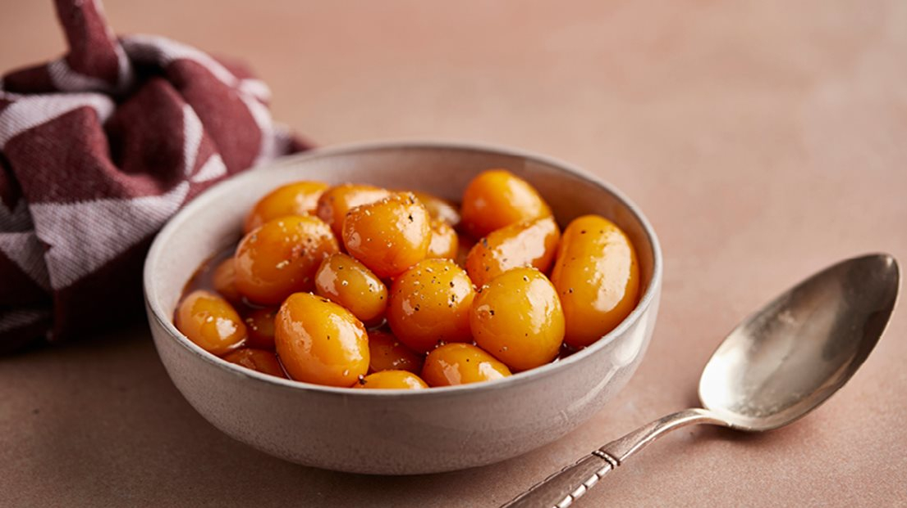

# Brunede Kartofler (Danish Sugar-Glazed Potatoes)

*Denmark's Christmas glazed potatoes: small whole boiled potatoes rolled in a hot pan of melted sugar and butter till they take on a deep amber-caramel glaze. Served alongside the Danish Christmas roast pork, frikadeller, or any traditional Danish dinner; the traditional Christmas table side and a polarising dish (Danes love them; most non-Danes are bemused by sweet glazed potatoes).*

**Serves:** 6

**Prep Time:** 10 minutes

**Cook Time:** 25 minutes (mostly potato boiling)

## Overview
Brunede kartofler (literally "browned potatoes", though the name undersells the colour; they're more amber-caramel than just browned) are one of Denmark's most distinctive savoury-meets-sweet side dishes and a non-negotiable component of every Danish Christmas table. The technique is simple but the result polarises non-Danes: small whole new potatoes (peeled cooked the day before) are rolled in a hot pan where caster sugar has been melted into a pale golden caramel, then butter added to halt the caramel and turn it glossy. The potatoes pick up a glistening sweet amber glaze that's not too sweet (the potato's starch absorbs and balances the sugar) but unmistakably present. Served alongside the traditional Danish Christmas pork roast (julestege), Frikadeller, the Christmas duck, or any traditional dinner with rødkål and red cabbage. The Danish meal layout always has BOTH plain boiled potatoes AND brunede kartofler on the table; diners take some of each.

## Ingredients

- 1 kg small new potatoes (about walnut-sized, uniform, waxy, NOT floury; boiled the day before, peeled, cold)
- 100 g caster sugar
- 60 g butter
- ½ teaspoon flaky sea salt
- (Optional, less traditional: 1 tablespoon water at the start to dissolve the sugar; or a splash of cream at the end for a silkier glaze)

### To serve
- Alongside any Danish Christmas or Sunday dinner, particularly with julestege (Christmas roast pork), Frikadeller, roast duck, or roast goose

## Method

### Stage 1 - Prep the potatoes (the day before - essential)
1. Boil 1 kg of small new potatoes in their skins in salted water 12-15 minutes till just tender (a knife slides in easily).
2. Drain; cool completely.
3. Peel (the skins slip off easily on cold cooked potatoes).
4. Refrigerate overnight if making the day before, or rest at room temp for a few hours.
5. The potatoes need to be COLD and DRY when they hit the caramel, warm or wet potatoes won't glaze properly.

### Stage 2 - Make the caramel
1. Use a wide heavy-bottomed pan (cast iron ideal).
2. Spread the sugar in an even layer across the bottom.
3. Heat over medium heat (no stirring, let the sugar melt undisturbed).
4. Watch closely. After about 3-5 minutes, the sugar at the edges will start to melt and turn pale gold.
5. Gently swirl the pan (don't stir with a spoon) to distribute the melting sugar.
6. Continue heating till the entire sugar pool is a uniform pale amber colour. This is the proper caramel stage, about 4-5 minutes total. Stop before it goes dark amber (bitter).

### Stage 3 - Add butter
1. Quickly add the butter to the hot caramel.
2. It will sizzle and may briefly seize. Don't panic.
3. Swirl the pan; the butter will combine with the caramel into a glossy amber liquid.
4. If the caramel seized into a lump, lower the heat to lowest and stir gently till smooth.

### Stage 4 - Add the potatoes
1. Add the cold dry peeled potatoes to the hot caramel-butter mixture.
2. Lower the heat to medium-low.
3. Gently roll the potatoes in the caramel with a spatula or by tilting the pan, taking care not to scratch them.

### Stage 5 - Glaze
1. Continue cooking and rolling 5-7 minutes till every potato is coated in a glistening amber-caramel glaze.
2. The caramel should cling to the potatoes; the pan should still have some pooled glaze.
3. Sprinkle flaky salt over the top.

### Stage 6 - Plate
1. Lift the glazed potatoes into a warm serving dish.
2. Drizzle any remaining glaze from the pan over the top.
3. Serve immediately while hot and glossy.

## Notes
- **Small uniform potatoes:** walnut-sized waxy potatoes. Large potatoes don't roll properly and don't glaze evenly.
- **COLD and DRY potatoes:** essential. Warm potatoes weep and dilute the caramel; wet potatoes don't take the glaze.
- **Caramel stage:** pale amber (not too pale, not too dark). The window is narrow. Watch carefully and don't multitask.
- **Butter at the end:** the magic step, halts the caramel and creates the glaze.
- **Don't stir with a metal spoon:** scratches the potatoes. Swirl the pan or use a wooden / silicone spatula gently.

## Variations
- **With cream:** add 2 tablespoons of cream after the butter for a silkier glaze.
- **With honey:** swap half the sugar for honey; the Christmas-feast deluxe version.
- **With cinnamon:** add a pinch of ground cinnamon to the caramel; less traditional but lovely in autumn.
- **Smaller potatoes (kids' favourite):** the smaller the potato, the more glaze per bite.
- **Sweet potato version:** swap white potatoes for small sweet potatoes; gives a deeper colour and sweetness.

## Serving
- At every Danish Christmas Eve dinner (julestege) · at a Danish Christmas Day lunch with frikadeller · at Sunday roast with duck or pork · at a Danish family Easter dinner · alongside any roast meat at a Danish table where boiled potatoes alone would feel too plain.

## Storage
- Best fresh, the glaze sets and dulls as they cool.
- Refrigerate 2 days; reheat in a 180°C oven for 8 minutes to re-soften the glaze.
- Don't freeze (texture suffers).
- Boiled-peeled cold potatoes (the base) keep 3 days refrigerated, ready to glaze when needed.
