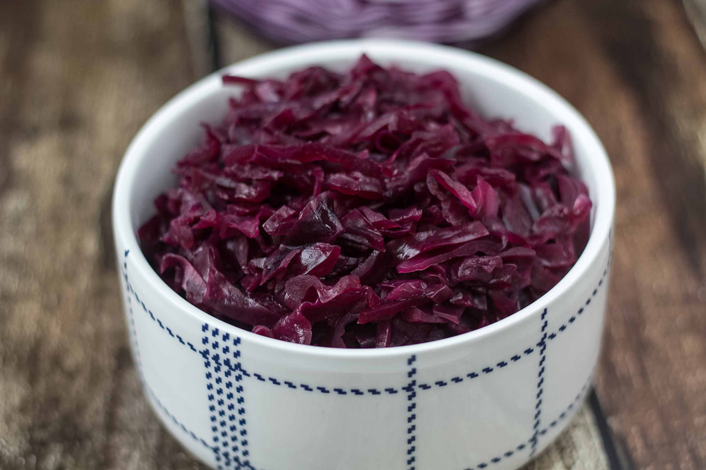

# Rødkål (Danish Red Cabbage)

*Denmark's red cabbage: shredded red cabbage slow-cooked with red wine vinegar, sugar, redcurrant jelly, butter, allspice and a splash of red wine into a tender, glossy, sweet-sour mound. The traditional Danish Christmas side; eaten with frikadeller, julestege, duck, or any traditional Danish dinner all winter long.*

**Serves:** 8 (generous portions for a Christmas table)

**Prep Time:** 15 minutes

**Cook Time:** 2 hours

## Overview
Rødkål (Danish red cabbage) is one of the cornerstone Danish side dishes and a fixture of every Danish Christmas, Sunday roast, frikadeller dinner and traditional cold-month meal: finely shredded red cabbage slow-cooked for 1.5-2 hours with red wine vinegar, sugar, butter, allspice berries, and the traditional Danish sweet-tart liftliftiplifter - a generous spoonful of redcurrant jelly added in the last 20 minutes that brings the colour to a vivid ruby and the flavour to a balanced sweet-sour-fruit. The result is tender, glossy, deeply ruby-coloured, sweet-sour and aromatic, transformed completely from the raw cabbage starting point. Often made days or even a week in advance (it improves dramatically with rest), reheated in big quantities for Christmas, and eaten cold from the fridge as leftovers for days afterwards.

## Ingredients

- 1 large head red cabbage (about 1.5 kg; outer leaves removed, quartered, cored, finely shredded)
- 60 g butter
- 1 large onion (finely chopped)
- 200 ml red wine vinegar
- 100 ml red wine (a dry red; or skip and add extra vinegar + 100 ml water)
- 100 g caster sugar (or to taste - Danish cooks lean sweet)
- 4 tablespoons redcurrant jelly (traditional Danish - Hjordbærsyltetøj works as substitute)
- 8 whole allspice berries
- 6 whole cloves
- 1 cinnamon stick
- 2 bay leaves
- 1 ½ teaspoons fine sea salt
- ½ teaspoon ground black pepper
- 2 tablespoons cornflour (mixed with 4 tablespoons cold water; optional, for a thicker finish)

### Optional Danish additions
- 1 apple (peeled, grated; adds gentle fruit-sweetness)
- 100 g raisins (added in the last 30 min)
- 1 small piece of duck fat or goose fat (instead of some butter; the traditional Christmas-duck-pairing version)

### To serve
- Alongside Frikadeller (Danish meatballs)
- Alongside julestege (Christmas roast pork)
- Alongside duck or goose
- Alongside roast beef or roast pork
- With brunede kartofler (glazed potatoes) on the same plate

## Method

### Stage 1 - Prep the cabbage
1. Remove the outer leaves of the red cabbage; quarter it; cut out the core.
2. Finely shred the cabbage with a sharp knife or mandoline (5mm strips).
3. The cabbage will look like a huge volume - it cooks down to about a third.

### Stage 2 - Sauté the onion
1. In a large heavy pot (Dutch oven or similar), melt the butter over medium heat.
2. Add the chopped onion; cook 8 minutes till soft and translucent.

### Stage 3 - Add the cabbage
1. Add the shredded red cabbage to the pot.
2. Stir to coat in the butter.
3. The cabbage will be a deep purple-red mountain. Don't worry; it shrinks.

### Stage 4 - Add the liquids and aromatics
1. Pour in the red wine vinegar and red wine.
2. Add the sugar, allspice berries, cloves, cinnamon stick, bay leaves, salt, and pepper.
3. Stir thoroughly to combine.
4. The vinegar will turn the cabbage bright magenta within minutes.

### Stage 5 - Slow-cook
1. Cover the pot; lower heat to lowest.
2. Cook 1.5-2 hours, stirring every 20-30 minutes.
3. The cabbage will gradually soften, deepen in colour, and reduce in volume.
4. Add a splash of water if the pot looks dry.

### Stage 6 - Add the redcurrant jelly
1. After 1 hour of cooking, stir in the redcurrant jelly.
2. The jelly will melt into the liquid; the cabbage will turn a brighter ruby colour.
3. Optional: stir in the grated apple and/or raisins at this stage.
4. Continue cooking another 30-60 minutes till the cabbage is fully tender and the liquid has reduced to a glossy syrup.

### Stage 7 - Optional: thicken
1. If the rødkål is too liquid for your preference, whisk in the cornflour-water slurry.
2. Cook 2 minutes more till glossy and thick.

### Stage 8 - Rest (the traditional Danish step)
1. Cool to room temperature.
2. Refrigerate at least 24 hours, preferably 2-3 days.
3. The flavour deepens dramatically with rest.

### Stage 9 - Reheat and serve
1. When ready to serve, warm gently in a pan over low heat (add a splash of water if dry).
2. Mound onto the Christmas table or beside the frikadeller plate.

## Notes
- **Slow cook 1.5-2 hours:** the cabbage needs the time to fully soften and absorb the flavours. Shortcut versions are noticeably worse.
- **Redcurrant jelly:** the Danish signature. Adds glossiness, sweet-tart fruitiness, and the traditional Christmas colour.
- **Make ahead:** rødkål made 2-3 days in advance and reheated is dramatically better than fresh.
- **Whole spices, removed before serving:** the allspice + cloves + cinnamon stick + bay should be picked out (or just left in and warned about at the table - they're not eaten).
- **Sweet-sour balance:** the traditional Danish lean is slightly sweet. Adjust to taste.

## Variations
**With goose fat:** swap some butter for goose fat - the traditional Christmas-goose-pairing version.
**Spicier:** add 1 teaspoon Indian curry powder for a less traditional but lovely twist.
**With pickled herring jus:** add a splash of brine from a jar of pickled herring for extra savoury depth.
**Sugar-free:** swap sugar for stevia and use sugar-free jelly; works but tastes thinner.
**Quick rødkål (30 min):** use pre-shredded cabbage and pressure-cook 25 minutes; not traditional but Tuesday-night practical.
**With orange:** add the zest of 1 orange; gives a brighter winter note.

## Serving
At Danish Christmas Eve dinner (julestege + brunede kartofler + rødkål - the traditional Christmas trio) · at any Danish Sunday roast · at a frikadeller weeknight dinner · at a Danish julefrokost Christmas lunch · alongside duck, goose, pork or beef any winter day.

## Storage
- Refrigerates 2 weeks (improves over the first 3 days; stays good for ages).
- Freezes 3 months - perfect for making big batches ahead of Christmas.
- Reheat with a splash of water in a pan or microwave.
- Cold rødkål is excellent on smørrebrød (the Danish lunch tradition).
