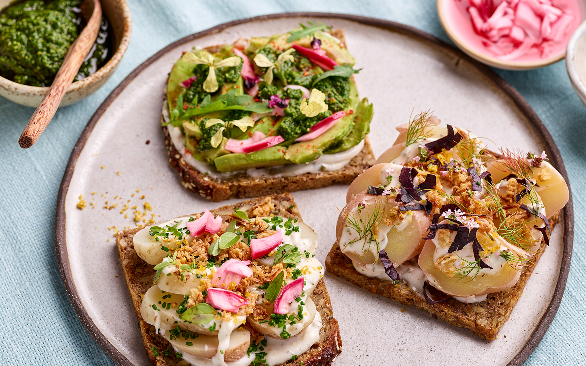

# Smørrebrød (Danish Open-Faced Rye Sandwiches)

*Denmark's iconic open-faced sandwich tradition: dark dense rye bread, generously buttered, topped with a carefully arranged combination of cured fish, meat, cheese or egg plus garnishes (pickled cucumber, dill, chives, red onion, cress, capers, beetroot). Each topping is a named composition: kartoffelmad (potato), æg og rejer (egg and shrimp), dyrlægens natmad (vet's late-night supper). The Danish lunch institution and the dish that defines Danish food culture.*

**Serves:** 4 (8 smørrebrød - 2 per person)

**Prep Time:** 30 minutes

**Cook Time:** 10 minutes (boiling eggs)

## Overview
Smørrebrød (literally "buttered bread") is the Danish open-faced rye-bread tradition that defines Danish lunch culture and dominates every Danish workplace canteen, café menu, ferry-port restaurant and countryside kro (country inn) from Copenhagen to Skagen. The construction is structural: a thick slice of dark dense Danish rye bread (rugbrød - sourdough rye with whole grains, very dense, slightly sour, the canonical Danish carb) is generously buttered, then topped with a carefully arranged combination of one main protein (cured herring, smoked salmon, leverpostej liver pâté, sliced cold roast beef, hard cheese, sliced hard-boiled egg) plus garnishes that always include something pickled, something fresh-green (dill, chives, cress, parsley), and often something pickled and sharp (red onion, capers, pickled cucumber). Each combination has a name and a strict canonical structure; the most famous are:

- **Sild på rugbrød** (pickled herring): herring + raw red onion + chopped dill + capers
- **Æg og rejer** (egg and shrimp): sliced boiled egg + cold-water shrimps + dill + lemon
- **Kartoffelmad** (potato): sliced boiled potato + raw red onion + mayo + chives
- **Dyrlægens natmad** ("vet's late-night supper"): leverpostej + sliced cold roast beef + meat aspic + raw onion + cress
- **Roastbeef** (roast beef): sliced cold roast beef + remoulade + crispy fried onion + horseradish + cress
- **Skinke og italiensk salat** (ham and Italian salad): cold ham + a cubed-vegetable-and-mayo salad

Smørrebrød is eaten with a knife and fork, never picked up. Accompanied by a small glass of cold pilsner and a shot of akvavit (the snaps ritual - see [Aalborg Akvavit recipe](../../drinks/regional/denmark/aalborg-akvavit.md)). Three details: dense Danish rugbrød (NOT lighter American or English rye - must be the dense Danish sourdough version), generous butter under everything, fork-and-knife (never handheld).

## Ingredients

### Bread base
- 8 thick slices Danish rugbrød (dense sourdough rye; if unavailable, use the densest dark German rye / pumpernickel)
- 100 g cold salted butter (Danish butter ideal - Lurpak; or any quality salted butter)

### Topping 1: Sild på rugbrød (pickled herring) - for 2 pieces
- 4 fillets pickled herring (inlagd sill style; from a jar)
- 1 small red onion (sliced into thin half-rings)
- 1 small bunch fresh dill (chopped fine)
- 2 tablespoons capers (drained)
- 4 small lemon wedges

### Topping 2: Æg og rejer (egg and shrimp) - for 2 pieces
- 2 hard-boiled eggs (sliced into rounds)
- 200 g cooked cold-water shrimps (small Greenland prawns; drained and patted dry)
- A few sprigs of fresh dill
- 2 lemon wedges
- Mayonnaise (a small dot)

### Topping 3: Kartoffelmad (potato) - for 2 pieces
- 4 small cold boiled potatoes (peeled, sliced thin)
- 4 tablespoons mayonnaise
- 1 small red onion (sliced very thin)
- A small bunch chives (chopped fine)
- Ground black pepper

### Topping 4: Dyrlægens natmad (vet's late-night supper) - for 2 pieces
- 4 slices of cold leverpostej (Danish liver pâté; warm-baked the day before is the canonical chef version, or use shop-bought leverpostej from a tin - Stryhn's brand is the Danish standard)
- 4 thin slices cold roast beef
- 2 small spoons of meat aspic (sky - chopped fine; from a butcher; or skip)
- 1 small red onion (sliced very thin)
- A small handful of garden cress

### To serve (the snaps ritual)
- Small cold pilsners (Carlsberg, Tuborg, Royal Pilsner)
- Tiny shots of ice-cold akvavit (Aalborg, OP Anderson)
- Fork-and-knife per person; no hands

## Method

### Stage 1 - Boil the eggs
1. Bring a pan of water to a gentle simmer.
2. Add 2 eggs; simmer 9 minutes (for slightly firm but not chalky yolks).
3. Drain; cool under cold running water 1 minute.
4. Peel; slice into 5mm rounds.

### Stage 2 - Boil the potatoes (for kartoffelmad)
1. Boil small potatoes in salted water 12-15 minutes till tender.
2. Drain; cool completely (essential - the slices won't hold their shape if warm).
3. Peel; slice into 5mm rounds.

### Stage 3 - Butter the bread
1. Lay all 8 slices of rugbrød on a board.
2. Spread cold butter generously across each slice (Danish butter use is generous - distinct visible thickness, not a thin smear).

### Stage 4 - Build each smørrebrød
1. **Sild på rugbrød (2 pieces):** Place 1-2 herring fillets across each slice. A few thin half-rings of red onion. A scatter of capers. A heap of chopped dill. A lemon wedge alongside.

2. **Æg og rejer (2 pieces):** Lay 3-4 egg slices across each. A small mound of cold shrimps. A small dot of mayo. A sprig of dill. A lemon wedge.

3. **Kartoffelmad (2 pieces):** Lay 4-5 potato slices across each. A zigzag of mayo. Thin slices of raw red onion. A heap of chopped chives. A grind of black pepper.

4. **Dyrlægens natmad (2 pieces):** Spread a generous layer of leverpostej across each. Lay 2 slices of cold roast beef on top. A small spoon of chopped meat aspic (if using). A few thin half-rings of red onion. A handful of garden cress on top.

### Stage 5 - Plate
1. Arrange the 8 smørrebrød on a large flat platter or one per plate.
2. The traditional Danish serving order is: herring first (cold), then fish (other), then meat, then cheese - drink akvavit between courses.
3. Each gets a knife and fork.

### Stage 6 - The snaps and beer ritual
1. Pour small cold pilsner beers into glasses.
2. Pour tiny ice-cold akvavit into snaps glasses.
3. The canonical Danish move: eat herring → sip beer → sip akvavit → "skål!" → repeat for each smørrebrød.

## Notes
- **Danish rugbrød:** absolutely the canonical bread. Dense sourdough rye, dark, slightly sour, full of whole grains and seeds. Lighter American rye or English rye won't give the right result.
- **Generous butter:** Danish butter use is generous; thin smears are wrong.
- **Each topping is a named composition:** don't mix freely; respect the canonical combinations.
- **Fork-and-knife only:** smørrebrød is plated and eaten with cutlery, never handheld. Picking one up marks you as a non-Dane.
- **Pickled / fresh / sharp:** every composition has all three - pickled element (herring, onion), fresh-green (dill, cress, chives), sharp (mustard, horseradish, capers).

## Variations
**Beef-and-blue-cheese:** thin slices of cold roast beef + crumbled Danish blue + horseradish + crispy onions + cress (less canonical, more modern).
**Tartar:** Danish-style raw beef tartare on rye with raw egg yolk and chopped raw onion (the Stockholm Royal Smørrebrød House version).
**Smoked salmon:** smoked salmon + creamy dill mustard + capers + cucumber + dill (canonical fish version).
**Hot smørrebrød:** include a few hot smørrebrød (warmed leverpostej; or a small frikadelle on rye with mustard and pickled beetroot).
**Cheese-only at the end:** the canonical Danish lunch ends with cheese smørrebrød (a slice of strong Danish blue, or mild Danbo, with a sliced radish on rye).

## Serving
At a Danish lunch at a Copenhagen restaurant (Restaurant Schønnemann is the historic temple) · at a Danish workplace canteen Friday lunch · at a julefrokost (Danish Christmas lunch) · at a wedding luncheon · at home as a substantial weekend lunch.

## Storage
- Best assembled and eaten within 1 hour.
- The bread softens once buttered + topped. Don't make hours in advance.
- The components separately (boiled eggs, potatoes, herring, leverpostej) keep refrigerated 3-5 days.
- Cold leftover smørrebrød toppings on fresh bread are excellent next-day lunch.
