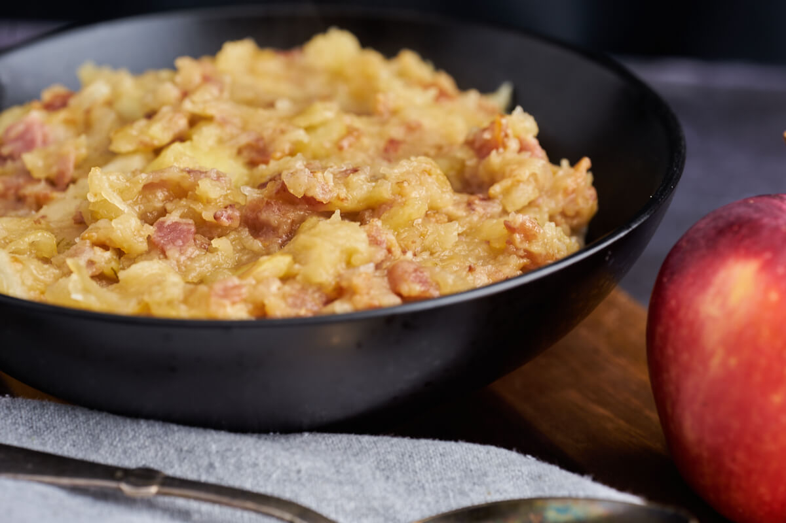

# Æbleflæsk (Danish Apple and Bacon)

*Denmark's autumn pork-and-apple dish: thick slices of bacon (or pork belly) fried crispy then layered with a sweet-tart compote of cooked apple and onion in the bacon fat. Eat warm on dark rye bread with mustard and chopped chives; a centuries-old Danish farmhouse staple that's still on every Danish menu in apple season.*

**Serves:** 4

**Prep Time:** 15 minutes

**Cook Time:** 35 minutes

## Overview
Æbleflæsk (literally "apple bacon") is one of Denmark's oldest dishes, a farmhouse staple that has been on Danish tables for at least 300 years and still turns up in every kro (country inn), every autumn menu in Copenhagen and every Danish home when the apples come down. The construction couldn't be simpler. Thick slices of streaky bacon or salted pork belly are fried hard in a dry pan till the fat renders and the slices crisp. The bacon is lifted out; in the rendered fat, chopped sweet onions soften, then chunks of tart cooking apple (Bramley, Granny Smith) go in with a touch of sugar and cook till just tender and lightly caramelised, kept chunky rather than mashed. The bacon goes back on top to warm through. Scooped onto thick slices of dark Danish rye bread and eaten as an open-faced sandwich with strong Dijon mustard and chopped chives.

## Ingredients

### Bacon
- 400 g thick-cut streaky bacon (or salted pork belly slices; about 1cm thick)

### Apples
- 800 g tart cooking apples (Bramley, Granny Smith, or Danish Belle de Boskoop; peeled, cored, sliced into 1cm-thick wedges or chunks)
- 2 medium onions (sliced into half-moons)
- 2 tablespoons brown sugar (or maple syrup)
- 1 tablespoon apple cider vinegar
- ¼ teaspoon ground cinnamon (optional)
- ¼ teaspoon ground allspice
- ½ teaspoon fine sea salt
- ½ teaspoon ground black pepper

### To serve
- 8 thick slices Danish rugbrød (dark rye bread)
- Cold salted butter (for the bread)
- 4 tablespoons Dijon mustard or coarse-grain mustard
- 1 small bunch chives (chopped fine)
- A few sprigs of fresh thyme
- A cold pilsner

## Method

### Stage 1 - Fry the bacon
1. Heat a dry wide cast-iron pan over medium-high heat.
2. Lay the bacon slices in a single layer.
3. Cook 5-6 minutes per side, undisturbed, till the bacon is deeply browned and the fat has rendered out.
4. Lift the bacon out to a warm plate; cover loosely.
5. Reserve the rendered bacon fat in the pan (don't pour off).

### Stage 2 - Sauté the onions
1. Reduce heat to medium.
2. Add the sliced onions to the rendered bacon fat.
3. Cook 8 minutes till soft and golden at the edges.

### Stage 3 - Add the apples
1. Add the apple wedges to the onion-and-bacon-fat pan.
2. Sprinkle with the brown sugar, cinnamon (if using), allspice, salt, and pepper.
3. Cook 10-12 minutes, turning occasionally with a spatula (don't stir vigorously, you want the apple chunks to stay intact, not mash into sauce).
4. The apples should soften, lightly caramelise on the outside, and release their juices. They should be just-tender, holding their shape.

### Stage 4 - Add vinegar and finish
1. In the last 2 minutes, drizzle the apple cider vinegar over.
2. Stir gently.
3. Lay the fried bacon back on top of the apple-onion mixture.
4. Warm through 2 minutes.

### Stage 5 - Toast the bread
1. While the apples cook, toast the slices of rugbrød lightly under a grill or in a toaster.

### Stage 6 - Build the open-faced sandwich
1. Spread cold butter generously on each slice of warm toast.
2. Smear a thin layer of Dijon mustard.
3. Spoon a generous portion of the warm apple-and-onion onto each slice.
4. Lay a piece of crispy bacon on top.
5. Scatter chopped chives and a few sprigs of thyme.

### Stage 7 - Serve immediately
1. Eat with knife and fork (the open-faced sandwich is too messy to pick up).
2. A cold pilsner.
3. A small dish of extra mustard on the side.

## Notes
- **Thick bacon:** thin streaky bacon dries out. Aim for 1cm-thick cuts.
- **Tart cooking apples:** Bramleys hold up. Sweet eating apples turn to sauce.
- **Keep the apples chunky:** stir gently, don't mash. The dish is meant to have texture.
- **Bacon fat is the cooking medium:** don't drain it off; cook the onions and apples in it.
- **Warm on rye with mustard:** the traditional Danish presentation.

## Variations
**With pork belly instead of bacon:** thick slices of salted Danish flæsk, more substantial.
**With prunes:** add 100g chopped pitted prunes to the apple mix for the Christmas-feast version.
**With caraway seeds:** add 1 teaspoon caraway to the apples, the Bavarian-influenced variant.
**With cider reduction:** replace the vinegar with 100ml dry cider reduced in the pan to a syrup; deeper apple flavour.
**Vegetarian:** swap the bacon for smoked tofu strips fried crispy; the apple-and-onion mixture stays the same.
**On a plate (not as open sandwich):** serve the apple-bacon mixture as a side alongside roast pork or a Danish dinner main.

## Serving
At a Danish country kro (inn) in autumn · at a Copenhagen restaurant's seasonal autumn menu · at a Danish family Sunday lunch in October · at home with the first windfall apples · as part of a julefrokost (Christmas lunch) cold-buffet.

## Storage
- Best fresh and warm.
- Cooked apple-bacon mixture refrigerates 3 days; reheat gently in a pan.
- Don't store assembled (the bread softens).
- Bacon can be fried in advance and stored refrigerated 3 days; warm with the apples just before serving.
