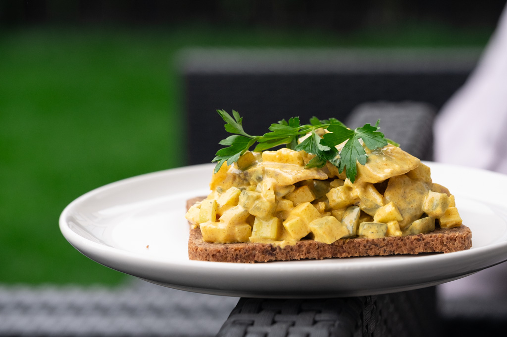

# Karrysild (Danish Curried Herring)

*Denmark's curried herring: pickled herring fillets dressed in a mild yellow curry mayonnaise with chopped onion, capers and apple, served cold on rye bread or as one of many cold dishes on the Danish lunch table. The bright-yellow smørrebrød classic; the Danish answer to the Swedish senapssill (mustard herring) tradition.*

**Serves:** 6 (as a smörgåsbord component) or 4 (as a full lunch)

**Prep Time:** 15 minutes (plus 4 hours chilling)

**Cook Time:** None

## Overview
Karrysild (Danish curried herring) is the Danish answer to the broader Scandinavian pickled-herring tradition and a fixture of every Danish lunch buffet, smørrebrød spread, julefrokost (Christmas lunch), and Sunday cold-buffet. The construction is straightforward: pre-cured pickled herring fillets (matjessild or saltsild - the Scandinavian salt-and-vinegar-cured herring sold in jars; not raw fish, not smoked) cut into bite-sized pieces, then folded into a curry mayonnaise - mayonnaise mixed with mild curry powder, a touch of cream and Dijon mustard, finished with finely chopped raw onion (the canonical sharp lift), capers, and either grated apple or chopped sweet pickle for the sweet-tart counterpoint. Refrigerated at least 4 hours for the flavours to meld; the herring gradually takes on the yellow colour of the curry-mayo. Served cold on a piece of dark Danish rye bread with chopped chives and a sprig of dill, or as one of three to five pickled-herring variations laid out on a Danish lunch table (alongside inlagd sill, senapssill, dilled herring, etc.). The dish was an early-1900s import - Danish home cooks adapted British-Indian curry powder for the herring jar - and is now one of the canonical Danish herring forms. Three details: pre-cured pickled herring (NOT raw fish), mild Danish curry powder (gentle and sweet, not Indian-hot), chill at least 4 hours for the colour and flavour to develop.

## Ingredients

### Curry mayo
- 200 g mayonnaise (good quality; Hellmann's or similar)
- 100 ml soured cream or crème fraîche
- 2 tablespoons mild curry powder (mild Madras or Stuart's brand)
- 1 tablespoon Dijon mustard
- 1 teaspoon turmeric (for the bright yellow colour)
- 2 tablespoons mango chutney (or apricot jam)
- 1 tablespoon caster sugar
- 1 teaspoon lemon juice
- ½ teaspoon fine sea salt
- ¼ teaspoon ground white pepper

### Herring and mix-ins
- 400 g pre-cured pickled herring fillets (from a jar; rinsed lightly and drained; cut into 2cm bite-size pieces)
- 1 small red onion (very finely chopped)
- 4 tablespoons capers (drained)
- 1 medium apple (peeled, finely grated; or 4 tablespoons sweet pickle relish)
- 1 small bunch fresh dill (chopped fine; reserve sprigs for garnish)

### To serve
- 6 slices Danish rugbrød (dark rye bread)
- 60 g cold salted butter (for the bread)
- 1 small bunch chives (chopped fine)
- A sprig of fresh dill per portion
- A small spoon of fish roe (optional luxury)
- A glass of cold pilsner
- A shot of ice-cold akvavit
- A side dish of small boiled new potatoes (warm; for the substantial-lunch version)

## Method

### Stage 1 - Make the curry mayo
1. In a wide bowl, whisk the mayonnaise, soured cream, curry powder, Dijon mustard, turmeric, mango chutney, sugar, lemon juice, salt, and white pepper.
2. Taste; adjust - the sauce should be properly yellow, gently sweet, mildly curried, and slightly tangy.

### Stage 2 - Prep the herring
1. Lift the pre-cured herring fillets from their jar.
2. Rinse briefly under cold water to remove some of the original pickling brine.
3. Pat dry; cut into 2cm bite-sized pieces.

### Stage 3 - Combine
1. Add the herring pieces to the curry mayo.
2. Stir in the chopped red onion, capers, grated apple (or sweet pickle relish), and chopped dill.
3. Toss gently to coat - every piece of herring should be coated in the bright yellow curry mayo.

### Stage 4 - Chill
1. Cover; refrigerate at least 4 hours (overnight is better).
2. The herring will take on the yellow colour; the flavours will meld.
3. The longer it rests, the more uniform the colour and the deeper the curry flavour.

### Stage 5 - Serve as smørrebrød
1. Butter each slice of rugbrød generously.
2. Spoon a generous portion of karrysild over each slice.
3. Top with chopped chives, a sprig of dill, and (optionally) a small spoon of fish roe.
4. Plate.

### Stage 5b - Or serve as a lunch buffet component
1. Spoon the karrysild into a small glass dish.
2. Place on the lunch table alongside other pickled-herring variants (inlagd sill, senapssill).
3. Provide small spoons; guests serve themselves onto a piece of rugbrød.

### Stage 6 - The snaps ritual
1. Pour cold pilsner into glasses.
2. Pour tiny ice-cold akvavit into snaps glasses.
3. Eat a forkful of karrysild on rye → sip beer → sip akvavit → "skål!" → repeat.

## Notes
- **Pre-cured pickled herring:** the canonical Scandinavian base. Matjessild or saltsild from a jar. Don't use raw herring or smoked herring - different products.
- **Mild Danish curry powder:** the canonical balance is gentle and sweet. Indian hot curry powder is too aggressive.
- **Mango chutney:** the Danish-British-colonial influence. Adds the sweet-fruity note that distinguishes karrysild from generic curried mayo.
- **Chill 4 hours minimum:** the herring needs time to take on the yellow colour and absorb the curry flavour.
- **Generous butter on the bread:** the buttery layer is essential under the wet karrysild.

## Variations
**With grated carrot:** add a small grated carrot for sweetness and crunch.
**With raisins:** add 2 tablespoons of raisins (plumped in akvavit first) for a richer, more Christmas-feast version.
**Spicier:** add a pinch of cayenne or chopped fresh chilli.
**With smoked herring instead of pickled:** less canonical, more smoky.
**Mini canapé size:** spoon onto small squares of buttered crisp bread for cocktail-hour smørrebrød.
**With dill and crème fraîche only (sweeter, milder):** for kids or curry-averse guests.

## Serving
At a Danish julefrokost Christmas lunch (alongside 5-6 other small dishes) · at a Sunday cold-buffet · as one of the canonical herring trio (curried, mustard, dilled) at any Danish lunch · at a Copenhagen restaurant smørrebrød lunch · at home with cold beer and akvavit.

## Storage
- Karrysild refrigerates 1 week in a sealed container (the flavour deepens over the first 3 days).
- Don't freeze (the mayo splits and the fish texture suffers).
- The bread should be assembled fresh; don't store the assembled smørrebrød more than an hour.
