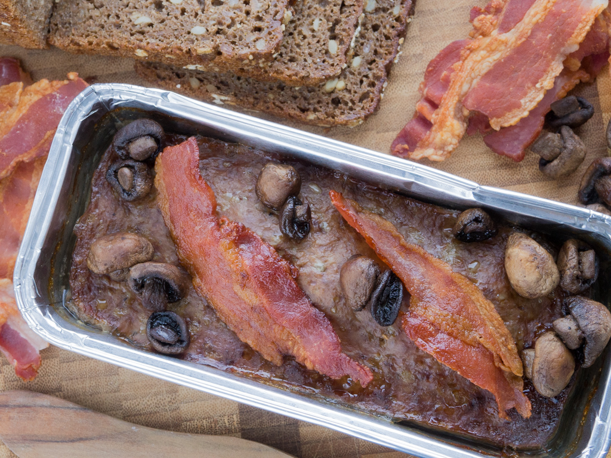

# Leverpostej (Danish Liver Pâté)

*Denmark's everyday liver pâté: pork liver baked in a loaf with bacon, onion, milk, eggs and a touch of anchovy and allspice into a smooth, savoury pâté that's sliced cold and spread or laid on rye bread. The Danish school-lunch and smørrebrød cornerstone; the canonical "this is what's in every Danish fridge" item.*

**Serves:** 8-10 (one loaf - refrigerates for the week)

**Prep Time:** 25 minutes

**Cook Time:** 1 hour

## Overview
Leverpostej is one of the most ubiquitous foods in Denmark - every Danish supermarket sells dozens of brands in plastic tubs, every Danish household has a tub in the fridge, every Danish school lunchbox includes a slice of rye bread smeared with leverpostej. The construction is a baked pork-liver loaf-style pâté: pork liver and pork fat (or back-bacon trim) ground together with onion, sweated in butter, then combined with eggs, milk, flour (the panade), anchovy fillets (yes - small canned anchovies, the Danish secret savoury booster), allspice, white pepper, marjoram or thyme, and salt. The mixture is poured into a buttered loaf tin, topped with strips of bacon and bay leaves, and baked in a water bath at 180°C for an hour till set firm. Cooled completely, sliced cold, and eaten with the canonical Danish accompaniments: a slice on rye bread topped with pickled beetroot and crispy fried onions for a snack smørrebrød; OR a slice on warm toast with a fried mushroom and bacon for a hot snack; OR straight from the spoon as a quick fridge-snack while standing at the kitchen counter. Three details: pork liver + bacon-fat panade (the canonical Danish ratio), anchovies in the mix (the umami secret), bacon strips and bay leaves on top before baking.

## Ingredients

### Pâté loaf (1 large loaf, ~1 kg)
- 500 g pork liver (trimmed, chopped roughly)
- 200 g pork fat (back fat) OR 300 g streaky bacon (chopped; the bacon version is the home-friendly option)
- 1 large onion (finely chopped)
- 4 garlic cloves (crushed)
- 50 g butter
- 4 large eggs
- 200 ml whole milk
- 100 ml double cream
- 4 tablespoons plain flour
- 4 anchovy fillets (from a tin; chopped fine)
- 2 teaspoons fine sea salt
- 1 teaspoon ground white pepper
- 1 teaspoon ground allspice
- ½ teaspoon ground nutmeg
- 1 teaspoon dried marjoram (or thyme)
- 1 tablespoon brandy (optional; adds depth)

### Topping the loaf
- 6-8 strips streaky bacon (laid across the top before baking)
- 3-4 bay leaves
- Equipment: a 1.5-litre loaf tin, lined with greaseproof paper (the tin sits in a water-bath, so the lining helps lift the loaf out)

### To serve
- Sliced Danish rugbrød (dark rye bread)
- Pickled beetroot (sliced)
- Crispy fried onions
- Sliced raw cucumber
- A sprig of fresh thyme or cress
- Dijon mustard
- A cold pilsner OR a strong coffee

## Method

### Stage 1 - Prep
1. Preheat the oven to 180°C (350°F).
2. Line a 1.5-litre loaf tin with greaseproof paper (the paper helps lift the cooked loaf out cleanly).
3. Fill a deeper roasting tin with hot water - this will be the water bath.

### Stage 2 - Sauté the aromatics
1. In a wide pan, melt the butter over medium heat.
2. Add the chopped onion; cook 8 minutes till deeply soft and golden.
3. Add the crushed garlic; cook 30 seconds.
4. Take off the heat; cool 5 minutes.

### Stage 3 - Grind the meat
1. **Option A (food processor - quicker, less canonical):** put the chopped liver, pork fat / bacon, sautéed onion-garlic, and chopped anchovies into the food processor. Pulse till the mixture is finely chopped but not a complete purée (some texture is desirable). Transfer to a large bowl.
2. **Option B (mincer - canonical):** pass the liver and pork fat through a meat mincer (medium plate) twice. Combine with the chopped onion-garlic and anchovies in a large bowl.

### Stage 4 - Make the binder
1. In a separate bowl, whisk the eggs, milk, cream, and flour together until smooth (no lumps).
2. Add the salt, white pepper, allspice, nutmeg, marjoram, and brandy (if using).

### Stage 5 - Combine
1. Pour the milk-egg-flour mixture into the meat mixture.
2. Mix thoroughly with a wooden spoon till uniform.
3. The mixture should be quite loose - closer to a thick batter than a meatloaf.

### Stage 6 - Fill the loaf tin
1. Pour the mixture into the lined loaf tin.
2. Tap the tin on the counter a few times to settle.
3. Lay the strips of streaky bacon across the top in slightly overlapping rows.
4. Tuck 3-4 bay leaves between the bacon strips.

### Stage 7 - Bake in water bath
1. Place the loaf tin in the larger roasting tin.
2. Pour hot water into the roasting tin to come halfway up the sides of the loaf tin (the water-bath / bain-marie).
3. Carefully transfer to the oven.
4. Bake 60-70 minutes till the centre of the loaf is set firm to the touch and a digital thermometer reads 75°C in the centre.
5. The bacon on top should be lightly browned (don't expect crispy from the water-bath bake).

### Stage 8 - Cool
1. Lift the loaf tin out of the water bath.
2. Let stand at room temperature till cool to touch.
3. Cover with cling film; refrigerate at least 6 hours (preferably overnight) to firm up fully.

### Stage 9 - Slice and serve
1. Lift the cooled loaf out of the tin using the greaseproof paper.
2. Slice into 1cm thick slices with a sharp knife.
3. **As a snack on rye bread (smørrebrød):** lay a slice of leverpostej on a buttered slice of Danish rye bread. Top with sliced pickled beetroot, a sprinkle of crispy fried onions, and a sprig of fresh thyme or cress.
4. **As a hot snack on toast:** warm a slice in a low oven (160°C) for 5 minutes. Place on hot buttered toast; top with sautéed mushrooms and a strip of crispy bacon.
5. **Straight from the tub (the quick-snack version):** spread on rye bread or crisp bread with a knife; sprinkle with chopped raw onion and salt.

## Notes
- **Pork liver + pork fat:** the canonical Danish ratio. Substitute back-bacon trim if pork fat is unavailable.
- **Anchovies in the mix:** the Danish umami secret. Don't skip - they melt into the loaf and you can't taste them but the depth comes from them.
- **Water bath (bain-marie):** essential for gentle even cooking. Without it the loaf cracks and dries out.
- **Bacon strips on top:** the canonical Danish look. The bacon doesn't fully crisp during the water-bath bake - that's expected.
- **Make ahead:** the loaf improves in the first 24 hours as the flavours marry.

## Variations
**With chicken liver:** half pork liver + half chicken liver gives a milder version.
**With brandy or sherry:** add 2 tablespoons of brandy or dry sherry to the mixture for a more elegant Christmas version.
**With mushroom and bacon topping (the hot smørrebrød version):** the "dyrlægens natmad" style - see [smørrebrød](../smorrebrod.md).
**Spicier:** add a pinch of cayenne and 1 teaspoon of crushed juniper berries.
**Vegetarian "leverpostej":** swap the meat for lentils + walnuts + miso paste; nothing like the original but a credible vegetarian substitute.
**Christmas leverpostej:** add chopped prunes and a touch of port for a Christmas-feast deluxe version.

## Serving
At a Danish school lunchbox · at a Danish workplace canteen as a smørrebrød option · at a Christmas julefrokost buffet · at home as a quick fridge-snack with rye bread · at a Danish family Sunday breakfast.

## Storage
- Whole loaf refrigerates 1 week wrapped in cling film.
- Sliced and assembled smørrebrød: eat within an hour.
- Leverpostej freezes 3 months (slice before freezing for portioning).
- Loaf can be made up to 5 days ahead - actually improves over the first 24 hours.
