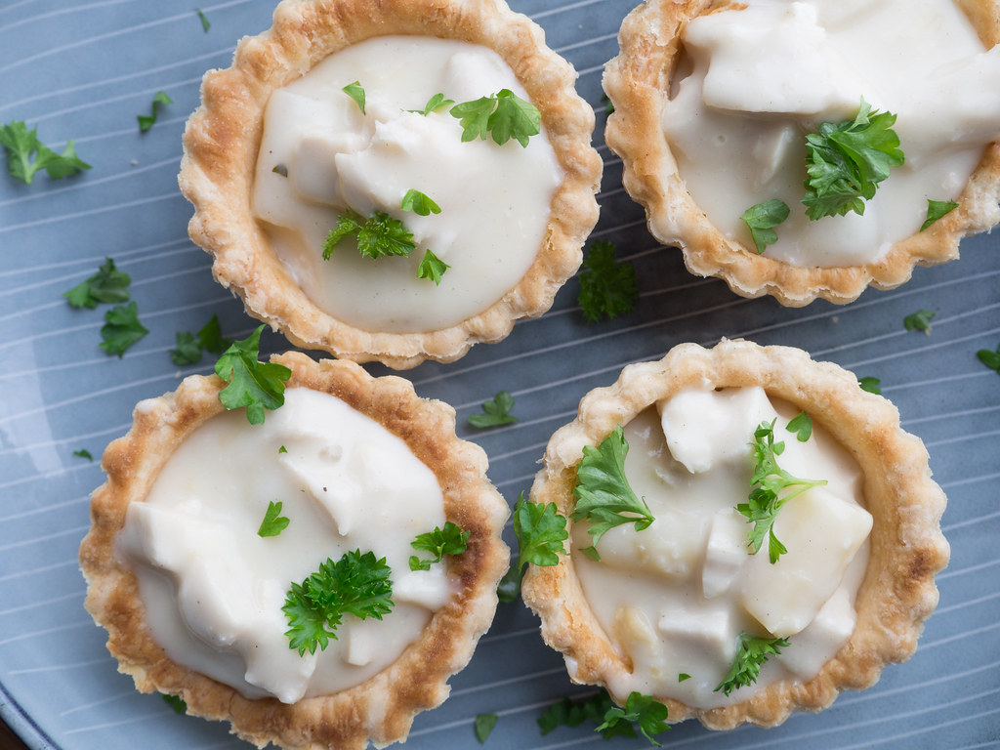

# Tarteletter (Danish Pastry Cups with Creamed Chicken and Asparagus)

*Denmark's mid-20th-century party dish: small flaky butter-pastry cups filled with a creamy chicken-and-asparagus ragout (the traditional filling: chicken white meat, white asparagus, a touch of white wine, finished with cream and parsley). Served warm as a starter or buffet centrepiece; the Danish "fancy lunch" dish that turns up at confirmations, weddings, and Sunday lunches.*

**Serves:** 4 (2 tartlets per person)

**Prep Time:** 30 minutes (assumes shop-bought tartlet shells; +1 hour if making from scratch)

**Cook Time:** 25 minutes

## Overview
Tarteletter are one of Denmark's most distinctively Danish "fancy lunch" dishes: a buttery flaky pastry cup about 7 to 8 cm wide, filled with a creamy white ragout, traditionally chicken and asparagus. Came to Denmark from French haute cuisine in the 1900s and was domesticated into the Danish home menu in the 1950s as the traditional confirmation/wedding/christening/Sunday lunch dish. The pastry cups come pre-baked from Danish supermarkets (a freezer-aisle staple); the traditional home version makes them fresh. The filling: poached chicken white meat (or leftover roast) diced small, white asparagus (canned is the Danish tradition; fresh is modern), a roux-based white sauce with milk, cream, a splash of dry white wine and chicken stock, finished with chopped parsley, lemon and a pinch of nutmeg. Spooned hot into warmed shells just before serving.

## Ingredients

### Tartlet shells (8 small, about 7cm wide)
- Option A: 8 shop-bought tartlet shells (Karen Volf, Wasa Tarteletter; widely available in Denmark and Scandinavian shops)
- Option B (homemade): 1 sheet (320g) good-quality butter puff pastry, baked into 8 tartlet shells

### Filling - creamed chicken and asparagus
- 500 g cooked chicken (poached chicken breast OR leftover roast chicken; cubed into 1cm dice)
- 200 g white asparagus (a small jar / tin OR 400g fresh white asparagus, peeled and boiled till tender, cut into 2cm pieces)
- 50 g butter
- 4 tablespoons plain flour
- 300 ml chicken stock
- 200 ml whole milk
- 150 ml double cream
- 100 ml dry white wine (or extra stock + 1 tablespoon white wine vinegar)
- 1 teaspoon Dijon mustard
- 1 small bunch fresh parsley (chopped fine; reserve some for garnish)
- Juice of ½ lemon
- ½ teaspoon ground nutmeg
- 1 teaspoon fine sea salt
- ½ teaspoon ground white pepper

### Garnish
- A few pickled white asparagus tips (or fresh chervil sprigs)
- Sprigs of fresh dill or parsley
- Ground black pepper

### To serve
- A small green salad with vinaigrette
- A glass of crisp dry white wine (German Riesling or Danish-style Pinot Gris)
- Champagne if it's a celebration

## Method

### Stage 1 - Heat the tartlet shells
1. If using shop-bought tartlet shells: place on a baking sheet and warm in a 180°C (350°F) oven for 5 minutes to crisp them up.
2. If making from scratch (puff pastry): cut 16 rounds from the puff pastry sheet (8 with a 9cm cutter as the base, 8 with a 7cm cutter as the rim cut from the centre of each base). Stack the rim on the base; brush with egg wash; bake at 200°C for 15 minutes till deeply golden and risen. Cool 5 minutes; if the centres puffed up, gently press them down with the back of a spoon to create the cup hollow.

### Stage 2 - Poach the chicken (if starting from raw)
1. Place 2 chicken breasts in a small pan; cover with cold water.
2. Add a pinch of salt, a peppercorn, a bay leaf.
3. Bring to a gentle simmer; cook 18-20 minutes till the chicken is just cooked through.
4. Lift out; cool slightly.
5. Dice into 1cm cubes.
6. Reserve the poaching liquid as chicken stock for the sauce.

### Stage 3 - Prep the asparagus
1. If using canned/jarred white asparagus: drain; cut into 2cm pieces.
2. If using fresh white asparagus: peel; cut into 2cm pieces; boil in salted water 6-8 minutes till tender; drain.

### Stage 4 - Make the white-wine cream sauce
1. In a heavy pan, melt the butter over medium heat.
2. Whisk in the flour; cook 2 minutes till golden (don't darken).
3. Gradually whisk in the chicken stock in a steady stream, then the milk, then the cream.
4. Bring to a gentle simmer; cook 4 minutes till thickened to a heavy custard.
5. Add the white wine; simmer 2 minutes more (the alcohol cooks off but the wine flavour stays).
6. Stir in the mustard, nutmeg, salt, and pepper.

### Stage 5 - Combine
1. Stir the diced chicken and asparagus into the sauce.
2. Warm through 3 minutes (don't overcook the asparagus).
3. Stir in the chopped parsley and lemon juice off the heat.
4. Taste; adjust salt and lemon.

### Stage 6 - Plate
1. Place 2 warm tartlet shells on each plate.
2. Spoon the creamed chicken-and-asparagus filling generously into each (the filling should mound up slightly above the shell rim).
3. Top each with a small piece of pickled asparagus tip or a sprig of chervil.
4. A scatter of fresh parsley.
5. A grind of black pepper.

### Stage 7 - Serve immediately
1. With a small green salad alongside.
2. A glass of cold dry white wine or champagne.
3. Eat with a knife and fork; the shells are too delicate for hands.

## Notes
- **Shop-bought shells are traditional:** even at Danish home dinners, most cooks use the freezer-aisle tartlet shells. Homemade is the special-occasion luxury.
- **White wine in the sauce:** the Danish chef's touch; not optional for the proper flavour.
- **Asparagus - canned vs fresh:** canned white asparagus is the traditional 1950s-1970s Danish version. Fresh is more modern.
- **Serve immediately:** the shells go soggy within 5 minutes of filling.
- **Don't overfill:** the filling should mound just above the shell, not spill over.

## Variations
**With shrimps and dill (rejer i tarteletter):** swap chicken-and-asparagus for cold-water shrimps in a dill-cream sauce. Equally Danish.
**With mushrooms:** add 200g sliced sautéed mushrooms; the autumn variant.
**With ham:** swap chicken for diced cooked ham; the lunchbox version.
**Vegetarian:** swap chicken for poached cauliflower or mushrooms.
**Mini-cocktail size:** use 4cm tartlet shells and a smaller portion of filling; serve as canapés at a Danish reception.

## Serving
At a Danish confirmation luncheon · at a wedding buffet · at a Sunday lunch · at a Danish 50th birthday celebration · at a Christmas Eve starter course · at home as a special-occasion lunch with sparkling wine.

## Storage
- Filling refrigerates 3 days; reheat gently with a splash of milk to loosen.
- Empty tartlet shells keep in a sealed tin for a week (or freeze 1 month).
- Don't store assembled - the shells turn soggy within an hour.
