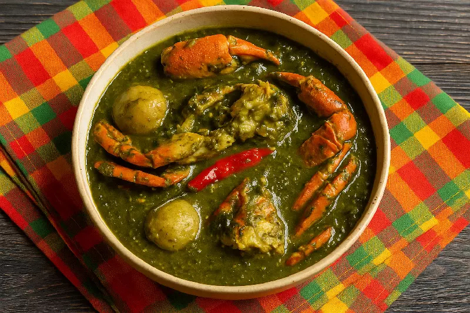

# Callaloo Dominica

*Dominica's velvet green soup: dasheen (taro) leaves simmered down with okra, crabmeat, coconut milk and thyme until silky and dark, finished with a sweep of lime and a dab of butter.*

**Serves:** 4

**Prep Time:** 20 minutes

**Cook Time:** 35 minutes

## Overview
Callaloo is the Dominican Sunday soup, the dark green velvet bowl that uses the broad heart-shaped leaves of the dasheen plant (the taro Colocasia esculenta) cooked down until they break completely and turn into a thick silky liquid. The Dominican version is rich: a base of sweated onion, garlic and thyme; the chopped callaloo leaves piled high; okra added for the second thickening; cubes of fresh crabmeat (or whole small blue crabs) for the seafood depth; coconut milk poured in at the end for the island richness. The soup is simmered long enough for the leaves to dissolve into the broth (about 30 minutes), then puréed lightly with a stick blender to the velvet texture that defines a proper callaloo. Eat with hot bread on the side. The Trinidadian version puts spinning crabs in the bowl; the Jamaican version uses amaranth leaves and goes much drier. The Dominican version stays soupy, silky, and unmistakably coconut-laced.

## Ingredients

### The base
- 2 tbsp coconut oil (or vegetable oil)
- 1 large onion, chopped
- 4 garlic cloves, crushed
- 2 spring onions, sliced
- 4 sprigs fresh thyme

### The greens
- 500 g dasheen (taro) leaves, washed and roughly chopped (or 400 g of spinach + 100 g of swiss chard as the temperate-climate stand-in)
- 200 g okra, sliced thinly
- 1 litre water or light chicken stock
- 1 whole scotch bonnet (pierced)
- 1 tsp salt
- 1/2 tsp black pepper

### The crab
- 300 g fresh cooked crabmeat (white and brown), picked
- (Or 2 small whole blue crabs, washed, broken in halves)

### The finish
- 200 ml coconut milk
- 1 tbsp butter
- 1 tbsp fresh lime juice
- Black pepper to taste

## Method

### Stage 1 - The base
1. Heat the oil in a heavy pot over medium heat.
2. Add the onion and garlic; cook 5 minutes until soft.
3. Add the spring onions and thyme; cook 1 minute more.

### Stage 2 - The greens
1. Pile the chopped dasheen leaves into the pot; they will look enormous.
2. Pour over the stock or water.
3. Add the okra, the pierced scotch bonnet, the salt and the black pepper.
4. Bring to a boil; reduce to a steady simmer.
5. Cook uncovered 25-30 minutes; the leaves will collapse and the okra will release its body.
6. Stir occasionally and break up any large leaf pieces with the spoon.

### Stage 3 - Velvet the soup
1. Lift out the scotch bonnet.
2. Use a stick blender to pulse the soup to a velvet texture (or pulse half and leave half textured).
3. The soup should be thick, dark green, glossy.

### Stage 4 - The crab and coconut
1. Stir in the crabmeat (or the whole crab pieces).
2. Pour in the coconut milk; warm through 4-5 minutes (don't boil hard).
3. Stir in the butter and the lime juice.
4. Taste for salt and pepper.

### Stage 5 - Serve
1. Ladle into deep bowls.
2. A dusting of black pepper.
3. A wedge of lime on the rim.

## Notes
- **The dasheen leaves:** the right plant is taro (Colocasia esculenta). The leaves contain calcium oxalate; cooking for 25+ minutes breaks the irritant compounds down. Don't undercook.
- **Wear gloves to prep:** raw taro leaf sap can irritate the skin. Wash hands well after chopping.
- **Substitutes:** outside the Caribbean, a mix of spinach and chard works; the colour is brighter and the flavour milder than true callaloo.
- **The okra ratio:** okra adds the silky body. Don't skip it. Slice thin so it dissolves.
- **The coconut at the end:** boiling coconut milk splits it. Warm through, no more.

## Variations
**With salt pig tail:** simmer 200 g of soaked salt pig tail in the broth for 30 minutes before the greens go in.
**With smoked herring:** flake 100 g of smoked herring into the soup with the crab for a smoky-fish depth.
**With shrimp:** swap or add 200 g of peeled raw shrimp in the last 4 minutes of simmer.
**Vegan:** leave out the crab; use light vegetable stock; the coconut milk carries it.
**Drier (not soup):** halve the stock for a thicker callaloo to serve as a side dish.

## Serving
Serve very hot in deep bowls with a wedge of lime · with crusty bread or bakes for dipping · alongside a plate of fried fish · as the Dominican Sunday starter or light lunch · with hot pepper sauce on the table.

## Storage
- The soup keeps 3 days refrigerated; the flavour deepens overnight.
- Reheat gently; don't boil hard or the coconut splits.
- Freeze the soup base (before the crab and coconut go in) for 2 months; add the crab and coconut fresh when reheating.
- The colour fades a little on the second day, the taste does not.
</content>
</invoke>
