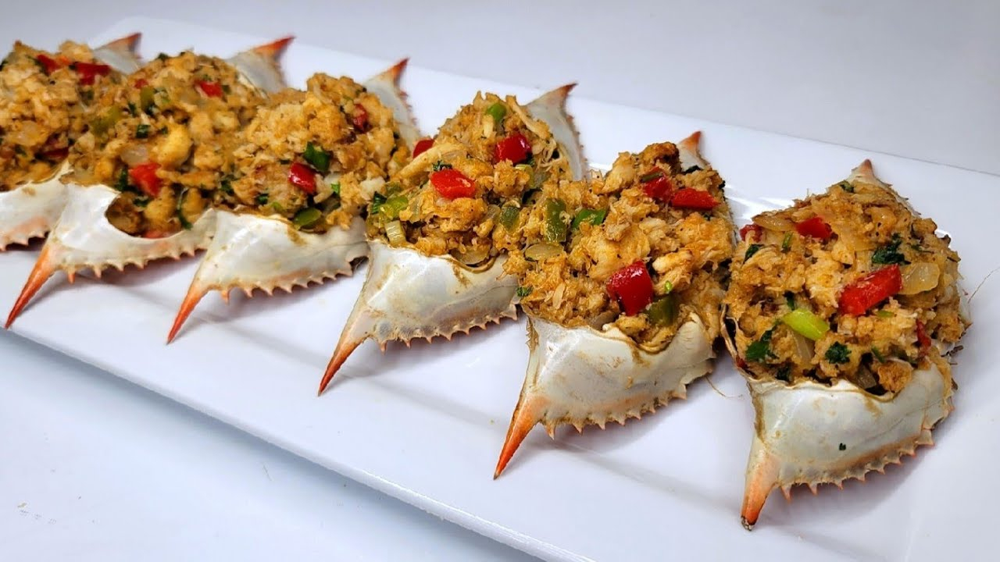

# Crab Back

*Dominica's stuffed-crab plate: the meat of the giant land crab pulled, mixed with fried onion, breadcrumb, thyme and butter, packed back into the cleaned shell and baked till golden.*

**Serves:** 4 (one crab per person)

**Prep Time:** 30 minutes

**Cook Time:** 25 minutes

## Overview
Crab back is the Dominican land-crab dish, the celebration plate served on a fresh holiday and at family gatherings. The crab is the black land crab Gecarcinus ruricola, walked out from under the buttress roots after the August rains and boiled live, the white claw meat and the brown body meat carefully pulled, the empty back shell scrubbed clean and saved. The pulled meat is mixed with sweated onion and garlic, fresh thyme, fine breadcrumb, a knob of butter, a hit of scotch bonnet, a squeeze of lime; the mixture is packed back into the cleaned shell with a final dusting of breadcrumb and a dab of butter, then baked or grilled till golden on top. The result is a small hot bowl of seasoned crab eaten with a small spoon straight from the shell. Eat with bakes or with a chunk of breadfruit. Outside the Caribbean, the dish works beautifully with steamed brown-crab or large mud-crab using the same technique.

## Ingredients

### The crabs
- 4 large boiled crabs (land crab if you can; brown crab works), with back shells saved
- 400 g pulled mixed crab meat (white and brown)

### The seasoned stuffing
- 30 g butter
- 1 small onion, finely chopped
- 3 garlic cloves, crushed
- 1 spring onion, finely chopped
- 4 sprigs fresh thyme, leaves only
- 1/4 scotch bonnet, deseeded and finely chopped
- 1 tbsp fresh parsley, chopped
- 1 tbsp fresh lime juice
- 60 g fine fresh white breadcrumbs
- 1/2 tsp paprika
- 1/4 tsp ground allspice
- Black pepper to taste
- Salt only if needed (the crab is naturally salty)

### To top
- 30 g fine breadcrumbs
- 20 g butter, in small dabs
- A dusting of paprika

### To serve
- Wedges of lime
- Hot sauce

## Method

### Stage 1 - Prepare the shells
1. Scrub the empty back shells thoroughly inside and out.
2. Boil them in water with a splash of lime juice for 5 minutes to sterilise.
3. Drain and set aside upside down to dry.

### Stage 2 - The stuffing
1. Pick through the pulled crab meat; remove any shell or cartilage.
2. Melt the 30 g butter in a small pan over medium heat.
3. Add the onion, garlic, spring onion, thyme and scotch bonnet.
4. Sweat 5 minutes until soft and fragrant; do not brown.
5. Remove from heat; let cool 3 minutes.
6. Tip into a bowl; add the crab meat, parsley, lime juice, breadcrumbs, paprika, allspice and black pepper.
7. Mix gently with a fork; do not crush the meat.
8. Taste before salting (the crab is naturally salty).

### Stage 3 - Fill and top
1. Heat the oven to 200 C.
2. Pack the stuffing into the four prepared crab shells; mound it slightly.
3. Scatter the topping breadcrumbs.
4. Dot the butter dabs across the tops.
5. Dust each shell with a little paprika.

### Stage 4 - Bake
1. Arrange the filled shells on a baking tray.
2. Bake 12-15 minutes until the tops are golden and bubbling.
3. If the tops haven't browned, finish under a hot grill for 2 minutes.

### Stage 5 - Serve
1. Lift the hot shells onto plates.
2. Lime wedges and hot sauce on the side.
3. Eat with a small spoon straight from the shell.

## Notes
- **The crab meat ratio:** the traditional Dominican mix is roughly 2 parts white claw meat to 1 part brown body meat. The brown gives the depth; the white gives the bite.
- **Don't oversalt:** crab meat carries salt from the boiling water. Always taste first.
- **The shells:** keep the shells when you boil crabs through the year, you can freeze them clean for later.
- **Brown crab alternative:** outside the Caribbean, the dressed crabs sold in fishmonger shops work very well.
- **Breadcrumb amount:** 60 g for the body, 30 g for the top. Less for a wetter stuffing; more for a firmer one.

## Variations
- **With coconut:** stir 2 tbsp of grated fresh coconut into the stuffing for a slightly sweet variant.
- **With sherry:** add 1 tbsp of dry sherry to the sweat for an old-Creole grand-house version.
- **Spicier:** use a whole half scotch bonnet for a hotter stuffing.
- **With cheese top:** sprinkle 30 g of grated parmesan over the breadcrumbs before baking.
- **With curry note:** add 1/4 tsp of Caribbean curry powder to the sweat.

## Serving
- Serve hot from the oven with a wedge of lime on the rim · with bakes for dipping into the buttery stuffing · with cold mauby or sorrel · as a Dominican first course at a holiday table · alongside crisp green salad · with hot pepper sauce on the table.

## Storage
- The filled raw shells keep 24 hours refrigerated before baking; useful for prep-ahead.
- Baked crab back keeps 2 days refrigerated; reheat covered in a 180 C oven for 10 minutes.
- Don't freeze cooked crab back; the texture suffers.
- The cleaned empty shells freeze well; wrap and store up to 6 months for later use.
</content>
</invoke>
