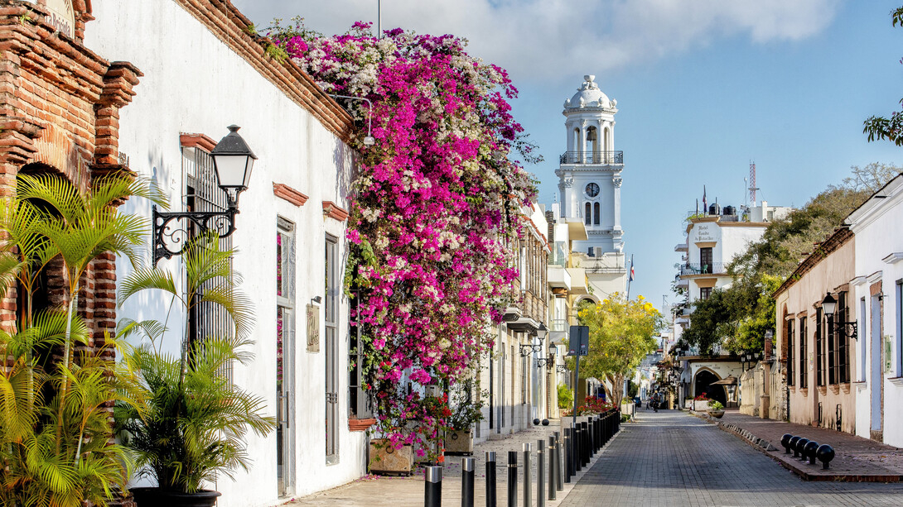

# Dominican Cuisine (Dominica)

Dominica is the rainforest island, the largest stretch of unbroken Caribbean wilderness, and its cooking reflects the volcanic interior: provision grounds carved into the mountainsides, rivers full of crayfish, and the original Carib (Kalinago) presence that gave the Caribbean its cassava bread and its taste for crapaud. The food is rooted in three threads. The Kalinago thread is the oldest: cassava bread baked on a flat stone, fish wrapped in heliconia leaves, the smoked-and-peppered preparations that survive in the boucan. The African-Creole thread is the everyday: the long-simmered sancoche pot, the stewed pelau with browned-sugar caramel, the crab back stuffed and roasted, the callaloo soup laced with coconut milk. The third thread is the mountain-chicken thread, the famous frog-leg dish made from the giant native crapaud that was once Dominica's national dish; the species is now critically endangered and protected, so the recipe survives in chicken form, the same creole tomato-pepper stewing technique applied to a chicken leg in place of the frog. Around these sit Dominica's other markers: the provision boil-up of dasheen and yam and breadfruit and green plantain; the smoked herring opened into a roll with bakes for breakfast; the coconut tart and the banane peze for sweet; and the bois bandé bark steeped with spice as the island's strange, famous tonic.
</content>
</invoke>