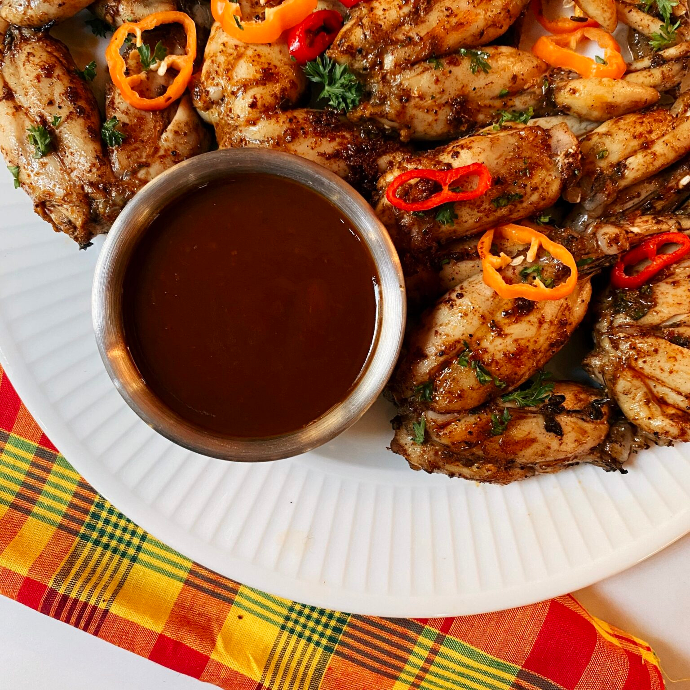

# Mountain Chicken Style

*Dominica's famous frog-leg dish rebuilt with chicken to protect the crapaud: bone-in chicken thighs stewed in the creole tomato-pepper-thyme sauce that defines the island's most identifiable plate.*

**Serves:** 4

**Prep Time:** 20 minutes (plus 1 hour marination)

**Cook Time:** 45 minutes

## Overview
Mountain chicken is the historical national dish of Dominica, the name given to the giant native crapaud (the mountain frog Leptodactylus fallax) whose meaty hind legs were stewed in a creole tomato-pepper sauce and served as the proud island plate. The crapaud is now critically endangered and protected, hunting is illegal, and so the dish survives in spirit through this chicken version: the same creole stewing technique applied to bone-in chicken pieces. The seasoning is the giveaway: a green seasoning rub of garlic, thyme, scotch bonnet, lime and chive worked deep into the meat for an hour; then a tomato-onion sauce browned in oil, the chicken added back, and the lot simmered until the gravy is thick and dark. The dish is plated with a piece of breadfruit or yam on the side and eaten with hot sauce and lime. It is Dominica's recipe for a special meal, the family Sunday cooked with reverence for what the dish used to be.

## Ingredients

### The chicken
- 600 g bone-in chicken thighs (skin on)
- 600 g bone-in chicken drumsticks (skin on)
- 1 tbsp fresh lime juice
- 1 tsp salt

### The green seasoning rub
- 6 garlic cloves, crushed
- 6 sprigs fresh thyme, leaves only
- 1 small bunch chives (or 4 spring onions), chopped
- 1 scotch bonnet, deseeded and chopped (use a quarter for milder)
- 1 tbsp fresh parsley, chopped
- 1 tsp black pepper
- 2 tbsp fresh lime juice
- 2 tbsp vegetable oil

### The creole sauce
- 3 tbsp vegetable oil
- 2 medium onions, sliced
- 1 green pepper, sliced
- 1 red pepper, sliced
- 4 medium tomatoes, chopped (or 1 tin of chopped tomatoes)
- 2 tbsp tomato paste
- 2 spring onions, sliced
- 4 sprigs fresh thyme
- 2 bay leaves
- 1 tsp paprika
- 1/2 tsp ground allspice
- 500 ml chicken stock or water
- 1 whole scotch bonnet (pierced, for perfume)
- Salt to taste

### To finish
- A handful of fresh parsley, chopped
- Wedges of lime

## Method

### Stage 1 - Wash and season
1. Rinse the chicken in cold water with the lime juice; pat dry.
2. Season all over with the salt.
3. Pulse the green seasoning ingredients to a coarse paste (mortar and pestle works well).
4. Rub the paste deep into the chicken, under the skin where you can.
5. Cover and rest at least 1 hour (overnight in the fridge is better).

### Stage 2 - Brown the chicken
1. Heat the oil in a heavy pot over medium-high heat.
2. Brown the chicken pieces in batches, 3-4 minutes a side, skin-side first.
3. Lift out and set aside.

### Stage 3 - The creole base
1. Reduce the heat to medium.
2. Add the onions, green pepper and red pepper to the same pot; cook 6-8 minutes until softened.
3. Stir in the tomatoes, tomato paste, spring onions, thyme, bay leaves, paprika and allspice.
4. Cook 5 minutes until the tomato has broken down into a rough sauce.

### Stage 4 - The simmer
1. Return the chicken to the pot, nestling the pieces into the sauce.
2. Pour over the stock; add the pierced whole scotch bonnet.
3. Bring to a boil; reduce to a steady simmer.
4. Cover loosely; cook 30-35 minutes until the chicken is tender and the sauce has thickened and darkened.
5. Lift out the bonnet and the bay leaves.
6. Taste for salt.

### Stage 5 - Serve
1. Scatter the parsley.
2. Plate the chicken with plenty of sauce spooned over.
3. Lime wedges on the side.

## Notes
- **The green seasoning:** the heart of all Dominican cooking. The hour-long marination is what gives the dish its depth. Don't skip it.
- **Skin-on, bone-in:** the bones and skin enrich the sauce. Skinless boneless cuts dry out.
- **The pierced bonnet:** pierce and leave whole for perfume only. If you want fire, burst it during the simmer with a wooden spoon.
- **Sauce reduction:** the finished gravy should coat the back of a spoon. Cook uncovered for the last 10 minutes if it's still loose.
- **The crapaud connection:** the dish is a tribute. The crapaud is protected. Never substitute the real thing, the species cannot afford it.

## Variations
- **With red wine:** add 100 ml of red wine to the sauce base, the festive version.
- **With curry:** add 1 tbsp of Caribbean curry powder to the creole base for the curried-mountain-chicken cross-over.
- **With coconut milk:** stir 150 ml of coconut milk into the sauce in the last 10 minutes, the richer plate.
- **Drier braise (less sauce):** reduce the stock to 300 ml for a thicker gravy.
- **With dumplings:** drop small flour dumplings into the simmering sauce in the last 15 minutes for a one-pot family meal.

## Serving
- Serve with a chunk of boiled breadfruit or yam or green fig on the side · with rice and peas · with provision boil-up · with crapaud-style dumplings simmered in the sauce · with hot sauce on the table · as the Dominican Sunday lunch · with a glass of cold sorrel or mauby.

## Storage
- The stew keeps 3 days refrigerated; the gravy improves overnight as the spices settle.
- Freeze the cooled stew for 2 months; thaw overnight before reheating.
- Reheat gently with a splash of water to loosen the gravy.
- Don't reheat more than once; the chicken texture suffers.
</content>
</invoke>
