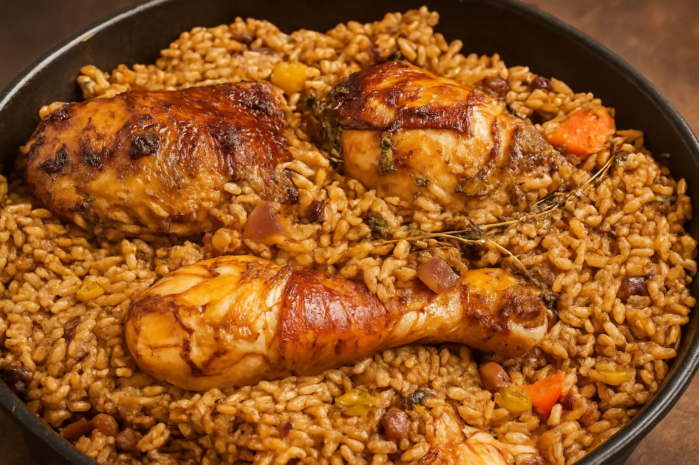

# Pelau (Dominica)

*Dominica's one-pot Sunday rice: brown sugar caramelised dark in a heavy pot, chicken pieces seared in the caramel, then rice and pigeon peas and coconut milk thrown in and cooked till the pot dries down into glossy, sticky grains.*

**Serves:** 6

**Prep Time:** 20 minutes (plus 1 hour marination)

**Cook Time:** 45 minutes

## Overview
Pelau is the great Caribbean one-pot rice dish, found across the southern islands and cooked with regional differences from Trinidad to Grenada to Dominica. The Dominican version follows the standard creole template with island detail: bone-in chicken pieces marinated with green seasoning (garlic, thyme, scotch bonnet, lime); brown sugar caramelised in oil until it foams dark mahogany; the chicken seared in that caramel until each piece is glazed; rice and pigeon peas stirred through; coconut milk and stock poured in; the whole pot covered and steamed down until the rice is dry, glossy, and the bottom is the slightly catched bun-bun every Dominican cook prizes. The pigeon peas (also called gungo peas) carry the African inheritance; the browned sugar gives the colour; the coconut milk gives the Dominican signature. Eat with a slice of avocado and a wedge of lime. This is the Dominican Sunday lunch when the family comes to eat.

## Ingredients

### The chicken
- 1 kg bone-in chicken pieces (thighs and drumsticks)
- 1 tbsp fresh lime juice
- 1 tsp salt

### The green seasoning
- 6 garlic cloves, crushed
- 6 sprigs fresh thyme, leaves only
- 4 spring onions, chopped
- 1 small bunch chives or chadon beni, chopped
- 1/2 scotch bonnet, deseeded and chopped
- 1 tsp black pepper
- 2 tbsp vegetable oil

### The caramel base
- 3 tbsp vegetable oil
- 3 tbsp dark brown sugar (muscovado works)

### The rice
- 1 large onion, chopped
- 3 garlic cloves, crushed
- 1 medium carrot, diced
- 1 red pepper, diced
- 400 g long-grain rice, rinsed
- 250 g cooked or tinned pigeon peas, drained
- 400 ml coconut milk
- 400 ml chicken stock or water
- 4 sprigs fresh thyme
- 2 bay leaves
- 1 whole scotch bonnet (pierced)
- 1 tsp salt
- 1/2 tsp ground allspice

### To finish
- A handful of fresh parsley, chopped
- Slices of ripe avocado
- Wedges of lime

## Method

### Stage 1 - Marinate the chicken
1. Rinse the chicken with the lime juice; pat dry.
2. Season with the salt.
3. Pulse the green seasoning ingredients to a coarse paste.
4. Rub the paste into the chicken; rest at least 1 hour (overnight is better).

### Stage 2 - The caramel
1. Heat the 3 tbsp of oil in a heavy pot (cast iron or thick aluminium) over medium-high heat.
2. Sprinkle the brown sugar evenly into the hot oil.
3. Do not stir for the first 30 seconds.
4. The sugar will melt, foam, then darken; let it go to a deep mahogany (about 2 minutes total).
5. The foam stage is when the sugar is ready; do not let it burn black.

### Stage 3 - Sear the chicken
1. Working quickly, add the marinated chicken pieces to the caramel.
2. Stir to coat each piece in the dark glaze.
3. Cook 5-6 minutes; the chicken will pick up the colour.

### Stage 4 - Build the pot
1. Add the onion, garlic, carrot and red pepper; stir 3 minutes.
2. Add the rinsed rice, the drained pigeon peas, the thyme, the bay leaves and the allspice.
3. Stir for 1 minute to coat the rice in the seasoned oil.
4. Pour in the coconut milk and the stock.
5. Add the pierced scotch bonnet.
6. Add the salt; stir once.

### Stage 5 - Steam down
1. Bring to a rolling boil.
2. Reduce to the lowest steady simmer.
3. Cover the pot tightly with a lid (a clean tea towel under the lid catches steam).
4. Cook 22-25 minutes; do not lift the lid.
5. When the time is up, lift the lid; the rice should be dry, the chicken cooked through.

### Stage 6 - Rest and serve
1. Lift out the scotch bonnet and the bay leaves.
2. Fluff the rice gently with a fork.
3. Cover again; rest off the heat for 5 minutes.
4. Scatter the parsley.
5. Plate with slices of avocado and a wedge of lime.

## Notes
- **The caramel stage:** the heart of pelau. The sugar must go dark mahogany before the chicken hits; this is what gives the dish its colour and the slight bitter-sweet edge that defines a proper pelau. If the sugar burns to black, start over.
- **The pot:** heavy-bottomed is essential. A thin pan scorches the rice.
- **The bun-bun:** the catched layer at the bottom of the pot is prized in the Caribbean. Don't scrape it off; let it crisp and serve it broken into the rice.
- **Don't lift the lid:** the steam is what cooks the rice. Trust the timer.
- **The pigeon peas:** dried pigeon peas need to be cooked first (40 minutes simmer). Tinned is the everyday shortcut.

## Variations
**With salt beef:** add 200 g of soaked salt beef alongside the chicken for a richer one-pot.
**With pork:** swap the chicken for cubed pork shoulder; cook the same way.
**Vegetarian:** leave out the chicken; double the pigeon peas; use vegetable stock; add 200 g of cubed pumpkin for body.
**With raisins:** stir 60 g of raisins through with the rice for the Christmas variant.
**Spicier:** burst the scotch bonnet with a wooden spoon during the steam-down.

## Serving
Serve hot in a wide bowl with a slice of ripe avocado on the side · with a wedge of lime · with a small green salad · with hot pepper sauce on the table · as the Dominican Sunday lunch · with a glass of cold sorrel or mauby.

## Storage
- The pelau keeps 3 days refrigerated; the flavour deepens overnight.
- Reheat covered in a pan with a tablespoon of water to revive the steam.
- Freeze the cooled pelau for 2 months in flat portions.
- The avocado and lime are always added fresh, never stored together with the rice.
</content>
</invoke>
