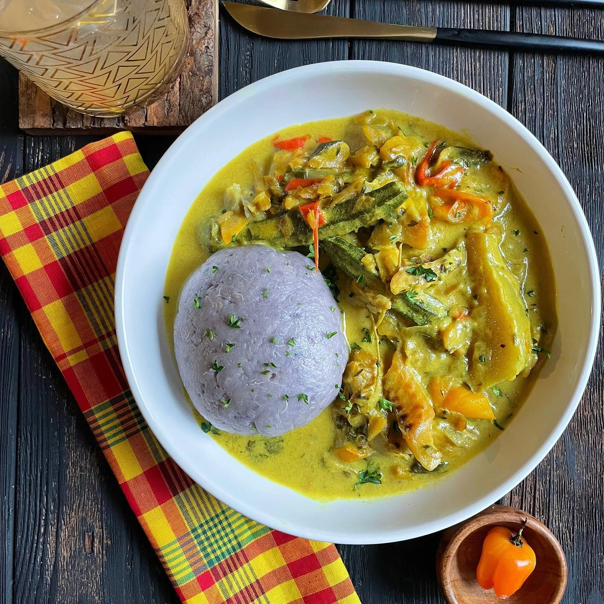

# Sancoche (Dominica)

*Dominica's great Saturday one-pot: salt beef and fresh beef simmered with carrot, breadfruit, yam, green plantain and flour dumplings in a long, slow coconut-and-thyme broth.*

**Serves:** 6

**Prep Time:** 30 minutes (plus overnight soaking for the salt beef)

**Cook Time:** 2 hours

## Overview
Sancoche is the Dominican Saturday stew, the great cleaning-out-the-garden one-pot in which everything that grows on the provision ground goes into the same broth with salt beef and fresh beef and flour dumplings. The salt beef must be soaked overnight to draw out the cure, then simmered first to build the salted-meat depth of the broth. Next in goes the fresh beef, the carrot, the breadfruit, the yam, the green plantain, the dasheen, and a fat sprig of thyme; the dumplings (small spoonfuls of flour-and-water dough) drop in the last twenty minutes and swell into pillowy mouthfuls. The pot simmers a long time, the provision starches thicken the broth, the coconut milk goes in at the end for the Dominican richness. Eat with a wedge of lime and bread on the side. This is the everyday Saturday lunch that turns a kitchen into a family gathering.

## Ingredients

### The meats
- 300 g salt beef (corned beef cut, or salted brisket), cubed
- 500 g beef stewing cuts (chuck or shin), cubed
- 2 tbsp vegetable oil

### The base
- 1 large onion, chopped
- 4 garlic cloves, crushed
- 2 spring onions, sliced
- 2 medium tomatoes, chopped
- 4 sprigs fresh thyme
- 2 bay leaves
- 1 tsp black pepper
- 1 scotch bonnet, whole and pierced
- 2 litres water

### The provision
- 1 medium carrot, in chunks
- 400 g breadfruit, peeled and cubed
- 300 g yellow yam or white yam, peeled and cubed
- 1 medium dasheen (taro), peeled and cubed (about 250 g)
- 2 green plantains, peeled and cut in chunks

### The dumplings
- 200 g plain flour
- 1/2 tsp salt
- About 90 ml water

### The finish
- 200 ml coconut milk
- A handful of fresh parsley, chopped
- A wedge of lime per bowl

## Method

### Stage 1 - Soak the salt beef
1. Soak the cubed salt beef in plenty of cold water overnight (or at least 4-6 hours), changing the water twice.
2. Drain and rinse well.

### Stage 2 - The broth
1. Heat the oil in a large heavy pot over medium heat.
2. Add the onion and garlic; cook 5 minutes until softened.
3. Add both meats; stir for 5 minutes to coat in the oil.
4. Pour in the 2 litres of water.
5. Add the spring onions, tomatoes, thyme, bay leaves, black pepper and the whole pierced scotch bonnet.
6. Bring to a boil; skim the scum.
7. Reduce to a low simmer and cook 1 hour, uncovered, until the meats are tender.

### Stage 3 - The provision
1. Add the carrot, breadfruit, yam, dasheen and green plantain to the pot.
2. Simmer 25-30 minutes until the provision is tender and the broth has thickened slightly from the released starches.

### Stage 4 - The dumplings
1. While the provision cooks, mix the flour, salt and water into a firm dough.
2. Knead briefly; rest 10 minutes.
3. Pinch off small almond-shaped dumplings (about 2 cm long).
4. Drop them into the simmering pot for the last 15 minutes.
5. Do not stir aggressively; the dumplings cook through and rise.

### Stage 5 - Finish
1. Stir in the coconut milk; warm through 3-4 minutes (don't let it boil hard).
2. Lift out the scotch bonnet and bay leaves.
3. Taste; the salt beef should have seasoned the broth, so you may not need extra salt.
4. Scatter the parsley.
5. Ladle into deep bowls with a wedge of lime on the rim.

## Notes
- **Soak the salt beef:** the overnight soak is not optional. Salt-cured beef without soaking will make the broth uneatable.
- **The provision order:** add the dasheen and yam last, they cook quickly. Older breadfruit takes longer.
- **The dumplings:** keep them small. Big dumplings sit heavy in the bowl. Pinch into thin almond shapes.
- **The coconut milk:** add at the end and only warm through. Boiling hard splits the coconut.
- **The whole scotch bonnet:** pierce and leave whole for perfume only; burst it for fire.

## Variations
- **With salt pig tail:** swap or add 200 g of salt pig tail (soaked) for a richer pork-and-beef Sunday version.
- **With pumpkin:** add 200 g of cubed pumpkin in the last 20 minutes, the soft-sweet variant.
- **With callaloo leaves:** stir 200 g of shredded callaloo into the pot for the last 5 minutes, the green-laced version.
- **Lighter (no coconut):** leave the coconut milk out for a clearer broth.
- **Chicken sancoche:** swap the beef for bone-in chicken; reduce cook time to 45 minutes.

## Serving
- Serve very hot in deep bowls with a wedge of lime on the rim · with crusty bread or Dominican bakes for dipping · with hot sauce on the table · as the Dominican Saturday lunch · with a glass of cold mauby or sorrel.

## Storage
- The stew keeps 3 days refrigerated; the broth thickens further as the starches set.
- Reheat with a splash of water to loosen.
- Freeze the meat-and-broth base for 2 months; cook fresh provision and dumplings when reheating.
- The dumplings get a little firmer overnight, still good but best on the day.
</content>
</invoke>
