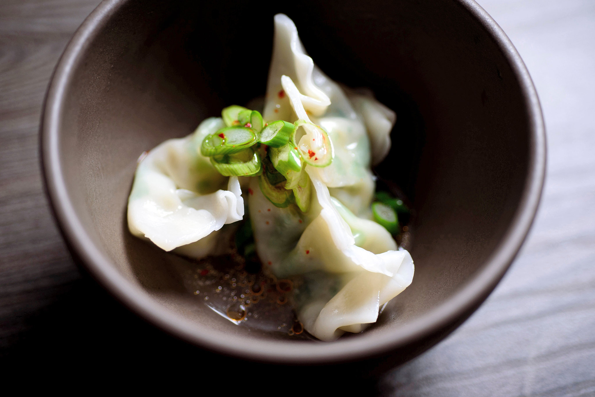

# Crapaud-Style Dumplings

*The small almond-shaped flour dumplings the Dominicans drop into a stew pot: a quick flour-and-water dough rolled in the palm and simmered straight in the gravy until soft and pillowy.*

**Serves:** 6 as a side (about 30 dumplings)

**Prep Time:** 10 minutes

**Cook Time:** 15 minutes

## Overview
These are the small dumplings every Dominican stew pot gets in the last twenty minutes: a quick lean dough of flour, salt and water (no leavener) rolled by hand into long thin almond shapes and dropped straight into the simmering gravy of sancoche, fish broth, or stewed chicken. They are called crapaud-style because the shape resembles a small frog's leg, the silhouette of the mountain crapaud that gave Dominican cooking its most famous dish; the dumplings are made the same shape as a small homage. The technique is the same across the southern Caribbean: cold water in, knead briefly, rest 10 minutes, pinch and roll, drop into the pot. The dumplings absorb a little of the broth flavour as they cook and thicken the gravy with their released starch. Don't make them too big; small dumplings cook through properly and sit lightly in the bowl alongside everything else.

## Ingredients

- 300 g plain flour
- 1 tsp salt
- About 150 ml cold water

### To cook
- A simmering pot of stew broth (sancoche, fish broth, stewed chicken gravy, callaloo)
- Or, as a stand-alone test pot:
  - 1 litre water
  - 1 tsp salt
  - 1 sprig fresh thyme

## Method

### Stage 1 - The dough
1. Tip the flour into a wide bowl with the salt.
2. Add half the water; mix with a wooden spoon.
3. Add the rest of the water bit by bit until the dough just comes together into a firm, not sticky, ball.
4. Turn out onto a clean surface; knead 2 minutes only to a smooth firm dough.
5. Cover with a damp cloth; rest 10 minutes.

### Stage 2 - Shape
1. Pinch off pieces about the size of a walnut.
2. Roll each piece between the palms into a thin almond shape about 5 cm long and 1.5 cm thick.
3. Lay them on a lightly floured tray as you go.
4. Repeat until all the dough is used (about 30 dumplings).

### Stage 3 - Cook in the stew pot
1. Wait until the stew gravy is at a gentle simmer with everything else cooked tender.
2. Drop the dumplings one by one into the pot, spacing them out.
3. Don't stir aggressively (the dumplings can break apart).
4. Cover loosely; simmer 12-15 minutes until the dumplings are firm and cooked through.
5. They will rise to the surface as they cook.
6. Cut one open to test; the inside should be soft, not raw.

### Stage 4 - (Stand-alone version)
1. Bring 1 litre of salted water with the thyme to a gentle boil.
2. Drop the dumplings in; simmer 12 minutes.
3. Lift out with a slotted spoon; toss with butter or stew gravy to serve.

## Notes
- **The dough:** must be firm. A soft, sticky dough produces dumplings that fall apart in the pot.
- **The size:** small is the rule. Too big and the middle stays raw while the outside dissolves into the broth.
- **The shape:** the almond shape (rolled between the palms) is the Dominican signature; a tight oval finger-roll. Avoid round balls (they cook unevenly).
- **The pot:** simmer, never boil hard. A vigorous boil breaks the dumplings up.
- **The starch thickening:** the dumplings will release a little starch into the broth, which is the desired thickening for a Dominican stew.

## Variations
**With cornmeal (Dominican variant):** swap 100 g of the flour for fine cornmeal for a slightly grainy bite.
**Spinners (the thin twisted version):** roll into long thin twists about 8 cm long for the Jamaican-style spinner alternative.
**With grated coconut:** knead 30 g of dried grated coconut into the dough for a coconut-laced dumpling.
**With dasheen:** replace 100 g of flour with 100 g of mashed cooked dasheen for the heritage Carib variant.
**Sweet dumplings (for sweet bean soup):** add 2 tbsp of sugar and 1/4 tsp of nutmeg to the dough.

## Serving
Serve in the pot they were cooked in, dropped straight into sancoche · into callaloo · into stewed beef gravy · into fish broth · as part of the Saturday one-pot · ladled into deep bowls with plenty of broth.

## Storage
- Best eaten the day they're cooked.
- Leftover dumplings keep 2 days refrigerated in the broth; reheat gently with a splash of water.
- Don't freeze cooked dumplings (the texture goes pasty).
- Uncooked rolled dumplings can be laid on a floured tray and chilled for up to 4 hours before cooking.
</content>
</invoke>