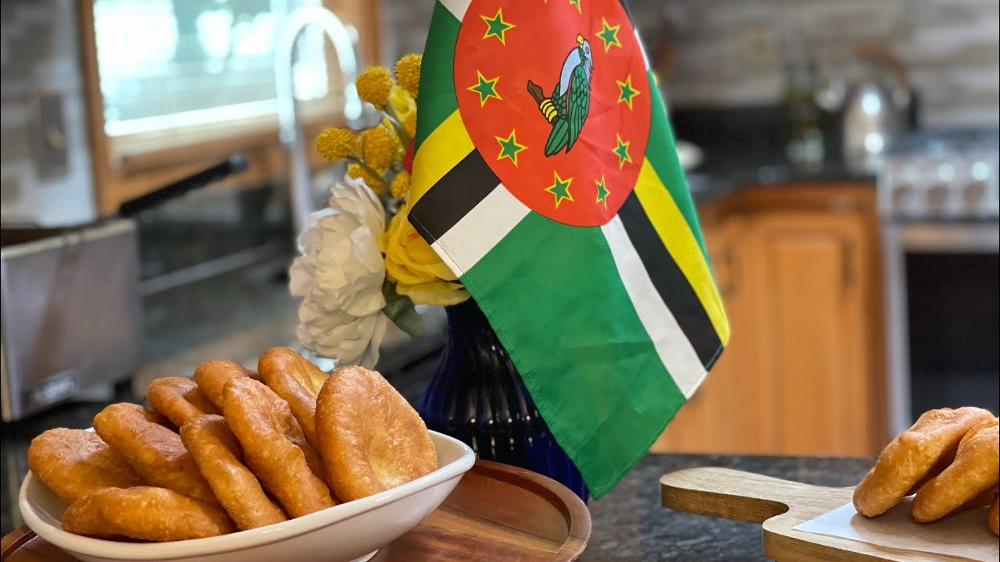

# Dominica Bakes

*Dominica's morning side: rounds of soft flour-and-baking-powder dough fried in shallow oil until they puff golden, eaten warm with smoked herring, saltfish or sancoche.*

**Serves:** 8 bakes

**Prep Time:** 15 minutes (plus 20 minutes rest)

**Cook Time:** 20 minutes

## Overview
Bakes are the Caribbean breakfast bread, the small fried rounds of soft flour dough that go with everything across the islands and are particularly tied to the Dominican morning. The dough is a quick mix of plain flour, baking powder, salt, a knob of butter or shortening, a little sugar and enough water to bring it together; a rest of 20 minutes relaxes the gluten so the rounds don't bounce back. Each ball is rolled out to about a centimetre, slipped into shallow hot oil, and fried about 2 minutes a side until puffed golden. The result is crisp on the outside and soft on the inside, big enough to split open and fill with smoked herring sauteed with onion and tomato (the Dominican breakfast standard) or to dip into sancoche or fish broth. Eat hot from the pan. The same dough baked in the oven gives "bake bake" (oven bakes); fried gives the lighter, puffier morning version most Dominicans grew up on.

## Ingredients

- 500 g plain flour
- 1 tbsp baking powder
- 1 tsp salt
- 2 tbsp sugar
- 30 g butter (or vegetable shortening), softened
- 300 ml warm water (approx)
- Vegetable oil for shallow frying (about 500 ml)

## Method

### Stage 1 - The dough
1. Whisk the flour, baking powder, salt and sugar in a large bowl.
2. Rub in the softened butter with your fingertips until it disappears into the flour.
3. Make a well in the centre; pour in 250 ml of the warm water.
4. Mix with a fork, adding more water bit by bit until the dough just comes together.
5. Turn out onto a lightly floured surface; knead 2 minutes only to a soft, slightly tacky dough.
6. Cover with a damp cloth; rest 20 minutes (don't skip this).

### Stage 2 - Shape
1. Divide the rested dough into 8 even balls.
2. Roll each one into a round about 1 cm thick and 10 cm across.
3. Lay them on a floured tray; rest 5 more minutes.

### Stage 3 - Fry
1. Heat the oil in a wide pan to 170 C (a small dough scrap should sizzle on contact and rise within 5 seconds).
2. Slip in 2 or 3 bakes at a time; do not crowd the pan.
3. Fry 2 minutes a side, gently spooning hot oil over the tops to help them puff.
4. Lift onto a plate lined with kitchen paper.
5. Continue with the rest, keeping the cooked bakes warm under a clean cloth.

### Stage 4 - Serve
1. Eat hot, the very moment they come out.
2. Split open and stuff with smoked herring sauté, saltfish, or fried egg.

## Notes
- **The rest:** the 20-minute rest is what gives a tender bake. Skipping it gives a tough chewy round.
- **The oil temperature:** 170 C is the sweet spot. Too hot burns the outside before the middle cooks; too cool gives a greasy heavy bake.
- **Don't overwork:** 2 minutes of kneading is enough. Over-kneaded dough makes dense bakes.
- **Roll evenly:** uneven thickness gives uneven cooking. A wooden rolling pin works best.
- **The puff:** spooning hot oil over the tops while they fry encourages the puff; this is the Dominican cook's trick.

## Variations
- **With coconut milk:** swap half the water for coconut milk for a richer, slightly sweeter bake.
- **With cornmeal:** replace 100 g of the flour with fine cornmeal for a more textured Dominican variant.
- **Sweet bakes (johnny cakes for tea):** double the sugar; add a pinch of cinnamon; serve with butter.
- **Oven bakes:** instead of frying, bake the rounds on a tray at 200 C for 18-20 minutes for a drier, denser version.
- **With nutmeg:** grate fresh nutmeg into the dough for the spice-island variant.

## Serving
- Serve hot from the pan with smoked herring stewed with onion and tomato (the Dominican breakfast classic) · with saltfish buljol · with cheese and avocado · dipped into sancoche or fish broth · split and filled like a small sandwich · with a mug of cocoa tea or strong coffee · at any Dominican breakfast table.

## Storage
- Bakes are best eaten the day they're made; they go a little tough overnight.
- Keep leftovers in a sealed container for 1 day; reheat in a dry pan or low oven (160 C for 5 minutes) to revive.
- Don't refrigerate (the texture suffers).
- The dough can be made the night before and rested in the fridge; bring back to room temperature before rolling.
</content>
</invoke>
