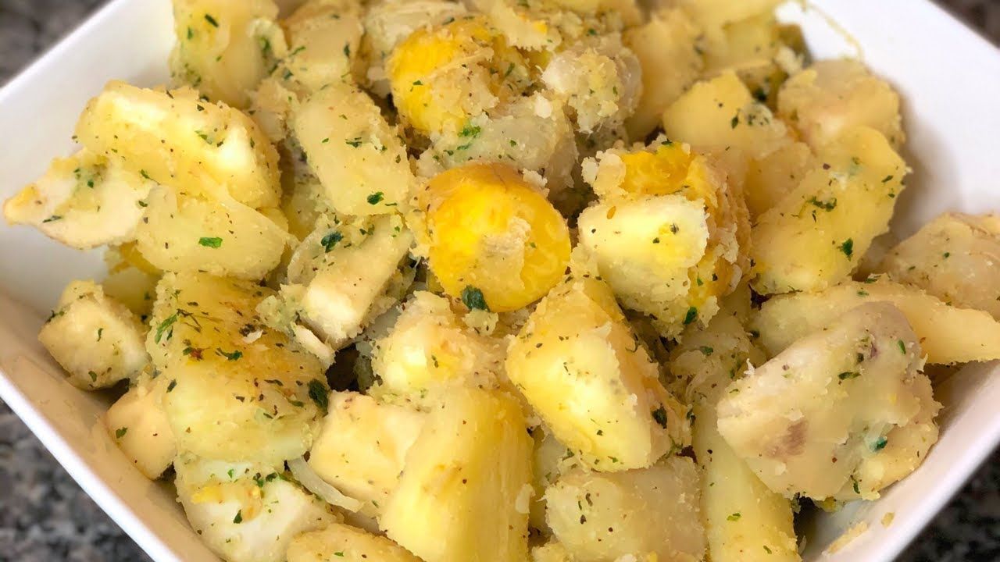

# Provision (Dominica Boil-Up)

*Dominica's everyday starch plate: dasheen, yellow yam, green plantain and breadfruit boiled in salted water and served as the wide, plain bed under any creole stew.*

**Serves:** 6 as a side

**Prep Time:** 20 minutes

**Cook Time:** 30 minutes

## Overview
Provision is the Caribbean word for the ground-grown starches that fed the islands long before rice and bread arrived in volume: dasheen (taro), yellow yam, green plantain, breadfruit, sweet potato, cassava, eddoes and tannia. In Dominica the standard everyday "boil-up" is a wide pot of salted water set on the stove first thing, into which goes whatever provision is fresh from the garden, simmered until the pieces are knife-tender, drained, and piled high on the plate as the bed under stewed chicken, fish broth, or the Saturday sancoche. The trick is staggering the additions: hard yam first, then dasheen, then breadfruit, then green plantain, so everything is done at the same moment. The boiled provision absorbs every drop of gravy poured over it; the slightly creamy yam, the slightly chewy plantain and the slightly sweet breadfruit give the plate texture and weight. This is the most everyday side in Dominica and the most overlooked.

## Ingredients

- 2 litres water
- 1 tbsp salt
- 1 medium dasheen (taro), about 300 g, peeled and cut in 4 cm chunks
- 400 g yellow yam, peeled and cut in 4 cm chunks
- 2 medium green plantains, peeled and cut in 4 cm rounds
- 400 g breadfruit (about a quarter of a breadfruit), peeled, cored and cut in 4 cm wedges
- 1 medium sweet potato, peeled and cut in 4 cm chunks (optional)
- 1 sprig fresh thyme

### To finish
- 1 tbsp coconut oil or butter (optional)
- Black pepper

## Method

### Stage 1 - Prep
1. Peel the provision under cold running water; the cut surfaces oxidise quickly.
2. Drop the peeled pieces into a bowl of cold water as you work.
3. Wear gloves for the dasheen; the raw sap can irritate the skin.

### Stage 2 - The boil
1. Bring the 2 litres of water to a rolling boil in a large pot.
2. Add the salt and the sprig of thyme.
3. Add the yellow yam and the dasheen; cook 12 minutes (these are the longest cooking).
4. Add the breadfruit; cook 8 minutes.
5. Add the green plantain and the sweet potato if using; cook 10 more minutes.
6. Test with the point of a knife; each piece should give easily but hold its shape.

### Stage 3 - Drain and finish
1. Drain the provision into a colander.
2. Tip back into the warm pot.
3. Toss with the coconut oil or butter if using.
4. A grind of black pepper.
5. Serve immediately, piled high on the plate.

## Notes
- **The stagger:** different provision pieces cook at different rates. Yellow yam and dasheen go first, plantain and breadfruit later. Adjust by 2-3 minutes if your pieces are larger or smaller than the recipe.
- **Wear gloves for dasheen:** raw taro sap irritates the skin. Always peel under running water.
- **The salt:** the cooking water must be properly salted, this is the only seasoning. Taste the water; it should be lightly briny.
- **Knife test:** the knife should slide in easily but the chunk should hold its shape. Overcooked provision turns mushy.
- **Provision substitution:** outside the Caribbean, use a mix of what you can find. A starchy plain potato is the closest stand-in for yam.

## Variations
- **With coconut milk:** replace 500 ml of the water with coconut milk for a richer Dominican variant.
- **With salt fish:** drop 200 g of soaked saltfish into the pot for the last 5 minutes; serve the fish on top of the provision.
- **With ackee:** flake 200 g of fresh or tinned ackee over the drained provision for a cross-island plate.
- **With pumpkin:** add 300 g of cubed pumpkin in the last 10 minutes for a sweet-and-soft addition.
- **Steamed not boiled:** steam the provision over salted water for a drier finish (a lighter dinner side).

## Serving
- Serve hot piled on the plate under any creole stew · with stewed chicken or beef gravy ladled over · with saltfish buljol and butter · with smoked herring sauté · as the bed under sancoche dumplings · with hot pepper sauce · as the Dominican everyday lunch side.

## Storage
- Boiled provision keeps 2 days refrigerated; reheat by steaming over hot water (boiling makes it mushy).
- Don't freeze; the texture suffers badly.
- Leftover provision can be mashed with butter into a hash and fried golden the next morning.
- Cooked yam and breadfruit firm up overnight; this is normal.
</content>
</invoke>
