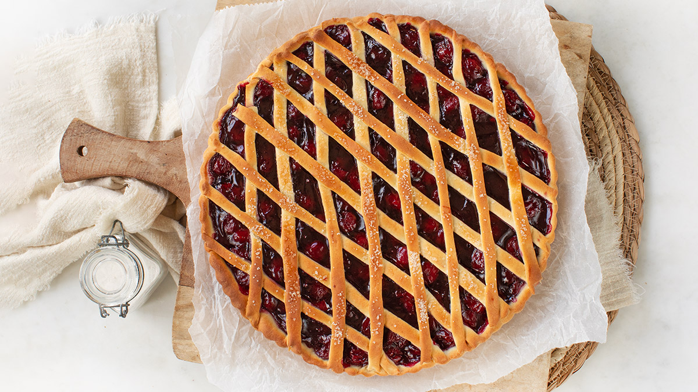

# Limburgse Vlaai (Limburg Fruit Tart)

*Southern Netherlands' signature fruit tart: a wide yeasted-dough base filled with cherries, plums, apricots or rice-cinnamon custard, topped with lattice or crumb, baked till golden.*

**Serves:** 10 (one 30 cm tart)

**Prep Time:** 35 minutes (plus 75 minutes for the dough to rise)

**Cook Time:** 45 minutes

## Overview
Vlaai is the signature regional tart of the Dutch province of Limburg, the southernmost province, bordering Belgium and Germany. Unlike most Dutch desserts, which tend toward the unfussy and Calvinist, the vlaai is celebratory: large, generous, decorative, and present at every Limburg birthday, communion, funeral, wedding, christening or family gathering. The dough is yeasted and bread-like (not the buttery shortcrust of a French tart), rolled thin and pressed into a wide shallow tin; the chewy-crisp character is distinct from any French pastry. The most famous fillings are dark Morello cherry (kersenvlaai, the Limburg classic, thickened with cornflour and flavoured with cinnamon and a touch of almond extract), rice-and-cinnamon custard (rijstevlaai), and stewed plum (pruimenvlaai). Topped with either a lattice of pastry strips or a butter-flour-sugar crumb (kruimelvlaai); some have both. Sold by the slice at every Limburg bakery, baked at home for family events.

## Ingredients

### The yeasted dough
- 400 g plain flour
- 50 g caster sugar
- 1 teaspoon salt
- 7 g instant dry yeast (1 sachet)
- 200 ml whole milk, lukewarm
- 1 large egg
- 80 g unsalted butter, melted and cooled
- 1 teaspoon vanilla extract

### Filling Option 1 - Cherry vlaai (kersenvlaai, the Limburg classic)
- 800 g dark Morello cherries (fresh, pitted; OR 500 g jarred Morello cherries, drained and 200 ml cherry juice reserved)
- 150 g caster sugar (use 100 g if using sweetened jarred cherries)
- 2 tablespoons cornflour
- 1 teaspoon ground cinnamon
- 1/4 teaspoon almond extract
- A squeeze of lemon juice

### Filling Option 2 - Rice vlaai (rijstevlaai, the comfort variant)
- 200 g short-grain pudding rice
- 800 ml whole milk
- 80 g caster sugar
- 1 vanilla pod, split (or 1 teaspoon vanilla extract)
- 1 cinnamon stick
- A pinch of salt
- 2 large egg yolks
- 100 ml double cream

### Topping
**Lattice topping:**
- The trimmings from the yeasted dough, rolled out and cut into strips

**Crumb topping (kruimelvlaai):**
- 120 g plain flour
- 80 g cold unsalted butter, cubed
- 80 g caster sugar
- 1 teaspoon ground cinnamon

### Egg wash
- 1 egg yolk + 1 tablespoon milk

### To serve
- Lightly whipped unsweetened double cream
- A scoop of vanilla ice cream
- A cup of strong coffee or hot chocolate

## Method

### Stage 1 - Make the dough
1. In a large bowl (or stand mixer with dough hook), combine the flour, sugar, salt and yeast.
2. Whisk together.
3. In a jug, whisk the milk, egg and melted butter together with the vanilla.
4. Pour the wet into the dry; mix till a soft dough comes together.
5. Knead 6-8 minutes (or in the mixer on medium 5 minutes) till smooth and elastic.
6. The dough should be soft and slightly tacky.

### Stage 2 - First rise
1. Place the dough in a lightly oiled bowl.
2. Cover with cling film.
3. Let rise at warm room temperature 60-75 minutes till roughly doubled.

### Stage 3 - Make the cherry filling (Option 1)
1. If using fresh cherries: pit them; toss with 150 g sugar and let sit 30 minutes till they release their juice.
2. If using jarred Morello cherries: drain (save 200 ml juice); use 100 g sugar.
3. In a heavy saucepan, combine the cherries (and their juice / reserved jarred juice), cornflour, cinnamon, almond extract and lemon juice.
4. Cook over medium heat 6-8 minutes, stirring, till the mixture thickens to a glossy, scoopable consistency.
5. Take off the heat; cool to room temperature before using.

### Stage 3 alternative - Make the rice filling (Option 2)
1. In a heavy saucepan, combine the rice, milk, sugar, vanilla pod (and seeds), cinnamon stick and salt.
2. Bring to a gentle simmer; cook covered 30-35 minutes, stirring every 5 minutes, till the rice is fully cooked and the mixture is thick and creamy (like a thick rice pudding).
3. Take off the heat; remove the vanilla pod and cinnamon stick.
4. Whisk the egg yolks with the double cream; stir into the rice off the heat (the residual heat cooks the yolks).
5. Cool to room temperature before using.

### Stage 4 - Prepare the tin and dough
1. Heat the oven to 200°C (180°C fan).
2. Butter a 30 cm wide shallow tart tin (or a 28 cm one if 30 cm isn't available).
3. Knock the dough back gently.
4. Take 2/3 of the dough; reserve the other 1/3 for the lattice (or skip if using crumb topping).
5. Roll the 2/3 portion to a circle 35 cm across, 4 mm thick.
6. Drape over the tin; press gently into the base and up the sides.
7. Trim any overhang; reserve the trimmings.

### Stage 5 - Fill
1. Spread the cooled filling (cherry or rice) evenly over the dough base.
2. Smooth the top.

### Stage 6a - If using lattice topping
1. Roll the reserved dough to a long rectangle, 4 mm thick.
2. Cut into 14 strips, each about 1.5 cm wide.
3. Lay 7 strips parallel across the filling, spacing evenly.
4. Lay the remaining 7 strips perpendicular, weaving over and under the first set.
5. Trim the ends and press to the rim.
6. Brush the lattice with the egg wash.

### Stage 6b - If using crumb topping (kruimelvlaai)
1. In a bowl, combine the flour, cold butter, sugar and cinnamon.
2. Rub with cold fingertips till the mixture resembles coarse crumbs.
3. Scatter generously over the filling.

### Stage 7 - Bake
1. Place the vlaai on a baking sheet.
2. Bake on the middle shelf of the oven 35-45 minutes till the dough is deep golden, the filling is bubbling, and the lattice (or crumb) is well-browned.
3. If the top browns too fast, cover loosely with foil for the last 10 minutes.

### Stage 8 - Cool and serve
1. Lift onto a wire rack.
2. Cool at least 1 hour, the filling firms as it cools.
3. Serve at room temperature or slightly warm.
4. Slice into 10 generous wedges.
5. Optionally with a dollop of whipped cream or a scoop of vanilla ice cream.

## Notes
- **Yeasted dough is the Limburg signature:** not the buttery shortcrust of a French tart. The chewy-crisp base is what makes a vlaai a vlaai.
- **Thick filling is essential:** the filling must be thick enough not to soak the dough. Cornflour for cherry; the rice itself for rice vlaai.
- **Cool the filling before baking:** hot filling melts the dough's structure. Room-temperature filling is correct.
- **Wide shallow tin:** a 30 cm wide, 2-3 cm deep tin is traditional. An American-style deep pie dish is wrong.
- **Limburg birthdays:** a vlaai is the traditional birthday cake in Limburg. Bakeries are inundated with custom vlaaien before every family event.
- **Lattice vs crumb:** the lattice is traditional; the crumb (kruimelvlaai) is equally traditional. Some Limburg bakeries offer half-and-half.

## Variations
**Pruimenvlaai (plum vlaai):** swap cherries for 800 g stewed plums; lattice topping.
**Abrikozenvlaai (apricot vlaai):** swap cherries for 600 g dried apricots reconstituted in hot water; crumb topping; very popular.
**Kruimelvlaai (crumb-topped):** any fruit filling, but covered with the butter-flour-sugar crumb instead of a lattice.
**Rijstevlaai (rice vlaai):** the cream-rice-pudding filling described in the recipe; usually has a lattice top.
**Appelvlaai (apple vlaai):** swap cherries for 800 g sliced cooked apples + 80 g raisins + 1 teaspoon cinnamon; lattice OR crumb top.
**Stroopvlaai (sugar-syrup vlaai):** a filling of pure dark sugar syrup (stroop) + butter + spice, the simplest Limburg variant.
**Bessenvlaai (red-currant vlaai):** swap cherries for 600 g fresh red or blackcurrants + 200 g sugar; tart and bright.
**Mini vlaaien (individual portions):** divide dough and filling among 8 individual tart tins (10 cm diameter); bake 20-25 minutes, the small-format variant.
**Modern Maastricht restaurant vlaai:** with a quenelle of vanilla ice cream, a small jug of warm cherry sauce, and a wafer biscuit, bistro-fied.

## Serving
At a Limburg family birthday party (the traditional setting; vlaai is the Limburg birthday cake) · at a Limburg communion, wedding, funeral, or christening · at a Limburg bakery on a Saturday morning · at a Maastricht café · at any Limburg life event from baptism to retirement · at home as the southern-Dutch alternative to a French apple tart · paired with whipped cream, vanilla ice cream, or a strong coffee.

## Storage
- Refrigerates 4 days. Bring to room temperature before serving (or warm gently in a 150°C oven for 10 minutes).
- Freezes 2 months whole or in slices; defrost overnight in the fridge.
- The filling can be made 2 days ahead and refrigerated; bring to room temperature before assembling.
- The yeasted dough refrigerates 24 hours after the first rise; bring to room temperature for 30 minutes before rolling.
- Day-old vlaai is excellent for breakfast, a slice with a strong coffee.
- The crumb topping keeps separately for a week in the freezer; useful for last-minute kruimelvlaai.
