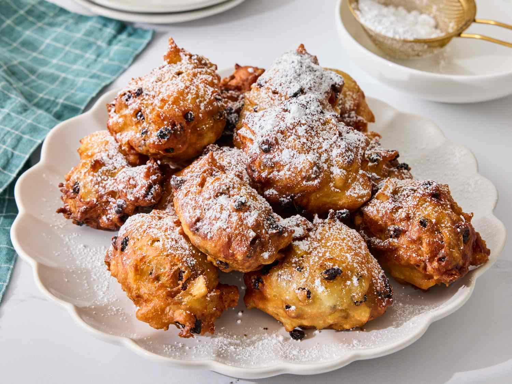

# Oliebollen (Dutch New Year's Eve Doughnuts)

*The Netherlands' New Year's Eve doughnut: yeasted batter with raisins, sultanas and apple, scooped into hot oil into irregular golden balls, dusted heavily with icing sugar.*

**Serves:** 16 medium oliebollen

**Prep Time:** 25 minutes (plus 90 minutes for the batter to rise)

**Cook Time:** 20 minutes

## Overview
Oliebollen ("oil balls") are the Netherlands' canonical New Year's Eve treat, sold from temporary oliebollenkraam on every Dutch street corner in the last two weeks of December and eaten by the bagful on 31 December. Three things distinguish a Dutch oliebol from a generic doughnut. The base is a batter, not a dough; thick and yeasted, scoopable rather than kneadable, more like a thick pancake batter than a bread dough. Scooped by the tablespoon into hot oil, it fries into irregular balls with a characteristic uneven, slightly knobbly surface that is the visual signature of the dish. The inclusions are raisins, sultanas and chunks of fresh apple folded in before frying, sometimes with currants or orange zest; oliebollen without inclusions are unfamiliar to Dutch palates. The finish is plain; icing sugar dusted generously over the warm balls, no glaze, no filling. The Dutch purist insists just powdered sugar. The trickiest part is scooping the wet sticky batter into hot oil; two tablespoons (one to scoop, one to push) is the home cook's standard trick.

## Ingredients

### The batter
- 500 g plain flour
- 50 g caster sugar
- 1 teaspoon salt
- 7 g instant dry yeast (1 sachet)
- 400 ml whole milk, lukewarm
- 2 large eggs
- 60 g unsalted butter, melted and cooled
- 1 teaspoon ground cinnamon (optional but very traditional)

### The inclusions
- 150 g raisins
- 100 g sultanas
- 100 ml dark rum OR strong tea (for soaking the dried fruit)
- 2 large eating apples (Royal Gala or Pink Lady), peeled, cored and chopped into 1 cm dice
- Finely grated zest of 1 lemon (optional; modern variant)
- 80 g chopped candied orange peel (optional; the festive variant)

### For frying
- 2 litres sunflower oil OR groundnut oil

### To finish
- 150 g icing sugar, sifted

### To serve
- Hot, dusted heavily with icing sugar.
- A glass of warm bisschopswijn (Dutch mulled wine) - the canonical New Year's Eve pairing.
- A cup of strong coffee for the morning after.

## Method

### Stage 1 - Soak the dried fruit
1. Place the raisins and sultanas in a small bowl.
2. Pour the dark rum or strong tea over.
3. Let stand 20 minutes (or up to 2 hours).
4. Drain (save the soaking liquid; some cooks add a tablespoon to the batter for extra flavour).

### Stage 2 - Make the batter
1. In a large bowl, combine the flour, caster sugar, salt, yeast and optional cinnamon.
2. Whisk together so the yeast is evenly distributed.
3. In a jug, whisk together the lukewarm milk, eggs and melted butter.
4. Pour the wet into the dry; whisk till smooth (no lumps).
5. The batter should be thick - the consistency of yogurt - not a thin pourable pancake batter.

### Stage 3 - First rise
1. Cover the bowl with cling film.
2. Let rise at warm room temperature 75-90 minutes till the batter has roughly doubled and is full of small bubbles.

### Stage 4 - Add the inclusions
1. Knock the batter back gently with a wooden spoon.
2. Fold in the soaked raisins, sultanas, chopped apple, optional lemon zest and optional candied orange peel.
3. The fruit should be evenly distributed but the batter should still be thick - don't add so much fruit that the batter loses its body.

### Stage 5 - Heat the oil
1. Heat the oil to 180°C in a deep heavy pot - 7-8 cm depth of oil.
2. Use a thermometer to verify the temperature.
3. Don't go above 190°C - too hot and the outside burns before the inside cooks; below 170°C and the oliebollen soak fat.

### Stage 6 - Fry (the two-spoon technique)
1. Working in batches of 4-5 at a time (don't overcrowd), dip 2 tablespoons into a small bowl of hot water (helps the batter slide off).
2. With one spoon, scoop up a generous tablespoon of batter (think golf-ball sized).
3. With the second spoon, slide / push the batter off into the hot oil.
4. The batter forms an irregular ball as it hits the oil; don't try to make it perfectly round.
5. Fry 5-7 minutes total, turning once or twice with a wire spider, till deeply golden brown on all sides.
6. The oliebollen are done when they're a deep gold all over; tap with the spider - they should sound hollow.

### Stage 7 - Drain
1. Lift the cooked oliebollen out with the spider; drain over the pot for a few seconds.
2. Transfer to a tray lined with kitchen paper.

### Stage 8 - Dust with icing sugar
1. While still warm, sift a generous coating of icing sugar over the oliebollen.
2. Some Dutch cooks toss them in a bag of icing sugar to coat all over.
3. Don't dust them when fully cold - the sugar doesn't stick as well.

### Stage 9 - Serve immediately
1. Pile the oliebollen on a serving plate.
2. Add an extra dusting of icing sugar just before serving.
3. Best eaten warm, within 30 minutes of frying.
4. Pair with a glass of warm bisschopswijn (Dutch mulled wine - see [Bisschopswijn](../../../drinks/regional/netherlands/bisschopswijn.md)) for the canonical New Year's Eve combination.

## Notes
- **Batter, not dough:** oliebollen batter is thick but pourable - more like a stiff pancake batter than a bread dough. Don't try to knead it.
- **Two-spoon scoop technique:** one spoon scoops, one spoon slides the batter off into the oil. The Dutch grandmother's method.
- **Dipping spoons in hot water:** helps the sticky batter slide cleanly off the spoon.
- **180°C is the magic temperature:** too low and the oliebollen soak fat; too high and the outside burns.
- **Don't overcrowd the oil:** 4-5 at a time. More drops the oil temperature.
- **Dust the sugar while warm:** the sugar sticks to the still-oily surface. Cold oliebollen don't take the sugar properly.
- **They don't keep:** oliebollen are at their peak within 30 minutes of frying. After 2 hours the texture has gone leathery; after a day they're sad.

## Variations
**Oliebollen met krenten (currant):** swap the sultanas for 100 g of currants - a tarter version.
**Oliebollen met appel (apple-heavy variant):** double the apple to 4 apples; skip the raisins and sultanas - the rural Dutch variant.
**Oliebollen with rum-soaked raisins (boozy):** double the rum and don't drain the raisins - the adult New Year's Eve variant.
**Krentenbollen (alternative name for a similar product):** smaller versions sold at Dutch bakeries year-round; same recipe but smaller portions.
**Berliner / Berlina (the filled cousin):** instead of free-form, shape the dough into balls; fry; inject with jam or custard - the Polish-German cousin.
**Appelbeignets (apple beignet variant):** dip rings of cored apple in a similar batter; fry; dust with sugar - the smaller alternative to oliebollen.
**Vegan oliebollen:** swap eggs for 3 tablespoons aquafaba; the butter for vegan block butter; the milk for oat milk.
**Quick-yeast oliebollen:** use a fast-rise yeast for a 45-minute rise instead of 90.

## Serving
At a Dutch street stall in the last two weeks of December (the canonical setting) · at a Dutch New Year's Eve household party · at a Dutch Christmas market · at an Amsterdam tourist food festival · at an Indonesian-Dutch restaurant as a sweet finisher · at home as the 31 December family tradition · paired with bisschopswijn (Dutch mulled wine) and a small chocolate.

## Storage
- Best within 30 minutes of frying. Past that, the texture deteriorates fast.
- Refrigerate up to 24 hours, but the texture won't fully recover; reheat in a 200°C oven for 4 minutes to revive somewhat.
- Don't freeze - the texture goes leathery.
- The raw batter, before the first rise, refrigerates 24 hours; bring to room temperature for 30 minutes before frying.
- The soaked raisins keep refrigerated 2 weeks in their soaking liquid.
- Don't try to make oliebollen ahead - they're a fresh-from-the-fryer treat.
