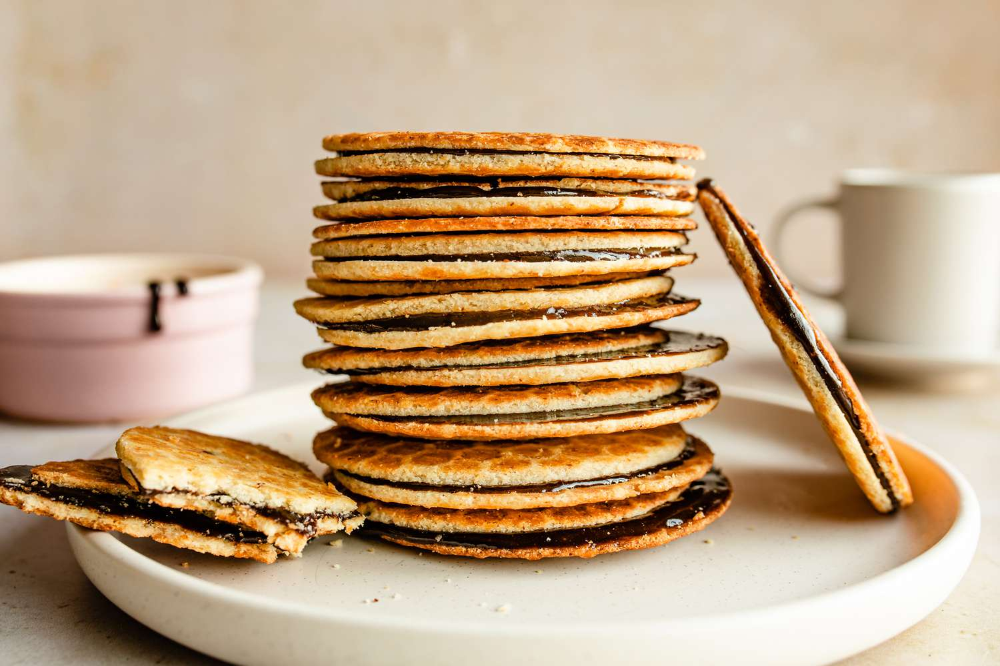

# Stroopwafels (Dutch Caramel-Filled Waffle Biscuits)

*Gouda's signature biscuit: thin waffle discs sliced in half warm and sandwiched with thick caramel syrup. Sit one on a mug of coffee to soften before eating.*

**Serves:** 14 stroopwafels

**Prep Time:** 1 hour (active)

**Cook Time:** 30 minutes (4 minutes per pair in the iron, 2 minutes filling)

## Overview
Stroopwafels are the Netherlands' most successful biscuit export and one of its most identity-defining sweet treats, invented in Gouda in the early 1800s. Three components. The wafel: a thin, buttery, lightly spiced waffle biscuit pressed in a pizzelle iron, about 8 mm thick before slicing. The slicing: while still warm and pliable, each wafel splits in half horizontally with a thin sharp knife. Cold wafels crack when sliced; warm wafels split cleanly. The stroop: a thick caramel of dark muscovado sugar, golden syrup, butter, cinnamon and a touch of vanilla brought to soft-ball stage at 115 °C, cooled slightly, then spread on the bottom half before the top presses back on. The classic Dutch eating technique places a fresh stroopwafel on top of a mug of hot coffee, where the steam softens the caramel into a near-molten centre after about thirty seconds. Daelmans and Lotus export everywhere, but the fresh-from-the-iron Gouda version is dramatically better than anything pre-packaged.

## Ingredients

### The waffle dough (makes 14 stroopwafels)
- 400 g plain flour
- 80 g caster sugar
- 1 teaspoon salt
- 7 g instant dry yeast (1 sachet)
- 1 teaspoon ground cinnamon
- 1/4 teaspoon grated nutmeg
- 200 g unsalted butter, melted and cooled
- 1 large egg, lightly beaten
- 100 ml whole milk, lukewarm

### The stroop (caramel filling)
- 250 g dark muscovado sugar OR soft dark brown sugar
- 100 ml golden syrup OR light corn syrup
- 80 g unsalted butter
- 2 tablespoons whole milk
- 1 teaspoon ground cinnamon
- 1/4 teaspoon vanilla extract
- A small pinch of fine sea salt

### Equipment
- A pizzelle iron (the traditional Italian/Dutch pizzelle iron; available online from kitchen-equipment specialists) - OR a sandwich press / panini grill at a pinch
- A sugar thermometer
- A long sharp knife OR a slicer
- A round 9-10 cm cookie cutter (optional - some pizzelle irons give a perfect round, others give a more rectangular wafel that needs trimming)

## Method

### Stage 1 - Make the dough
1. In a large bowl, combine the flour, caster sugar, salt, yeast, cinnamon and nutmeg.
2. Whisk together.
3. Add the melted butter, beaten egg and lukewarm milk.
4. Mix with a wooden spoon till a soft dough forms.
5. Knead briefly with the hands (or in a stand mixer on low) for 4-5 minutes till smooth.
6. The dough should be soft and slightly tacky.

### Stage 2 - First rise
1. Cover the bowl with cling film.
2. Let rise at warm room temperature 45 minutes - this is a SHORT rise (a true brioche-style long rise is too risen; a 45-minute rise is the traditional stroopwafel timing).
3. The dough will roughly double in size.

### Stage 3 - Make the stroop (caramel) filling
1. In a heavy small saucepan, combine the dark muscovado sugar, golden syrup, butter and milk.
2. Stir over medium heat till the sugar dissolves and the mixture comes to a simmer.
3. Continue cooking, stirring, till the mixture reaches 115°C on a sugar thermometer (soft-ball stage).
4. Take off the heat; stir in the cinnamon, vanilla and pinch of salt.
5. Let cool to a thick spreadable consistency (around 80°C; if it cools too much, gently re-warm).

### Stage 4 - Heat the pizzelle iron
1. Heat the pizzelle iron according to manufacturer's instructions (most need 5-7 minutes to reach the right temperature).
2. The iron should be hot enough that a small piece of dough sizzles briefly when placed.

### Stage 5 - Divide and shape the dough
1. Knock the dough back gently.
2. Divide into 14 portions (about 65 g each).
3. Roll each into a smooth ball.

### Stage 6 - Cook the wafels
1. Place one ball of dough in the centre of the hot pizzelle iron.
2. Close the lid firmly; press down for the first 10 seconds.
3. Cook 90 seconds to 2 minutes (depending on iron temperature) till the wafel is deep golden and crisp on the outside.
4. The pattern from the iron should be deeply embossed; the wafel should be about 8 mm thick.
5. Lift out carefully with a thin spatula.

### Stage 7 - Slice while warm
1. Working FAST while the wafel is still warm and pliable (you have about 30-45 seconds):
2. Lay the wafel flat on a board.
3. With a thin sharp knife held parallel to the board, carefully slice horizontally through the wafel to make 2 thin discs.
4. The wafel will be sticky; both halves will have an even thickness.
5. (Optional: use a 9-10 cm round cookie cutter to trim each wafel into a perfect round if your iron didn't give one.)

### Stage 8 - Fill and sandwich
1. While the two halves are still warm, spread a generous tablespoon of warm stroop (caramel) on the bottom half - cover the entire surface, edge to edge.
2. Press the top half back on, embossed-pattern facing up.
3. Set on a wire rack to cool.

### Stage 9 - Repeat with the rest of the dough
1. Work in batches - cook one wafel at a time, slice it, fill it, sandwich it before moving on.
2. The stroop in the saucepan can cool slightly between use; warm gently over low heat if it firms up.

### Stage 10 - Serve
1. Best eaten warm, with the caramel filling still slightly soft.
2. Classic Dutch technique: place a stroopwafel on top of a mug of hot coffee or tea (mug wider than the stroopwafel); let the steam soften the caramel for 30 seconds; lift, eat.
3. Cooled stroopwafels keep their texture but the caramel firms; they need a quick microwave (5 seconds) or a moment on top of a hot mug to soften the filling.

## Notes
- **Pizzelle iron is essential:** a Belgian waffle iron gives too thick a wafel; a panini press is the workable fallback (uneven pattern, but functional).
- **Slice while warm:** the 30-45 second window is critical. Cold wafels crack; warm ones split cleanly.
- **Soft-ball stage (115°C):** the traditional stroop temperature. Too cool and the syrup stays runny and the assembled stroopwafel falls apart; too hot and the syrup goes brittle.
- **Fresh-from-the-iron is dramatically better:** the supermarket pre-packed versions (Daelmans, Lotus) are good but the home-baked version is on another level.
- **The coffee-mug trick:** the classic Dutch presentation. The steam from the hot coffee softens the caramel inside the stroopwafel. Don't skip - it's part of the experience.

## Variations
**Chocolate stroopwafels:** dip half the assembled stroopwafel in melted dark chocolate; let set on parchment - the modern Dutch tea-room variant.
**Caramel-and-salted stroopwafels:** add 1/2 teaspoon of fleur de sel to the stroop - the modern sweet-salt variant.
**Spice-heavy stroopwafels:** double the cinnamon; add 1 teaspoon ground ginger and 1/4 teaspoon ground cloves to the dough - the speculoos-stroopwafel hybrid.
**Honey stroopwafels:** swap half the golden syrup for honey - more floral, less molasses.
**Maple stroopwafels:** swap the dark muscovado sugar for 200 g dark maple syrup + 50 g brown sugar - a Dutch-Canadian crossover.
**Smaller stroopwafels (mini):** divide the dough into 24 portions; cook in smaller pizzelle iron - the canapé / tea-time variant.
**Stroopwafel ice-cream sandwich:** sandwich vanilla ice cream between 2 stroopwafels; freeze - the modern Dutch dessert.
**Vegan stroopwafels:** swap egg for 2 tablespoons aquafaba; butter for vegan block butter; milk for oat milk.

## Serving
At a Gouda market stall (the traditional setting; freshly made every Wednesday and Saturday morning) · at any Dutch market town on market day · at a Dutch coffee shop with a strong espresso · at home with a mug of hot coffee or tea using the steaming-mug technique · at a Dutch sinterklaas (5 December) tea-time · in lunchboxes across the Netherlands · as the traditional Dutch gift to take home from a visit.

## Storage
- Best within 24 hours of making, while the caramel is still soft.
- Stores 5 days at cool room temperature in an airtight container - the caramel firms slightly but is still good.
- Don't refrigerate - the cold makes the caramel rock-hard.
- The stroopwafels can be revived by placing on top of a mug of hot coffee or tea for 30 seconds, or by microwaving for 5 seconds.
- Freezes 3 months wrapped in pairs; defrost at room temperature 20 minutes.
- The dough (raw, after the first rise) refrigerates 24 hours; bring to room temperature for 30 minutes before shaping.
- Pre-made (commercial) stroopwafels keep months in a sealed bag - convenient, but never as good as fresh.
