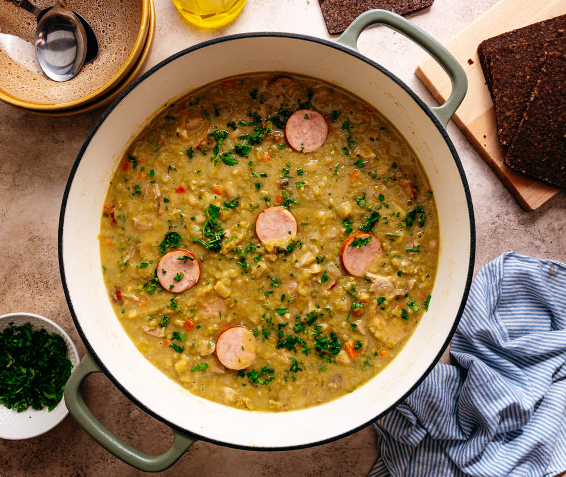

# Erwtensoep (Dutch Pea Soup, "Snert")

*The Netherlands' winter soup, also called "snert": green split peas simmered with smoked ham hock, rib and root vegetables till so thick a wooden spoon stands upright in the bowl.*

**Serves:** 6 generously

**Prep Time:** 25 minutes (plus 12 hours soaking the peas)

**Cook Time:** 2 hours 30 minutes

## Overview
Erwtensoep (nicknamed "snert" in casual Dutch) is the Netherlands' winter soup and arguably the country's most identity-defining cold-weather dish after the stamppots. Three things make it distinctively Dutch. First, the thickness: not a soup in the brothy French sense, but dense enough that a wooden spoon stands upright in the bowl. The canonical test among Dutch cooks: if the spoon falls over, the soup isn't ready. The thickness comes from cooking green split peas for hours till they collapse entirely; no thickener is added, the natural starch does all the work. Second, the meat: smoked ham hock plus smoked pork rib, with rookworst sausage added in the last thirty minutes. Third, the vegetables: the root-vegetable holy trinity of celeriac, carrot, leek and onion. Eaten in deep bowls with sliced rookworst on top and katenspek on dark rye on the side. When the canals freeze, food stalls along them sell mugs of snert to skaters; the canonical Dutch winter street food.

## Ingredients

### The peas and soaking
- 500 g dried green split peas (Dutch grüne erbsen / British marrowfat or split green peas)
- 2 litres cold water (for soaking, then discarded)

### The meat
- 1 smoked ham hock (about 600-800 g; rookhammetje in Dutch)
- 1 smoked pork rib (krabbetje) OR 300 g smoked pork shoulder (optional but canonical)
- 2 thick Gelderse rookworst smoked sausages (about 300 g total), added at the end

### The vegetables (sweated together)
- 1 large onion, finely chopped
- 2 leeks (white and pale green only), washed thoroughly and sliced
- 2 large carrots, finely diced
- 1/2 small celeriac (about 250 g), peeled and finely diced
- 2 sticks celery (the inner pale ones), finely diced
- 1 small floury potato (about 150 g), peeled and diced (for extra body)
- 2 tablespoons unsalted butter OR rendered bacon fat
- 2 bay leaves

### The stock
- 2.5-3 litres cold water (enough to cover the peas and meat)
- 1 teaspoon salt (more is added at the end after the smoked meat releases its salt)
- 1/2 teaspoon black pepper

### To finish
- A small bunch of celery leaves (the leafy tops from the inner celery), chopped
- 2 tablespoons chopped flat-leaf parsley
- A grind of black pepper

### To serve
- Dark Dutch rye bread (roggebrood), sliced thin and lightly toasted
- 4-6 slices of katenspek (Dutch smoked bacon) OR good smoked streaky bacon
- A pat of butter for the rye bread
- A small bowl of strong Dutch mustard
- A glass of cold Dutch lager OR strong hot tea

## Method

### Stage 1 - Soak the peas (12 hours ahead)
1. Tip the split peas into a large bowl.
2. Cover with cold water by 5 cm.
3. Leave at room temperature for 12 hours (or overnight).
4. Drain in a colander; rinse briefly under cold water.

### Stage 2 - Sweat the vegetables
1. Melt the butter in a large heavy stockpot over medium-low heat.
2. Add the chopped onion, leeks, carrots, celeriac and celery.
3. Sweat 10-12 minutes, stirring occasionally, till the vegetables are soft and lightly golden. No browning.

### Stage 3 - Build the soup
1. Add the drained peas to the pot.
2. Add the smoked ham hock and the smoked pork rib (or shoulder).
3. Add the bay leaves, salt, pepper and the diced potato.
4. Pour in 2.5 litres of cold water (or enough to cover everything by 5 cm).

### Stage 4 - The long simmer
1. Bring to a gentle boil; skim any foam from the surface.
2. Reduce to a low simmer.
3. Cook UNCOVERED for 2 hours, stirring every 20-25 minutes to make sure nothing catches on the bottom.
4. The peas will gradually collapse into a thick green sludge.
5. After 2 hours, check: the peas should be fully broken down, and the soup should be thick enough that a wooden spoon stands upright in the centre. If still loose, simmer 30-45 more minutes.

### Stage 5 - Add the rookworst
1. Lift out the ham hock and the pork rib; let them cool slightly on a board.
2. Add the rookworst sausages to the simmering soup; cook gently 25-30 minutes (don't boil hard - the sausage casing can split).
3. Lift the rookworst out; slice into 1.5 cm rounds.

### Stage 6 - Pick the meat
1. Pick the meat from the ham hock and the pork rib; discard skin and bones.
2. Roughly chop or shred the meat.
3. Return the meat to the pot.

### Stage 7 - Finish
1. Taste the soup; adjust salt and pepper (the smoked meat is already salty - taste before adding more).
2. Stir in the chopped celery leaves and parsley.
3. Add the sliced rookworst rounds.
4. Warm through 2-3 minutes.

### Stage 8 - Plate
1. Ladle into deep warm bowls; the soup should be so thick the ladle struggles to drop it.
2. Add a few sliced rookworst rounds prominently on top.
3. Add a grind of black pepper.
4. Place a slice of buttered rye bread topped with a slice of katenspek (smoked bacon) alongside.
5. Serve with mustard on the side.

## Notes
- **The spoon test:** Dutch home cooks judge erwtensoep by whether a wooden spoon will stand upright in the pot. If yes, it's ready; if no, simmer longer.
- **Soak the peas overnight:** non-negotiable. Unsoaked peas take 4-5 hours to break down and may stay slightly grainy.
- **Simmer uncovered:** the evaporation is what concentrates the soup to its proper thickness. A covered pot keeps the soup too thin.
- **Smoked meat is essential:** the smoked ham hock and smoked rib are what give erwtensoep its identity. Without them, it's just a pea soup. Smoked turkey works as a meat substitute but the flavour is less Dutch.
- **Better on day 2:** the flavours marry overnight; the soup thickens further. Many Dutch families deliberately make it the day before serving.
- **Don't add salt early:** the smoked meat releases plenty of salt during the long cook. Taste before adding more.

## Variations
**Erwtensoep met rookworst (the canonical home version):** as above with both ham hock + rookworst - what most Dutch families make.
**Snert without ham hock (lighter):** skip the ham hock; use a smoked turkey wing or just the rookworst - lighter, less rich.
**Vegetarian erwtensoep:** skip all meat; use a strong vegetable stock + a teaspoon of smoked paprika + a teaspoon of liquid smoke; serve with a small dollop of crispy fried-onion shreds on top.
**Modern Amsterdam restaurant variant:** serve in a small bowl with a sliced poached egg on top and a swirl of crème fraîche - bistro-fied.
**Erwtensoep with curry powder (modern):** add 1 teaspoon Indonesian curry powder (kerrie poeder) - the colonial-era Dutch-Indonesian variant.
**Snert with celery root puree:** swap the celery vegetable for an extra portion of celeriac - the modern earthy variant.
**Quick weeknight erwtensoep:** use frozen split peas (cooks in 1.5 hours instead of 2) + a tin of canned smoked-pork-belly + rookworst - 90 minutes total.
**Erwtensoep served at the Elfstedentocht ice-skating festival:** with hot mulled spirits (bisschopswijn) alongside.

## Serving
At a Dutch winter family dinner (the canonical setting, December to February) · at an ice-skating shelter along a frozen Dutch canal (the canonical Dutch winter street food) · at a Dutch sinterklaas (5 December) celebration · at a Dutch ice-skating festival like the legendary Elfstedentocht · at a Dutch Christmas Eve dinner · at a Dutch student-house dinner · at home as the canonical Sunday winter restorative · paired with dark rye bread, katenspek, mustard and a glass of cold lager.

## Storage
- Refrigerates 4 days - and improves with time. Many Dutch families make it the day before serving.
- Freezes 3 months in airtight containers; defrost in the fridge overnight; reheat gently with a splash of water to loosen.
- The soup thickens further in the fridge; loosen with a small ladle of water or stock when reheating.
- Don't reheat in the microwave - the texture changes; the stovetop is the correct reheat method.
- The dry split peas keep indefinitely in a sealed jar in a cool dry pantry.
- Day-old erwtensoep is the canonical Dutch winter lunch box - heat in a thermos in the morning, eat at lunch.
