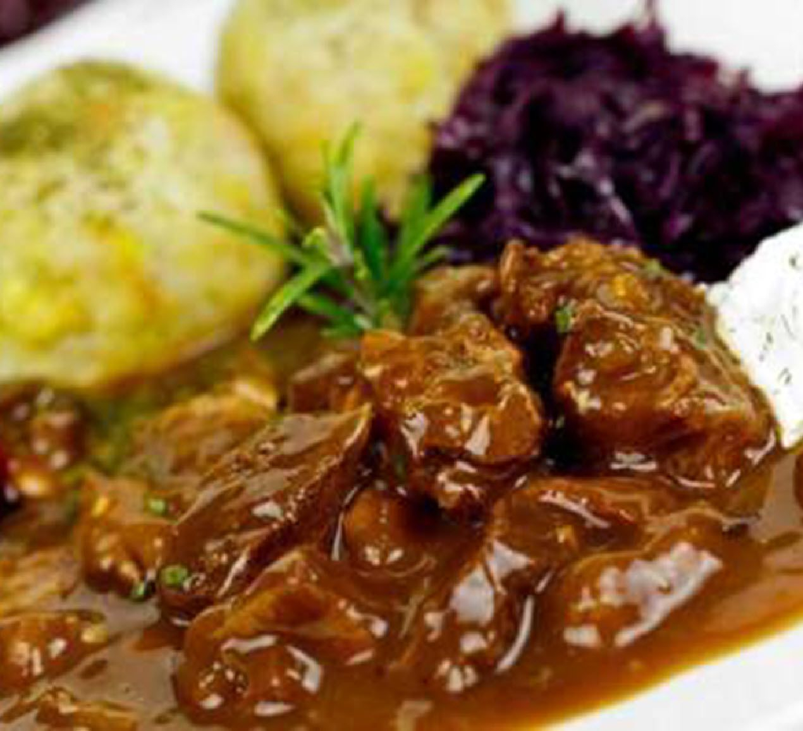

# Hachee (Dutch Beef and Onion Stew)

*The Netherlands' slow-cooked beef stew: stewing beef braised with sliced onions, cloves, juniper, bay and cider vinegar for the dish's signature sweet-sour tang. Better the second day.*

**Serves:** 6

**Prep Time:** 25 minutes

**Cook Time:** 2 hours 45 minutes

## Overview
Hachee is the Netherlands' traditional beef stew: the slow-cooked, deeply spiced, generously oniony braise that pairs with stamppot and turns up at every Dutch winter family meal. The onion-to-beef ratio is the Dutch signature; at least equal weight of onions to beef (traditional recipes use more onion than meat), sliced thin and sweated slowly till deeply golden before the beef joins them. The spice profile reflects the Netherlands' 17th-century spice-trade history; cloves, juniper berries, bay and allspice together give the warm, slightly sweet, faintly resinous note that marks hachee out from any French or Belgian beef braise. The acid is cider vinegar, giving the dish its sweet-sour edge that balances the caramelised onion and a teaspoon of brown sugar; without vinegar, hachee tastes flat. Some Dutch home cooks add a slice of mustard-spread dark rye to the pot Belgian-carbonnade-style, which thickens and seasons the gravy. The result is dark, glossy and deeply savoury. Served with stamppot, boiled potatoes or red cabbage.

## Ingredients

### The beef
- 1 kg beef chuck OR shin OR brisket, cut into 4 cm cubes
- 2 tablespoons plain flour
- 2 teaspoons salt
- 1 teaspoon black pepper
- 2 tablespoons sunflower oil OR rendered bacon fat

### The onion base (essential to get right)
- 1 kg yellow onions, halved and sliced thin (this looks like a lot; it is; trust the recipe)
- 60 g unsalted butter
- 1 teaspoon caster sugar
- 4 cloves garlic, finely chopped

### The braising liquid
- 600 ml beef stock
- 200 ml dark Dutch lager (Amstel, Heineken Brand Bock) OR water
- 3 tablespoons apple cider vinegar
- 1 tablespoon dark soy sauce OR Worcestershire sauce (gives depth and colour)
- 1 tablespoon soft dark brown sugar

### The Dutch spice mix
- 6 whole cloves
- 6 juniper berries (lightly crushed)
- 3 bay leaves
- 1/4 teaspoon ground allspice
- 1/4 teaspoon ground white pepper
- 1 teaspoon fresh thyme leaves (or 1/2 teaspoon dried)

### Optional thickener (the "mustard bread" technique)
- 1 slice country bread spread with 1 tablespoon grainy Dutch mustard (mosterd)

### To finish
- 1 tablespoon cold unsalted butter (for the gloss)
- Salt to taste

### To serve
- [Stamppot boerenkool](stamppot-boerenkool.md) OR [Hutspot](hutspot.md) OR 800 g boiled new potatoes
- A side of braised red cabbage (rodekool met appel)
- A glass of cold Dutch lager OR a dark abbey-style beer

## Method

### Stage 1 - Brown the beef
1. Pat the beef cubes dry with kitchen paper.
2. Toss with the flour, salt and pepper in a bowl.
3. Heat 1 tablespoon of the oil in a heavy Dutch oven over medium-high heat.
4. Brown the beef in 3 batches (don't overcrowd). 4-5 minutes per batch, turning to get deep colour on at least 3 sides.
5. Transfer to a bowl as you go. Leave the fond in the pot.

### Stage 2 - Sweat the onions (this is the key step)
1. Reduce heat to medium-low.
2. Add the remaining oil + the butter to the pot.
3. Add the sliced onions and a generous pinch of salt.
4. Cover with a lid; cook 10 minutes, stirring once.
5. Uncover; sprinkle the sugar over.
6. Continue cooking 18-22 more minutes, stirring every 4-5 minutes, till the onions are deeply caramelised, jammy, and reduced to about 1/3 of their original volume.
7. Add the chopped garlic in the last 2 minutes; cook till fragrant.

### Stage 3 - Deglaze and build the braise
1. Pour the dark lager (or water) into the onion pot; scrape the bottom with a wooden spoon to lift the fond.
2. Bring to a brisk simmer; let it bubble 1 minute to cook off the harshest alcohol.
3. Add the beef stock, cider vinegar, dark soy sauce, brown sugar.
4. Add the cloves, juniper berries, bay leaves, allspice, white pepper, thyme.
5. Return the browned beef to the pot.
6. Bring to a gentle simmer.

### Stage 4 - Slow braise
1. Cover and reduce heat to the lowest possible simmer (small bubbles breaking the surface).
2. Cook 2.5 hours, stirring every 30 minutes to make sure nothing catches on the bottom.
3. The beef should be fork-tender; the sauce reduced to a glossy dark braise.

### Stage 5 - The optional mustard-bread thickener
1. (Optional, but very Dutch.) About 30 minutes before the end, spread the slice of country bread thickly with mustard.
2. Place mustard-side-down on top of the stew.
3. Continue cooking covered for the last 30 minutes.
4. After 30 minutes, the bread will have slumped into the sauce. Stir it through gently with a wooden spoon to thicken.

### Stage 6 - Finish
1. Fish out the bay leaves, cloves and juniper berries (the cloves and juniper are too intense to bite into).
2. Whisk in the cold cubed butter, off the heat, for the final gloss.
3. Taste; adjust salt, vinegar, or sugar as needed. The flavour should be deeply savoury with a sweet-sour finish and a faint warm-spice background.

### Stage 7 - Serve
1. Spoon a generous portion over a mound of stamppot or boiled potatoes.
2. Add a small spoonful of red cabbage alongside.
3. Pour a glass of cold beer.

## Notes
- **Sweat the onions properly:** 25-30 minutes. Without this, the stew tastes flat. With it, the onions melt into the sauce and become its body.
- **Brown the beef hard:** the dark crust is half the flavour. Patience pays.
- **The clove-juniper-vinegar combo:** these three specifics are what make hachee Dutch. Without them, you have a generic beef-and-onion stew.
- **Better the next day:** the flavours marry overnight. Make ahead if you can.
- **Don't skip the dark lager:** the malt sweetness gives depth. If you don't have one, use water + an extra teaspoon of dark brown sugar.
- **The mustard-bread trick:** the Dutch home cook's way of thickening the sauce while adding a sharp mustard counter-note. The slice of bread completely dissolves; don't be alarmed.

## Variations
**Hachee met appel:** add 2 chopped apples (Bramley or Granny Smith) to the onions in the last 10 minutes of sweating - the rural Dutch variant with extra sweetness.
**Hachee with pears (Limburg variant):** add 200 g sliced firm pears to the braise in the last 30 minutes.
**Hachee with prunes (sweet-savoury):** add 100 g pitted prunes in the last 30 minutes - the historical Dutch variant.
**Modern hachee (lighter):** halve the onions; use chicken stock; serve with a dollop of crème fraîche on top - the modern Amsterdam restaurant variant.
**Hachee with red wine instead of beer:** swap the dark lager for 200 ml red wine - lighter, more French.
**Hachee for sandwiches (broodje hachee):** chop the finished meat fine and serve in a soft Dutch bun with mustard - the Dutch deli lunch.
**Hachee with mushrooms:** add 300 g sliced mushrooms to the onions for the last 10 minutes of sweating.
**Slow-cooker hachee:** brown the beef and sweat the onions on the stovetop; transfer to a slow cooker on low for 6-7 hours.
**Vegetarian "hachee" with king oyster mushrooms:** swap beef for thick king oyster mushrooms; same onion-and-spice base.

## Serving
At a Dutch family Sunday dinner (the traditional setting; October to March) · at a Dutch farm-kitchen winter meal · at a Dutch sinterklaas (5 December) household · at a Dutch Christmas Eve dinner · at a Drenthe or Groningen pub on a winter evening · at home as the cold-weather Sunday braise · paired with [Stamppot boerenkool](stamppot-boerenkool.md), boiled potatoes, or buttered noodles.

## Storage
- Refrigerates 5 days; reheats better than it cooks first time round.
- Freezes 3 months in airtight containers; defrost overnight in the fridge.
- The flavours improve overnight - this is the traditional make-ahead Dutch stew.
- Reheat gently on the stovetop with a splash of water or stock to loosen.
- Day-old hachee on a soft Dutch bun (broodje hachee) is the Dutch deli lunch.
- Hachee freezes excellently in individual portions; defrost one portion at a time for a quick weeknight dinner.
