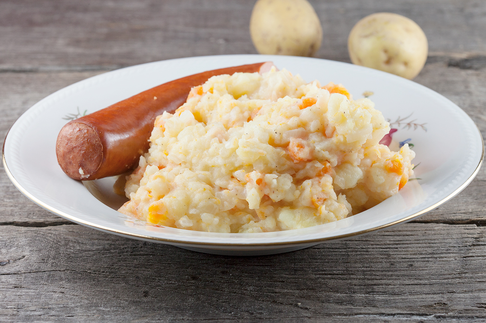

# Hutspot (Dutch Carrot, Onion and Potato Mash)

*The Netherlands' second-most-iconic stamppot: floury potatoes mashed coarsely with slow-cooked carrots and onions, topped with smoked rookworst or braised brisket.*

**Serves:** 4

**Prep Time:** 15 minutes

**Cook Time:** 40 minutes

## Overview
Hutspot is the historical heart of Dutch stamppot tradition: a coarse mash of floury potatoes, slow-sweated carrots and onions, finished with butter and milk, topped with meat. The Siege of Leiden story (the city was besieged by the Spanish in 1574, the relief arrived on 3 October and the starving Dutch defenders ate an abandoned Spanish stew of carrot, onion and parsnip) is half-folklore, half-history; the dish has been a Dutch identity-marker ever since. Every 3 October Leiden celebrates the Relief with hutspot, free herring and white bread distributed in the central square. Three Dutch-specific moves. The carrots and onions chop fine and sweat long and slow in butter, twenty to twenty-five minutes till meltingly soft and sweetly caramelised. Floury Bintje potatoes boil separately and join for the final crush. The traditional historical topping is klapstuk, a piece of brisket slow-braised for two hours; the modern weeknight topping is a thick smoked rookworst. Coarse crush, never a purée, finished with butter, warm milk and a generous pinch of nutmeg.

## Ingredients

### The base
- 800 g floury potatoes (Bintje, Maris Piper, King Edward, Russet), peeled and cut into 4 cm chunks
- 600 g carrots, peeled and cut into 5 mm dice
- 2 large onions, finely chopped
- 60 g unsalted butter
- 1 teaspoon caster sugar (balances the carrot natural sweetness; some Dutch cooks skip this)
- 1 teaspoon salt
- 1/2 teaspoon white pepper
- 1/2 teaspoon grated nutmeg
- 150 ml whole milk, warmed
- 40 g cold unsalted butter (to finish)

### The meat (pick one)
**Modern weeknight version:**
- 4 thick Gelderse rookworst smoked sausages (or 1 large smoked sausage cut into 4 portions; about 600 g total)

**Historical klapstuk version:**
- 700 g beef brisket OR shin
- 1 tablespoon sunflower oil
- 1 large onion, halved and stuck with 3 cloves
- 1 bay leaf
- 4 black peppercorns
- 1 carrot, halved
- 1 stick celery
- Cold water to cover
- Salt and pepper

### Optional accompaniments
- A small dish of strong Dutch mustard (mosterd)
- A bowl of pickled silverskin onions
- A glass of cold Dutch lager (Heineken, Amstel) OR cold buttermilk (the traditional historical drink)

## Method

### Stage 1 - (Optional) Brine the beef in advance (klapstuk version only)
1. If using the historical klapstuk method, place the brisket in a heavy pot.
2. Cover with cold water; add the clove-studded onion, bay leaf, peppercorns, carrot halves, celery and 1 teaspoon salt.
3. Bring to a gentle simmer; skim any foam from the surface.
4. Cover and poach 2-2.5 hours till the beef is fork-tender.
5. Lift out; let rest 10 minutes; slice across the grain into thick slices.
6. Save the broth - it makes excellent stock for the next day's soup.

### Stage 2 - Sweat the carrots and onions
1. Melt 60 g butter in a wide heavy pan over medium-low heat.
2. Add the chopped onions and a pinch of salt; sweat 5 minutes till translucent.
3. Add the diced carrots and the optional sugar.
4. Cover with a lid; cook 18-22 minutes, stirring every 4-5 minutes, till the carrots are completely soft, sweet and lightly golden. No browning - just long, slow softening.
5. Uncover for the last 3 minutes if there's any liquid in the pan.

### Stage 3 - Boil the potatoes
1. Meanwhile, place the potato chunks in a large pot.
2. Cover with cold salted water.
3. Bring to the boil, then reduce to a steady simmer.
4. Cook 15-18 minutes till fully tender.
5. Drain; return to the empty pot for 1 minute to evaporate moisture.

### Stage 4 - (If using rookworst) Warm the sausages
1. If using rookworst: gently warm in a saucepan of barely simmering water for 12-15 minutes (don't boil). Lift out; slice or keep whole.

### Stage 5 - The crush
1. Tip the boiled potatoes into the carrot-and-onion pan.
2. Add the warm milk, salt, white pepper and grated nutmeg.
3. With a sturdy fork or potato masher, crush coarsely - visible chunks of both potato and carrot should remain. No purée.
4. Whisk in the cold cubed butter, off the heat, for the final gloss.
5. Taste and adjust seasoning.

### Stage 6 - Plate
1. Spoon a generous mound of hutspot onto each warm plate.
2. Press a small well into the top with the back of a spoon.
3. (For the rookworst version): place a whole sausage on top or slice diagonally and prop slices against the mound.
4. (For the klapstuk version): place 2-3 thick slices of warm braised beef on top; spoon some of the warm beef-poaching broth into the well.
5. Add a dab of melting butter on top.

### Stage 7 - Serve
1. Serve immediately while hot.
2. Strong mustard on the side.
3. A glass of cold milk, buttermilk, or beer.
4. Sliced rye bread (roggebrood) if you want extra.

## Notes
- **Sweat the carrots and onions long:** 20-25 minutes. This is where the sweetness comes from. Rushing this step gives bitter, hard bits in the mash.
- **Small dice for the carrots:** 5 mm. Bigger pieces stay fibrous and crunchy in the crush.
- **Floury potatoes:** Bintje is traditional. Maris Piper, King Edward, and Russet substitute well. Avoid waxy varieties.
- **Coarse crush, not purée:** the visible chunks are the traditional texture. A smooth purée is what you'd order at a French restaurant.
- **Klapstuk vs rookworst:** the historical version uses slow-braised beef brisket; the modern version uses smoked sausage. Both are valid; the klapstuk version is what's served at the 3 October Leiden Relief celebration.

## Variations
**Hutspot met klapstuk (the historical / 3 October Leiden version):** as above with the slow-braised brisket - this is what's served free in Leiden every 3 October.
**Hutspot met spek (with bacon):** add 200 g crisp bacon lardons folded into the crush.
**Hutspot with parsnips:** swap 200 g of the carrots for 200 g parsnips - the older rural variant.
**Modern hutspot with smoked mackerel:** swap the meat for hot-smoked mackerel fillets - the modern Dutch healthy-week variant.
**Hutspot in a single pot (one-pot variant):** add the carrots and onions to the potato pot 10 minutes before the potatoes are done; drain together and mash with butter and milk. Simpler, slightly less depth than the separate-cook method.
**Vegetarian hutspot:** skip all meat; serve with a fried egg on top and crisp fried-onion shreds.
**Hutspot with apple:** add 200 g diced apple to the carrots in the last 8 minutes - the Frisian-influenced variant.
**Slow-cooker hutspot:** brisket in the slow cooker on low for 8 hours; mash and assemble at the end - the make-ahead variant.

## Serving
At a Dutch household winter dinner (the traditional setting; October to March) · at the 3 October Leiden Relief celebration (free hutspot, herring and white bread distributed in the central square) · at a Dutch family Sunday lunch · at a Dutch Christmas Eve meal · at a Drenthe or Groningen farmhouse kitchen · at home as the cold-weather Sunday restorative · paired with a glass of cold buttermilk (the traditional historical drink) or a cold Dutch lager.

## Storage
- Refrigerates 3 days. Reheats well in a pan with a splash of milk.
- Day-old hutspot pan-fried in butter till crisp on the outside is excellent for breakfast.
- Freezes 2 months in airtight containers; defrost overnight in the fridge.
- Don't refrigerate with the sausage on top; store the components separately.
- Leftover braised brisket (klapstuk version) refrigerates 5 days; excellent in a sandwich or chopped into a beef hash.
- The beef-poaching broth (klapstuk version) refrigerates 5 days and freezes 3 months; use as a base for soup or stew.
