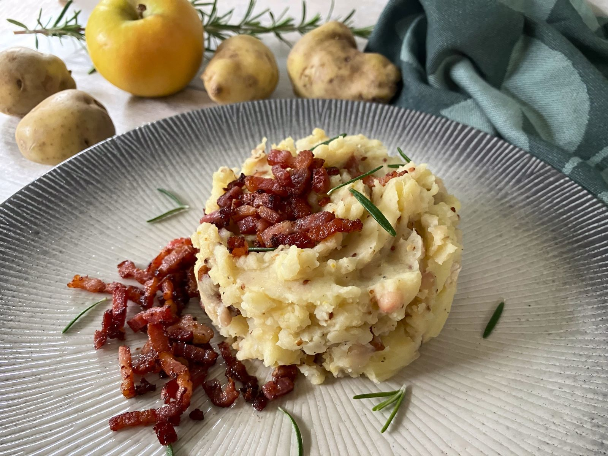

# Hete Bliksem ("Hot Lightning")

*Eastern Netherlands' rural stamppot variant: floury potatoes mashed coarsely with cooked apples (a mix of sour cooking apples and sweet eaters, the contrast is the point), finished with crisp bacon lardons and butter, the apple giving the dish its sweet-sour character. Named "hot lightning" for the contrast between the hot mash and the bracing apple acidity; born in the rural Achterhoek and Twente regions of eastern Holland; eaten with thick smoked sausage or a thick slice of black pudding alongside.*

**Serves:** 4 (as a side; 2 generously as a main)

**Prep Time:** 15 minutes

**Cook Time:** 30 minutes

## Overview
Hete bliksem (literally "hot lightning") is the apple-and-potato variant of stamppot, native to the eastern Netherlands - the Achterhoek region of Gelderland and the Twente region of Overijssel where apple orchards and potato fields share the same agricultural calendar. The construction is built around three Dutch-specific moves. First, the apple pairing: a mix of sour cooking apples (Bramley, or a tart Granny Smith) and sweet eating apples (Royal Gala, Pink Lady) - the contrast between the two is the entire point. Pure sour apples give a sour dish; pure sweet apples give a flat one; the mix is what gives hete bliksem its lightning name. Second, the cook: both potatoes and apples cook in the same pot (potatoes first, apples joined in the last 8-10 minutes). The apples should be soft but still hold some shape - not jammy. Third, the bacon: crisp bacon lardons folded into the finished mash along with their rendered fat. The smoky bacon-fat is what marries the apple sweetness to the potato. Some Dutch families add a small spoonful of brown sugar or a touch of cider vinegar to push the sweet-sour contrast further. Served as a side to grilled smoked sausage (rookworst), grilled pork chops, or a thick slice of black pudding (bloedworst). Three details: SOUR + SWEET APPLES TOGETHER (the contrast is the dish), DON'T OVER-COOK THE APPLES (some texture should remain; apple-sauce smooth is wrong), and CRISP BACON GOES IN AT THE END (a rendered bacon-fat plus crisp lardons; soft bacon in the mash loses the textural contrast).

## Ingredients

### The base
- 700 g floury potatoes (Bintje, Maris Piper, King Edward or Russet), peeled and cut into 4 cm chunks
- 400 g apples: 200 g cooking apples (Bramley or tart Granny Smith) + 200 g eating apples (Royal Gala, Pink Lady, or Cox's Orange Pippin), peeled, cored and roughly chopped
- 60 g unsalted butter
- 100 ml whole milk, warmed
- 1 teaspoon salt
- 1/2 teaspoon white pepper
- 1/4 teaspoon grated nutmeg

### The bacon
- 200 g good smoked streaky bacon, cut into 1 cm lardons
- 1 small onion, finely chopped (optional but very traditional)

### Optional sweet-sour adjustments
- 1 teaspoon soft dark brown sugar (if the apples aren't sour enough)
- 1 teaspoon cider vinegar (if the apples are too sweet)

### To serve
- A thick grilled smoked sausage (Gelderse rookworst, Polish kielbasa, or Cumberland) - 1 per portion
- OR a thick slice of black pudding (bloedworst), pan-fried golden
- OR a grilled pork chop
- A dab of strong Dutch mustard
- A glass of cold cider OR a Dutch lager

## Method

### Stage 1 - Render the bacon and sweat the onion
1. Place the bacon lardons in a heavy cold frying pan over medium-low heat (cold-start helps the fat render evenly).
2. Cook 8-10 minutes, stirring occasionally, till the bacon is crisp and the fat has rendered.
3. Lift the crisp bacon out with a slotted spoon; leave the rendered fat in the pan.
4. (If using onion): add the chopped onion to the bacon fat; sweat 6-8 minutes till golden.

### Stage 2 - Boil the potatoes
1. Place the potato chunks in a large pot.
2. Cover with cold salted water.
3. Bring to the boil, then reduce to a steady simmer.
4. Cook 12-14 minutes.

### Stage 3 - Add the apples
1. Add the chopped apples (both sour and sweet) to the potato pot.
2. Continue simmering 8-10 minutes till the potatoes are fully tender and the apples are soft but still hold some shape.

### Stage 4 - Drain and crush
1. Tip the potato-apple mixture into a colander.
2. Return the empty pot to the hob for 1 minute to evaporate moisture.
3. Tip the mixture back into the pot.
4. Add the butter, warm milk, salt, white pepper and grated nutmeg.
5. Add the rendered bacon fat and (optional) the sweated onion.
6. With a sturdy fork or potato masher, crush coarsely - visible chunks of potato and apple should remain. Don't smooth into a purée.

### Stage 5 - Taste and adjust
1. Taste; the dish should be sweet from the apples, savoury from the bacon and potato, with a faint warming spice from the nutmeg.
2. If too sweet: add a teaspoon of cider vinegar.
3. If too sour: add a teaspoon of brown sugar.

### Stage 6 - Finish and plate
1. Fold most of the crisp bacon lardons into the mash (save a small handful for garnish).
2. Spoon into warm wide bowls.
3. Press a small well into the top.
4. Scatter the reserved crisp bacon over the top.
5. Place the grilled sausage (or black pudding, or pork chop) prominently alongside.
6. Add a dab of mustard on the side.

## Notes
- **Sour AND sweet apples:** the contrast is the whole point. Pure sour gives a sour dish; pure sweet gives a flat one.
- **Don't over-cook the apples:** some texture should remain. If the apples are completely puréed into the potato, you've lost the textural character.
- **Crisp bacon at the end:** the rendered fat goes in early; the crisp lardons go in at the very end so they stay crisp.
- **Smooth purée is wrong:** the canonical hete bliksem has visible chunks. A potato masher or fork; never a ricer.
- **Adjust to your apples:** apple varieties differ wildly in sweetness and acidity. Taste, adjust.
- **Rural roots:** this is country home cooking from the eastern Netherlands. Modern Amsterdam restaurants do refined versions; the rural version is hearty and unfussy.

## Variations
**Hete bliksem met rookworst:** the canonical pairing - a whole smoked Gelderse rookworst sausage on top.
**Hete bliksem met bloedworst:** with a thick slice of pan-fried black pudding alongside - the rural Twente variant.
**Sweet hete bliksem (modern dessert variant):** skip the bacon and salt; add 50 g brown sugar to the apples; serve with vanilla ice cream as a Dutch take on apple crumble.
**Hete bliksem with prunes:** add 50 g pitted prunes to the apple cook - the rural Achterhoek variant.
**Hete bliksem with quince:** swap half the apples for poached quince - the autumn variant.
**Vegetarian hete bliksem:** skip the bacon; use 2 tablespoons of butter; serve with a fried egg on top.
**Hete bliksem with sausage and pear:** swap half the apples for sliced pear; serve with rookworst - the Limburg variant.
**Quick weeknight hete bliksem:** use frozen mash (good quality) + sliced apples microwaved 4 minutes + crisp bacon - 15 minutes total.

## Serving
At a Dutch farm-kitchen winter dinner (the canonical setting; eastern Netherlands, October to March) · at a Dutch family Sunday lunch · at a Twente or Achterhoek pub · at a Dutch Christmas Eve · at a rural Dutch harvest celebration · at home as a cold-weather side or a substantial main · paired with rookworst, black pudding, or a grilled pork chop.

## Storage
- Refrigerates 3 days. Reheats well in a pan with a small splash of milk and a touch of butter.
- Freezes 2 months but the apple texture suffers slightly on defrost; better used as a base for an apple-and-potato hash than re-served as the main dish.
- Day-old hete bliksem pan-fried in butter till crisp on the outside is excellent for breakfast with a fried egg.
- Don't refrigerate with the sausage on top; store separately.
- The bacon fat can be saved and used for the next day's fried potatoes or vegetables.
