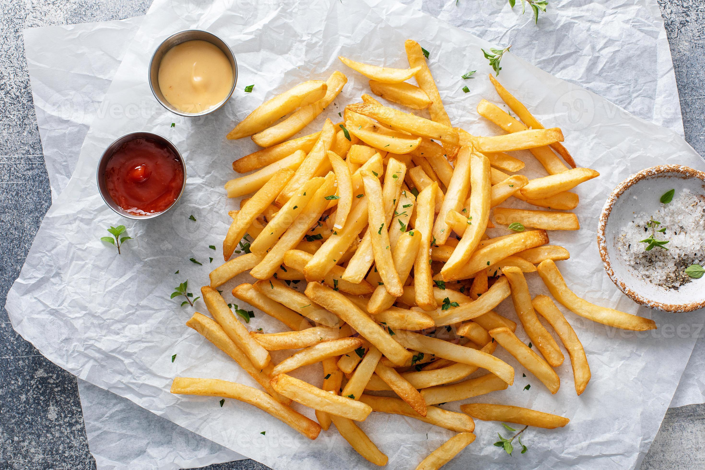

# Patat Met (Dutch Frites with Fritessaus)

*The Netherlands' national fast-food: twice-fried frites in a paper cone with fritessaus, the Dutch slightly-sweeter eggless near-mayo. "Patat met" is the universal chip-shop order.*

**Serves:** 4

**Prep Time:** 25 minutes (plus 15 minutes resting between fries)

**Cook Time:** 30 minutes

## Overview
Dutch frites differ from the [Belgian frites](../../belgian/side-dishes/belgian-frites.md) in three small but identity-defining ways. First, the cut: Dutch frites are sometimes slightly thicker (1.5 cm batons are common), giving a meatier interior. Second, the sauce: Belgian frites are paired with full-egg mayonnaise, but Dutch frites get fritessaus, a Dutch-specific eggless near-mayo that's slightly sweeter, with a faint vinegar tang. Calvé Fritessaus is the canonical supermarket brand; the home version is a quick emulsion of sunflower oil, vinegar, sugar, mustard and lemon juice. Third, the legendary Dutch combinations. "Patat oorlog" (chip war) is the iconic order: frites with fritessaus, a ladle of warm Indonesian-influenced peanut satay sauce and a scatter of finely chopped raw onion. "Patat speciaal" is fritessaus, curry ketchup and onion. "Patat pinda" is just frites and warm peanut sauce. The frites themselves follow the same twice-fried technique: low blanch, rest, high crisp.

## Ingredients

### The frites (twice-fried Belgian-style)
- 1.2 kg floury potatoes (Bintje, Maris Piper, King Edward, or Russet), cut to 1.2 cm × 1.2 cm × 7-9 cm batons
- 2 litres sunflower or groundnut oil for frying (the Dutch use beef tallow in some chip-shops; sunflower is the home standard)
- Fine sea salt

### The Dutch fritessaus (homemade; or use Calvé Fritessaus from the bottle)
- 1 large egg yolk (some Dutch fritessaus is eggless; this version uses yolk for stability)
- 1 tablespoon white wine vinegar OR cider vinegar
- 1 teaspoon Dijon mustard
- 1 teaspoon caster sugar
- A pinch of salt
- 200 ml sunflower oil (or other neutral oil)
- 1 teaspoon lemon juice
- 1 tablespoon water

### The Dutch satay sauce (satésaus) - canonical Indonesian-Dutch peanut sauce
- 4 tablespoons crunchy peanut butter
- 2 tablespoons sweet soy sauce (kecap manis - the Indonesian soy sauce; sold in Dutch supermarkets; substitute with regular soy + 1 tablespoon brown sugar)
- 1 tablespoon lime juice
- 1 clove garlic, finely grated
- 1/2 teaspoon sambal oelek (Indonesian chili paste) OR sriracha
- 1/4 teaspoon ground coriander
- 100 ml warm water (to thin to the right consistency)

### For the legendary "patat oorlog" combo
- The frites
- 4 tablespoons fritessaus
- 4 tablespoons warm satay sauce
- 1 small raw onion, very finely chopped

### Optional Dutch chip-shop sauces (offer one or more)
- Curry mayo (mayo + 1 teaspoon curry powder + a pinch of sugar)
- Knoflooksaus (garlic mayo)
- Joppiesaus (a Dutch fast-food brand-specific sauce - mayo + curry + onion + spices)
- Sambal mayo (mayo + sambal oelek)

## Method

### Stage 1 - Prep and soak the potatoes
1. Peel and cut the potatoes into 1.2 cm batons (slightly thicker than Belgian; the Dutch chip-shop standard).
2. Soak in cold water for 15 minutes to remove surface starch.
3. Drain and pat thoroughly dry on a clean tea towel.

### Stage 2 - Make the fritessaus
1. In a tall narrow bowl (jug-shaped helps for stick-blender use), combine the egg yolk, vinegar, mustard, sugar, salt and lemon juice.
2. Add the oil all at once on top of the yolk mixture.
3. Using a stick blender, blend on slowest speed from the bottom of the bowl up - the mixture will emulsify into a thick mayo-like sauce within 15-20 seconds.
4. Add 1 tablespoon of water and a small extra dash of vinegar to loosen and brighten - fritessaus is slightly thinner than mayo.
5. Taste; should be tangy, slightly sweet, gently sharp. Adjust salt or sugar.
6. Transfer to a clean jar; refrigerate.

### Stage 3 - Make the satay sauce
1. In a small saucepan, combine the peanut butter, sweet soy sauce, lime juice, grated garlic, sambal oelek and ground coriander.
2. Add the warm water slowly, whisking, till the sauce reaches a thick-pourable consistency.
3. Warm gently over low heat for 2 minutes; stir constantly.
4. Don't boil - the peanut butter can split.
5. Keep warm (or reheat gently before serving).

### Stage 4 - First fry (the blanch)
1. Heat the oil to 150°C in a deep heavy pot.
2. Fry the potatoes in 3 batches, 5-7 minutes each batch, till tender-soft and pale (no colour yet).
3. Lift out with a wire spider; drain on a wire rack.
4. Let rest at least 15 minutes.

### Stage 5 - Second fry (the crisp)
1. Heat the oil to 180°C.
2. Fry the rested potatoes in batches, 2-3 minutes each, till deeply golden and crisp.
3. Lift out, drain briefly, tip onto a tray lined with kitchen paper.
4. Season immediately with fine sea salt.

### Stage 6 - Plate "patat met" (frites with fritessaus, the basic Dutch order)
1. Pile a generous handful of hot frites into a paper cone or wide bowl.
2. Squeeze a generous serving (about 2-3 tablespoons) of fritessaus on top, in a Dutch-style "blob on top" rather than alongside.
3. Hand to the diner with a small wooden fork.

### Stage 7 - Plate "patat oorlog" (the national-favourite chip combination)
1. Pile a generous handful of hot frites into a paper cone or wide bowl.
2. Spoon 2 tablespoons of fritessaus on one side.
3. Pour 2-3 tablespoons of warm satay sauce over the top.
4. Scatter 1 tablespoon of finely chopped raw onion over.
5. Eat immediately with a small wooden fork. The combination of cold creamy sauce + warm peanut sauce + sharp raw onion + crisp hot frites is the Dutch chip-shop magic.

## Notes
- **Fritessaus is its own thing:** not just mayo. The Dutch-specific eggless (or low-egg), slightly sweet, more vinegar-forward profile is what makes it Dutch. The Calvé Fritessaus brand is the canonical commercial version; homemade gets you close.
- **Patat oorlog:** the legendary Dutch combo. Translates as "chip war" but is more about the joyful messy excess. Don't be shy with the sauces.
- **Frozen frites:** the Dutch home version often uses good frozen oven frites (Aviko is a Dutch brand) - acceptable, especially on weeknights. The chip-shop uses fresh.
- **Sweet soy sauce (kecap manis):** the Indonesian-influenced ingredient. Sold in Dutch supermarkets; substitute with regular soy + 1 tablespoon brown sugar.
- **Warm satay sauce:** the peanut sauce should be warm, not cold. Cold satay sauce hardens the cold sauce alongside.
- **Hand-eat style:** Dutch frites come in a paper cone and are eaten with a small wooden two-prong fork from the cone itself. No plate.

## Variations
**Patat speciaal (the diner-friendly variant):** frites + fritessaus + curry ketchup + finely chopped onion - the second-most-popular Dutch combination.
**Patat pinda:** just frites + warm satay sauce. No mayo. The simpler peanut-sauce variant.
**Patat met joppiesaus:** frites + Joppiesaus (a Dutch fast-food brand sauce - mayo + curry + onion + spices); Joppiesaus is sold in supermarkets across the Netherlands.
**Patat met curry:** frites + Indonesian curry ketchup (a sweet-spicy ketchup-curry blend).
**Patat met sambal:** frites + sambal mayo (mayo + sambal oelek + lime juice).
**Frikandel speciaal (the over-the-top chip-shop classic):** a frikandel sausage cut open lengthwise; topped with fritessaus, curry ketchup, and chopped onion - served alongside the frites.
**Kapsalon (Rotterdam-invented):** a baking tray of frites covered with grilled shawarma or kebab meat, cheese, salad, garlic sauce and sambal; baked under the grill till the cheese melts - the Dutch fast-food invention from Rotterdam.
**Healthier "patat" (oven frites):** the same fritessaus or satay sauce; over baked frites (220°C for 30 minutes, tossed halfway). Less crispy but a real Dutch home midweek dinner.

## Serving
At a Dutch frituur or chip-shop (the canonical setting; sold from carts and counters across every Dutch town) · at a Dutch summer beach in the Hague or Scheveningen · at an Amsterdam late-night street stand · at a Dutch carnival or fair · at a Dutch football match · at home as a Friday-night family treat · paired with a cold Heineken or a glass of cold milk.

## Storage
- Frites are at their peak for 30 minutes after frying. After that the texture suffers irreversibly.
- The fritessaus refrigerates 1 week in a sealed jar.
- The satay sauce refrigerates 5 days; freezes 2 months.
- The blanched (first-fried) frites can be refrigerated 3 days; bring to room temperature before the second fry.
- The blanched frites freeze 2 months on a tray then bagged; fry from frozen at 180°C, allow an extra minute.
- Day-old frites can be revived in a 200°C oven for 5 minutes - acceptable, not great.
