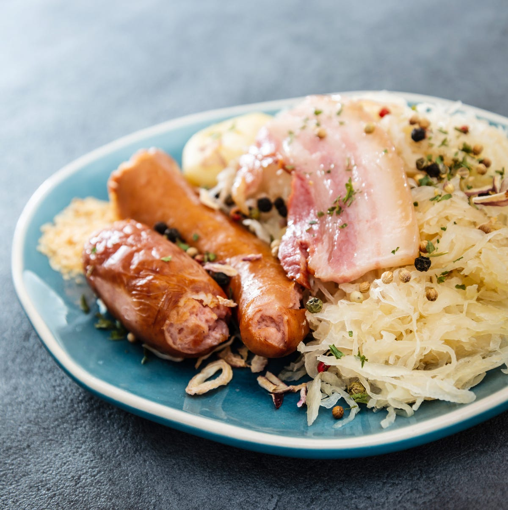

# Zuurkool met Spek (Dutch Sauerkraut with Bacon)

*The Netherlands' canonical winter sauerkraut side: good sauerkraut sweated slowly with onion and apple in rendered bacon fat till the harsh acidity mellows into a sweet-sour tang, finished with crisp bacon lardons and a generous pinch of caraway seed. The Dutch version is sweeter and more apple-forward than the German Sauerkraut, and the bacon is integral (not a topping). The standard winter accompaniment to rookworst, pork chops, or [Hutspot](hutspot.md); also the base of zuurkoolstamppot when folded into mashed potato.*

**Serves:** 4 (as a side)

**Prep Time:** 15 minutes

**Cook Time:** 35 minutes

## Overview
Zuurkool (Dutch sauerkraut) is a Dutch winter staple, but unlike the German version (which often arrives barely cooked, sharp and very acidic), the Dutch home version is mellowed by long slow cooking with apple, onion and bacon fat. The construction has three Dutch-specific moves. First, the sauerkraut itself: good barrel-cured sauerkraut (sold in jars or in food-grade plastic bags in Dutch supermarkets and many delis abroad), drained and rinsed lightly to remove some of the harsh acidity. Some Dutch home cooks rinse twice; others not at all - the rinse level adjusts the finished tartness. Second, the apple-and-onion sweat: a generous quantity of finely chopped apple (Bramley or Granny Smith for tartness; some cooks add a touch of soft brown sugar) and onion is sweated in rendered bacon fat for 8-10 minutes till soft and sweet. The sweetness of the cooked apple is what mellows the sauerkraut's sharpness. Third, the long covered braise: the rinsed sauerkraut joins the apple-onion, a splash of stock or apple juice, and a teaspoon of caraway seeds; cooked covered on low for 20-25 minutes till the flavours meld. The result is a savoury, sweet-sour, faintly tangy side dish that pairs with everything pork or sausage. Some Dutch families fold the finished zuurkool into mashed potato to make zuurkoolstamppot - the same logic as the stamppot family. Three details: RINSE THE SAUERKRAUT LIGHTLY (one rinse for medium tartness; no rinse for the German-style sharpness; two rinses for a milder finish), SWEAT THE APPLE AND ONION LONG (not just till translucent; you want them fully soft and sweet before the kraut goes in), and DON'T BOIL THE FINISHED ZUURKOOL (low simmer covered; high heat boils away the moisture and dries it out).

## Ingredients

### The sauerkraut and aromatics
- 700 g good sauerkraut (from a jar or food-grade bag; rinsed lightly to taste)
- 200 g good smoked streaky bacon, cut into 1 cm lardons
- 1 large onion, finely chopped
- 2 medium tart apples (Bramley or Granny Smith), peeled, cored and chopped fine
- 2 bay leaves
- 1 teaspoon caraway seeds (canonical Dutch addition)
- 6 juniper berries (optional; lightly crushed)
- 2 cloves (optional)
- 1 teaspoon soft dark brown sugar
- 1/4 teaspoon ground white pepper

### The liquid
- 200 ml unsweetened apple juice OR a mix of 100 ml chicken stock + 100 ml white wine

### To finish
- 1 tablespoon Dutch grainy mustard (mosterd) - some cooks add a small amount at the end
- A small handful of chopped fresh flat-leaf parsley OR a pinch of dried thyme
- A small grind of black pepper

### To serve
- Goes alongside Gelderse rookworst (Dutch smoked sausage), grilled pork chops, slow-roast pork belly, smoked German würst, or as a base for zuurkoolstamppot.
- Mashed potato or boiled potatoes alongside
- A glass of cold Dutch lager OR a glass of Riesling

## Method

### Stage 1 - Rinse the sauerkraut
1. Drain the sauerkraut in a colander.
2. Rinse lightly under cold running water for about 10 seconds - just enough to take the harshest edge off, not enough to wash out all the flavour.
3. Squeeze gently to remove excess water.

### Stage 2 - Render the bacon
1. Place the bacon lardons in a heavy cold pan over medium-low heat (cold-start helps the fat render evenly).
2. Cook 6-8 minutes, stirring occasionally, till crisp and the fat has rendered.
3. Lift the crisp bacon out with a slotted spoon; leave the rendered fat in the pan.
4. Set aside about 1/3 of the bacon for garnish; the rest goes back into the dish at the end.

### Stage 3 - Sweat the onion and apple
1. Add the chopped onion to the bacon fat.
2. Sweat 4-5 minutes till translucent.
3. Add the chopped apple.
4. Continue cooking 6-8 minutes till both apple and onion are fully soft and lightly golden.

### Stage 4 - Add the sauerkraut and spices
1. Add the rinsed sauerkraut to the pan; stir to coat in the bacon-apple-onion mixture.
2. Add the bay leaves, caraway seeds, optional juniper berries and cloves, brown sugar, and white pepper.
3. Pour in the apple juice (or stock-and-wine mix).
4. Bring to a gentle simmer.

### Stage 5 - Slow braise
1. Cover with a lid.
2. Reduce heat to low.
3. Cook 20-25 minutes, stirring once or twice, till the sauerkraut is meltingly soft and the flavours have melded.
4. Uncover for the last 3-5 minutes if there's any excess liquid - it should be moist but not soupy.

### Stage 6 - Finish
1. Fish out the bay leaves, cloves (whole) and juniper berries.
2. Fold in 2/3 of the crisp bacon (save the rest for garnish).
3. Stir in (optional) the Dutch mustard.
4. Stir in the chopped parsley.
5. Add a small grind of black pepper.
6. Taste; adjust sugar (if too sour) or a splash of vinegar (if too sweet).

### Stage 7 - Plate
1. Spoon into a wide warm bowl.
2. Scatter the reserved crisp bacon over the top.
3. Serve hot.

## Notes
- **Rinse the sauerkraut to taste:** one rinse mellows the acidity moderately; two rinses gives a softer, less tangy result. The German-style approach is no rinse (sharp and tangy); the Dutch home version is one rinse (mellow but still tangy).
- **Sweat the apple and onion fully:** not just till translucent. You want them fully soft and sweet, which is what tempers the sauerkraut.
- **Don't boil:** a covered low simmer protects the texture. High heat boils off the moisture and dries it out.
- **Caraway is the Dutch addition:** the German version skips this; the Dutch version uses it. It's a small detail but identity-defining.
- **Sugar balance:** start with 1 teaspoon; adjust at the end. Different sauerkrauts have different tartness levels.
- **Don't add the bacon too early:** if the crisp bacon goes in during the braise, it loses its crispness. Add at the end.

## Variations
**Zuurkoolstamppot:** fold the finished zuurkool through 800 g of mashed floury potato; serve with rookworst on top - the Dutch winter standard.
**Zuurkool met spek en banaan (with banana):** a weird-but-loved Dutch variant - slice a banana and lay it on top before serving; the sweet creamy banana balances the sharp sauerkraut beautifully.
**Zuurkool met ananas:** swap the apple for tinned pineapple chunks - the colonial-era Indonesian-Dutch variant.
**Vegetarian zuurkool:** skip the bacon; use 2 tablespoons of olive oil; finish with a teaspoon of smoked paprika for depth.
**Zuurkool with wine:** swap the apple juice for 200 ml dry Riesling - the Alsatian-Dutch crossover.
**Zuurkool with smoked sausage built in:** slice a rookworst sausage into rounds; add to the pan in the last 10 minutes of braising - turns the side into a complete dinner.
**Zuurkool soup (the leftover variant):** add 600 ml stock to the finished zuurkool; blend half; serve with cubed ham and a slice of dark rye bread.
**Modern Amsterdam variant:** finish with a swirl of crème fraîche on top and a dusting of smoked paprika - bistro-fied.

## Serving
At a Dutch winter dinner (the canonical setting; October to March) · at a Dutch family Sunday lunch · at a Dutch sinterklaas (5 December) family meal · at a German-Dutch border region restaurant · at home alongside grilled pork chops or rookworst · paired with mashed potato or buttered noodles, and a cold Dutch lager.

## Storage
- Refrigerates 5 days - and improves with time. Many Dutch families make it the day before.
- Freezes 3 months in airtight containers; defrost overnight in the fridge.
- The flavours meld further on day 2 and 3; arguably better than fresh.
- Don't store the crisp bacon mixed in - the bacon goes soft. Keep separate, scatter on top at serving.
- Leftover zuurkool is the start of dozens of Dutch dishes: zuurkoolstamppot, zuurkoolsoep, fried-egg-on-zuurkool breakfast.
