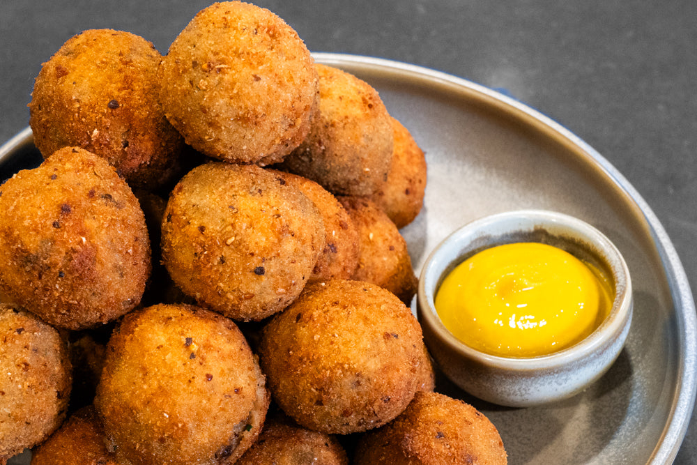

# Bitterballen (Dutch Deep-Fried Beef Croquettes)

*The Netherlands' canonical café snack: small spheres of a deeply-flavoured beef ragout (slow-cooked shredded beef in a thick velouté with onion, nutmeg and a splash of Maggi seasoning) chilled hard, rolled in flour, then beaten egg, then breadcrumbs, deep-fried till golden and the centre is molten. Served piping-hot in groups of 6, 8 or 12, on a small wooden board with a small ramekin of sharp Dutch mustard for dipping. The drinking-snack of choice in every Dutch café (especially with a small glass of beer or a borrel of jenever) - the canonical "borrel hapje" (snack with a small drink) of Dutch hospitality. The English "ditterball" mispronunciation is the giveaway.*

**Serves:** 32 bitterballen (8 per person × 4)

**Prep Time:** 1 hour (active)

**Cook Time:** 3 hours stewing + 25 minutes frying (plus 4 hours chilling)

## Overview
Bitterballen are the Netherlands' most identity-defining drinking snack. Named "bitterballen" because they're served with a "bitter" (an aperitif drink - jenever, vermouth or beer) - the small spheres of beef ragout are the canonical Dutch café food, sold in groups of 6, 8, 10 or 12 with a small ramekin of grainy Dutch mustard. The construction has three Dutch-specific moves. First, the ragout: this is NOT a simple seasoned beef mince. It's a slow-cooked stew (chunks of beef shin or chuck, braised 2.5-3 hours with onion, garlic, bay and a small amount of stock till fork-tender), shredded by hand into thin threads, then thickened with a heavy velouté - butter, flour, and the strained braising liquid cooked into a thick sauce that binds the shredded meat. Second, the chill: the meat-and-velouté mixture must be refrigerated UNTIL FIRM (at least 4 hours, ideally overnight) before shaping. Warm ragout falls apart when rolled; cold ragout holds its shape through the breading and frying. Third, the breading: the canonical Dutch double-breading - flour, then beaten egg, then breadcrumbs (some Dutch home cooks do a TRIPLE coating: flour-egg-crumb-egg-crumb for extra crisp). The classic Dutch breadcrumb is panko-like in texture but Dutch in origin (paneer or beschuit crumbs). Eaten hot - they should be GOLDEN OUTSIDE and ALMOST-MOLTEN INSIDE. Three details: COLD RAGOUT IS NON-NEGOTIABLE (warm ragout collapses; 4 hours minimum in the fridge), DOUBLE-BREAD FOR CRISPNESS (some Dutch home cooks triple-bread for extra crunch), and HOT OIL (180°C; lower and the breading soaks fat instead of going crisp).

## Ingredients

### The beef braise (slow-cooked, then shredded)
- 600 g beef shin OR chuck, in 5 cm chunks
- 1 tablespoon sunflower oil
- 1 large onion, finely chopped
- 4 cloves garlic, finely chopped
- 600 ml beef stock
- 200 ml dry white wine
- 2 bay leaves
- 1 teaspoon dried thyme
- 4 black peppercorns
- 1 teaspoon salt
- 1/2 teaspoon black pepper
- 1/2 teaspoon ground nutmeg

### The velouté (to bind the shredded meat)
- 60 g unsalted butter
- 80 g plain flour
- 300 ml of the strained braising liquid (from the beef above)
- 50 ml double cream (optional, for extra richness)
- 1 teaspoon Worcestershire sauce
- 1 teaspoon Maggi liquid seasoning OR an extra teaspoon soy sauce (the Dutch home secret)
- 1 small bunch chopped flat-leaf parsley (about 2 tablespoons chopped)
- A generous pinch of grated nutmeg
- Salt and white pepper to taste

### The breading (double-coat)
- 200 g plain flour (for the first coat)
- 4 large eggs, beaten (for the second coat)
- 250 g fine panko-style breadcrumbs OR Dutch beschuit crumbs (for the third coat)
- (Optional: a fourth and fifth coat by repeating the egg-and-crumb steps - the triple-bread variant)

### For frying
- 2 litres sunflower or groundnut oil

### To serve
- Grainy Dutch mustard (mosterd) - a small ramekin per person
- A glass of cold Heineken or Amstel pilsner OR a small glass of jenever
- A small wooden serving board (the canonical Dutch presentation)

## Method

### Stage 1 - Brown and braise the beef
1. Pat the beef chunks dry; season generously with salt and pepper.
2. Heat the oil in a heavy Dutch oven over medium-high heat.
3. Brown the beef on all sides, 3-4 minutes per side (work in 2 batches). Transfer to a plate.
4. Reduce heat; add the chopped onion to the same pot.
5. Sweat 5 minutes till translucent.
6. Add the garlic; cook 1 more minute.
7. Pour in the white wine; scrape the bottom to lift the fond.
8. Add the beef stock, bay leaves, thyme, peppercorns, salt, pepper, and nutmeg.
9. Return the beef and any juices to the pot.
10. Bring to a gentle simmer; cover.
11. Cook on the lowest possible heat for 2.5-3 hours till the beef is completely fork-tender and shreds easily.

### Stage 2 - Shred and reduce
1. Lift the beef chunks out of the pot.
2. Strain the braising liquid through a fine sieve into a clean saucepan.
3. Bring the strained liquid to a boil; reduce by half (to about 300 ml of intense beef gravy).
4. Meanwhile, shred the beef chunks finely by hand into thin threads.

### Stage 3 - Make the velouté
1. In a separate heavy saucepan, melt the butter over medium heat.
2. Whisk in the flour; cook 2-3 minutes, stirring, to make a pale roux.
3. Slowly whisk in the 300 ml of reduced braising liquid.
4. Cook 4-5 minutes, whisking, till the sauce thickens to the consistency of stiff custard.
5. Stir in the optional double cream, Worcestershire sauce, Maggi seasoning.
6. Add a generous pinch of grated nutmeg and the chopped parsley.

### Stage 4 - Combine and chill
1. Fold the shredded beef into the thick velouté in the pan.
2. Mix thoroughly; the mixture should be a thick, shred-bound paste.
3. Taste; adjust salt and pepper.
4. Spread the mixture into a flat layer (about 2 cm deep) in a buttered or oiled dish or tin.
5. Cover with cling film pressed directly onto the surface (prevents skin).
6. Refrigerate at least 4 hours, ideally overnight.

### Stage 5 - Shape the bitterballen
1. With damp hands (the mixture is sticky), scoop a heaped teaspoon (about 25-30 g) of the cold mixture.
2. Roll between your palms into a small ball, about 3-3.5 cm diameter.
3. Place on a tray lined with parchment.
4. Repeat with the remaining mixture - you should make 30-35 bitterballen.

### Stage 6 - Bread the bitterballen
1. Set up 3 shallow bowls: one with flour, one with beaten egg, one with breadcrumbs.
2. Roll each ball first in the flour (shake off excess), then in egg (let excess drip off), then in breadcrumbs (press gently to adhere).
3. For the canonical Dutch double-bread: dip the breaded ball back into the egg, then back into the breadcrumbs for a second crumb coat.
4. Place the breaded balls on a tray.

### Stage 7 - Chill the breaded balls
1. Refrigerate the breaded balls 30 minutes - this firms the coating and helps prevent splitting during frying.

### Stage 8 - Fry
1. Heat the oil to 180°C in a deep heavy pot.
2. Fry the bitterballen in batches of 6-8 (don't overcrowd; overcrowding drops the oil temperature).
3. Fry 3-4 minutes till deep golden brown all over.
4. The interior should be almost molten - a freshly fried bitterbal cut in half should release steaming, soft, shred-bound velouté.
5. Lift out with a slotted spoon; drain briefly on kitchen paper.

### Stage 9 - Serve immediately
1. Pile the hot bitterballen on a small wooden serving board.
2. Place a small ramekin of grainy Dutch mustard alongside.
3. Hand a wooden cocktail pick or small fork to each diner.
4. Eat HOT - the molten centre is part of the experience.
5. Serve with cold beer or a small glass of jenever.

## Notes
- **Cold ragout is non-negotiable:** warm ragout falls apart when rolled. 4 hours minimum in the fridge.
- **Double-bread for crispness:** single-coat bitterballen split during frying. The double-coat is standard.
- **Hot oil (180°C):** below 170°C the breading soaks fat; above 190°C the outside burns before the centre is hot.
- **Don't overcrowd the oil:** 6-8 at a time. More drops the oil temperature.
- **Eat immediately:** bitterballen are at their peak for 5 minutes after frying. After 15 minutes the centre has cooled and the magic is gone.
- **Maggi seasoning is the Dutch home secret:** the umami-soy-bouillon-like liquid that goes into everything in a Dutch kitchen. Worcestershire sauce is the substitute but Maggi gives the unmistakable Dutch profile.

## Variations
**Kroketten (broodje kroket form):** the same ragout shaped into cylinders 8-10 cm long, breaded and fried; served in a fresh Dutch bun with mustard - see [Broodje kroket](broodje-kroket.md).
**Veal bitterballen:** swap beef for veal; the more delicate Dutch upscale variant.
**Chicken bitterballen:** swap beef for slow-cooked shredded chicken thigh; lighter, paler ragout.
**Goulash bitterballen:** add 1 tablespoon of paprika and a pinch of caraway to the ragout - the Dutch-Hungarian crossover.
**Curry-spiced bitterballen (Indonesian-influenced):** add 1 teaspoon of mild curry powder to the ragout - the colonial-Dutch variant.
**Vegetarian bitterballen:** swap the beef for slow-cooked shredded king-oyster mushrooms + a splash of soy sauce for umami depth; the same velouté binding.
**Cheese bitterballen (kaasbitterballen):** swap the beef for a thick aged-cheese (oude kaas) velouté - the Dutch cheese-shop variant.
**Goose / duck bitterballen:** swap beef for slow-cooked duck or goose confit, shredded; the high-end variant.
**Smaller (bittergarnituur):** make 60 small (15 g) bitterballen for a Dutch reception or wedding canapé.

## Serving
At a Dutch café with a glass of cold beer (the canonical setting) · at a Dutch borrel (early-evening drinks gathering with snacks) · at a Dutch reception or wedding · at an Amsterdam brown bar (the traditional Dutch wood-panelled pub) · at a Dutch sinterklaas (5 December) family gathering · at a Dutch carnival in Limburg · at home as the canonical Friday-night drinking snack · paired with grainy mustard, cold lager, jenever or a Dutch witbier.

## Storage
- The breaded uncooked balls freeze excellently 3 months - on a tray then bagged. Fry from frozen at 180°C, allow 4-5 minutes (slightly longer than fresh).
- The ragout (before shaping) refrigerates 5 days; freezes 3 months.
- Cooked bitterballen don't store well - eat within 30 minutes of frying.
- Don't reheat cooked bitterballen - the breading goes soft and the molten centre solidifies.
- The shaped raw balls refrigerate 24 hours; bring to room temperature for 10 minutes before frying.
- A typical Dutch home freezes 30-50 bitterballen at a time for unexpected drinks-with-friends evenings.
