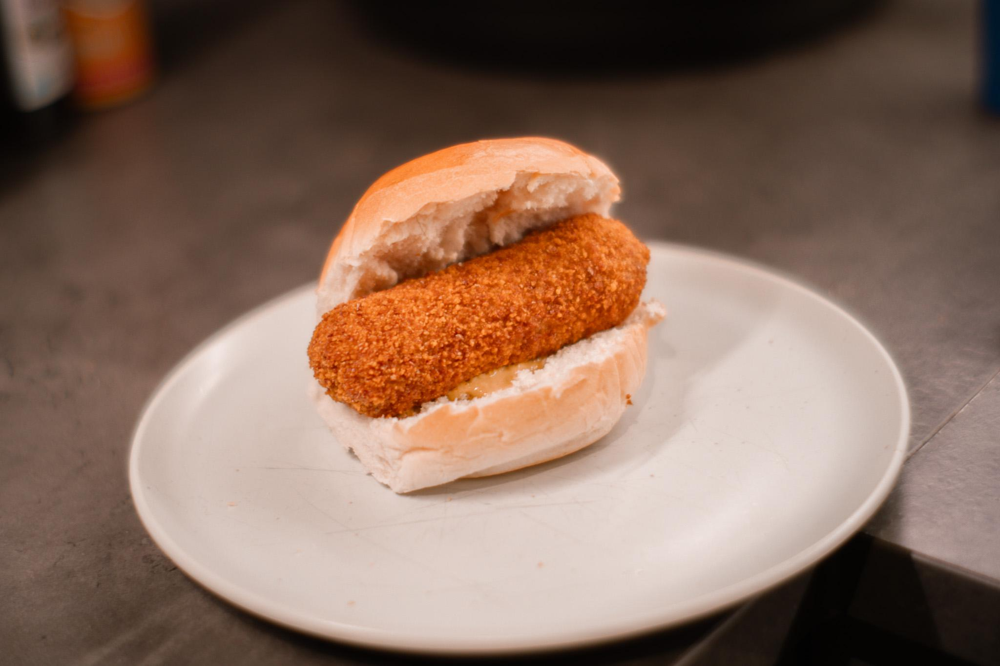

# Broodje Kroket (Dutch Kroket Sandwich)

*The Netherlands' Saturday lunch and FEBO-automaten classic: a cylindrical breaded beef croquette split, slathered with mustard, and stuffed into a soft Dutch bun.*

**Serves:** 4 sandwiches

**Prep Time:** 1 hour (active, mostly the kroket prep; uses the bitterbal ragout)

**Cook Time:** 3 hours stewing (or use leftover bitterbal ragout) + 8 minutes frying

## Overview
The broodje kroket is one of the Netherlands' most identity-defining quick lunches. The kroket itself is essentially a larger cylindrical version of the [bitterbal](bitterballen.md): the same slow-cooked-beef-and-velouté ragout, shaped into cylinders about 8 to 10 cm long and 3 cm wide, breaded twice and deep-fried till golden. The cylinder shape is essential since a ball doesn't fit a sandwich, but the cylinder slides neatly into a split bun. The bun is a fresh "zachte witte bol", the soft white round roll, lightly toasted on the cut sides and generously spread with grainy Dutch mustard. The hot kroket splits lengthways with a knife or slices into thick rounds, then presses into the bun. Eat standing up: the traditional FEBO automaten experience involves dropping coins into a vending-machine wall door behind which sits a hot kroket ready to grab. FEBO sells thousands daily in Amsterdam and Rotterdam; the home-made version is a Saturday-lunch tradition.

## Ingredients

### The beef braise (identical to bitterballen)
- 600 g beef shin OR chuck, in 5 cm chunks
- 1 tablespoon sunflower oil
- 1 large onion, finely chopped
- 4 cloves garlic, finely chopped
- 600 ml beef stock
- 200 ml dry white wine
- 2 bay leaves
- 1 teaspoon dried thyme
- 4 black peppercorns
- 1 teaspoon salt + 1/2 teaspoon black pepper
- 1/2 teaspoon ground nutmeg

### The velouté (to bind)
- 60 g unsalted butter
- 80 g plain flour
- 300 ml strained reduced braising liquid
- 50 ml double cream
- 1 teaspoon Worcestershire sauce
- 1 teaspoon Maggi liquid seasoning
- 2 tablespoons chopped flat-leaf parsley
- A generous pinch of grated nutmeg

### The breading
- 200 g plain flour
- 4 large eggs, beaten
- 250 g fine panko-style breadcrumbs

### For frying
- 2 litres sunflower or groundnut oil

### The sandwich (per sandwich, × 4)
- 1 fresh "zachte witte bol" (soft white Dutch roll) OR a fresh kaiser roll OR a soft bap
- 1-2 tablespoons grainy Dutch mustard (mosterd)
- 1 hot fried kroket

### To serve alongside
- A glass of cold Dutch lager (Heineken, Amstel)
- A small dish of extra mustard
- Optional: a Dutch chocolate sprinkle "hagelslag" sandwich for dessert (the Dutch peanut-butter-and-jam equivalent)

## Method

### Stage 1 - Braise the beef and make the ragout
1. Follow Stages 1-4 of the [Bitterballen](bitterballen.md) recipe to make the cold beef-and-velouté mixture.
2. (If you already have leftover bitterbal ragout, you can use that directly.)
3. Refrigerate at least 4 hours till firm.

### Stage 2 - Shape the krokets
1. With floured hands, take a 100-120 g portion of the cold ragout.
2. Shape into a cylinder about 8-10 cm long, 3 cm wide.
3. Place on a tray lined with parchment.
4. Repeat - you should make about 8-10 krokets from one batch of ragout (extras can be frozen).

### Stage 3 - Bread the krokets
1. Set up 3 shallow dishes: one with flour, one with beaten egg, one with breadcrumbs.
2. Roll each kroket in flour (shake off excess), then in egg, then in breadcrumbs.
3. For the traditional Dutch double-bread: dip back into egg and again into breadcrumbs.
4. Place on a tray.

### Stage 4 - Chill the breaded krokets
1. Refrigerate the breaded krokets 30 minutes (or overnight; this firms the coating and prevents splitting during frying).

### Stage 5 - Fry the krokets
1. Heat the oil to 180°C in a deep heavy pot.
2. Fry the krokets 2 at a time (don't overcrowd) for 5-6 minutes till deep golden brown all over.
3. The interior should be hot and almost molten.
4. Lift onto kitchen paper to drain briefly.

### Stage 6 - Prepare the buns
1. Split each soft Dutch roll in half horizontally.
2. Lightly toast the cut sides under a hot grill for 30 seconds (or in a dry pan).
3. Spread the bottom half generously with grainy Dutch mustard.

### Stage 7 - Assemble the broodje kroket
1. Lay 1 hot kroket on the mustard-spread bottom half of each roll.
2. (Some Dutch diners split the kroket lengthways with a knife first so it sits flatter.)
3. Cap with the top half of the roll.
4. Press down gently.

### Stage 8 - Serve immediately
1. Cut each sandwich in half on the diagonal (or eat whole).
2. Serve with extra mustard on the side.
3. Pair with a cold beer.
4. Eat standing up (traditional FEBO automaten posture) or at a Dutch lunchroom counter.

## Notes
- **Use the same ragout as bitterballen:** the beef braise is the foundation. If you've made bitterballen, you've made the foundation for kroketten.
- **Cylinder shape is essential:** a ball doesn't fit in a sandwich. The 8-10 cm × 3 cm cylinder is the Dutch standard.
- **Double-bread:** prevents splitting during frying.
- **Hot oil:** 180°C; the same as for bitterballen.
- **Fresh roll matters:** day-old buns ruin the experience. The contrast of soft cold roll vs hot crisp kroket is the dish.
- **Yellow mustard, grainy Dutch mosterd, OR Dijon all work:** the Dutch home version is grainy mustard; the FEBO automaten version is yellow mustard; both are acceptable.

## Variations
**Kalfsragout kroket (veal):** swap beef for veal; the more refined Dutch upscale variant.
**Pittige kroket (spicy):** add 1 teaspoon of sambal oelek and a pinch of cayenne to the ragout - the Indonesian-Dutch crossover.
**Goulash kroket:** add 1 tablespoon paprika to the ragout - the Hungarian-Dutch variant; very popular at Dutch fast-food counters.
**Kaasbouquet (cheese kroket):** swap the beef for a thick cheese-and-béchamel filling (aged Gouda + Parmesan + thick béchamel); the same breading and frying. The cheese-shop classic.
**Vegetarian kroket:** swap beef for a slow-cooked shredded king oyster mushroom + chestnut mushroom ragout; the same velouté binding.
**Chicken kroket:** swap beef for slow-cooked shredded chicken thigh; lighter, paler ragout.
**Goulash-kroket sandwich:** add a slice of fresh tomato and a leaf of lettuce alongside the kroket - the Toronto-style upgrade.
**Mini kroketten for canapés:** make 16 smaller (5 cm) krokets; serve at a Dutch borrel reception.

## Serving
At a FEBO automaten cafeteria (the traditional setting; sells thousands daily in Amsterdam, Rotterdam, Utrecht) · at a Dutch lunchroom (broodjeszaak) · at an Amsterdam train station counter · at a Dutch carnival or fair · at a Dutch wedding reception buffet · at home as a Saturday lunch · paired with cold Dutch lager and extra mustard.

## Storage
- The breaded uncooked krokets freeze excellently 3 months on a tray then bagged. Fry from frozen at 180°C, allow 7-8 minutes (slightly longer than from chilled).
- The ragout (before shaping) refrigerates 5 days; freezes 3 months.
- Cooked krokets are best within 5 minutes of frying.
- Don't reheat cooked krokets - the breading goes soft.
- The fresh rolls are best the day they're bought; if you have to plan ahead, freeze the rolls and defrost the morning of.
- A typical Dutch home freezes a batch of breaded uncooked krokets for last-minute Saturday lunches.
