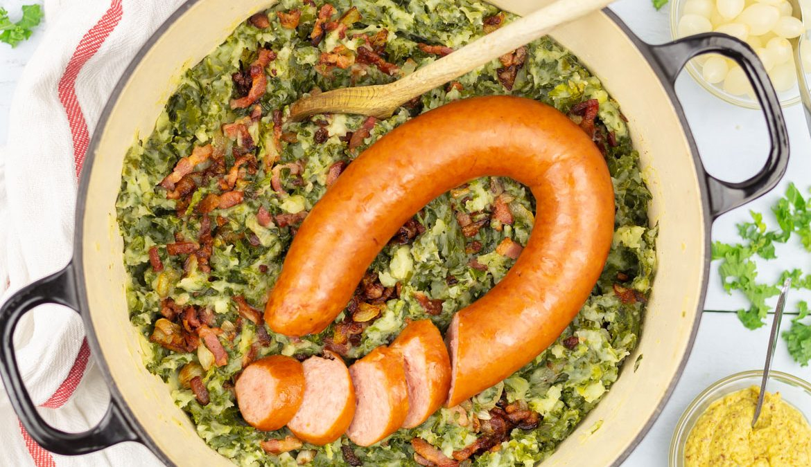

# Stamppot Boerenkool (Dutch Kale and Potato Mash)

*The Netherlands' canonical winter dinner: floury potatoes boiled with finely shredded curly kale till the kale collapses into the cooking water, drained, crushed coarsely with butter and a splash of warm milk, then crowned with a thick smoked rookworst sausage (Gelderse rookworst, the canonical Dutch smoked sausage) and a deep well of mustard-laced jus pooling in the centre. The dish that every Dutch household eats from October to March. Coarse, savoury, deeply restorative. Pairs only with a glass of cold milk, a Dutch witbier, or a stiff cup of strong tea.*

**Serves:** 4

**Prep Time:** 15 minutes

**Cook Time:** 35 minutes

## Overview
Stamppot is the canonical Dutch one-pot winter dinner, and stamppot boerenkool (the kale variant) is the most identity-defining of the family. "Stamppot" means "mashed pot" - everything cooks in one pot, gets mashed coarsely with butter and milk, and is served with a heaped sausage on top. The technique is bracingly simple. First, the potatoes: floury Bintje (the Dutch standard; Maris Piper, King Edward, or Russet substitute), peeled and boiled till tender. Second, the kale: curly kale (boerenkool in Dutch - literally "farmer's cabbage") finely shredded and added to the same pot in the last 8-10 minutes of cooking so the kale collapses into the cooking water and softens completely. Third, the crush: drained potato-and-kale mixture is mashed coarsely with butter, a splash of warm milk, salt, pepper and a generous pinch of nutmeg. This is NOT a smooth purée - the visible chunks of potato and the threads of kale are the canonical texture. Fourth, the sausage: a thick Gelderse rookworst (or any good smoked pork sausage - Polish kielbasa works as a fallback) is poached in the same pot during the last 15 minutes alongside the potatoes - some Dutch cooks slip it INTO the boiling water, others gently warm it whole. Sliced into thick rounds and served propped against the mound of stamppot. Fifth, the jus: a small well pressed into the top of the mash with a spoon and filled with the rich brown jus made from the sausage's pan drippings + a splash of stock + a teaspoon of grainy Dutch mosterd (mustard). The mustard pool in the centre is the unmistakable Dutch signature. Three details: SHRED THE KALE FINE (a 2-3 mm chiffonade; this is what lets the kale collapse properly into the mash), BOIL KALE LONG ENOUGH (8-10 minutes; under-cooked kale stays tough and stringy in the mash), and KEEP THE CRUSH COARSE (a potato masher or fork; never a ricer or food processor).

## Ingredients

### The stamppot
- 1 kg floury potatoes (Bintje, Maris Piper, King Edward or Russet), peeled and cut into 4 cm chunks
- 500 g curly kale (or 350 g pre-trimmed bagged shredded kale), woody stems removed, leaves finely shredded
- 80 g unsalted butter (plus more to serve)
- 120 ml whole milk, warmed
- 2 teaspoons fine sea salt
- 1/2 teaspoon white pepper
- 1/2 teaspoon grated nutmeg

### The sausage
- 4 thick Gelderse rookworst (Dutch smoked sausage) OR a substantial smoked pork sausage (Polish kielbasa, smoked Cumberland)
- Each about 150 g; total around 600 g

### The jus
- 100 ml beef stock OR chicken stock
- 1 tablespoon Dutch grainy mustard (mosterd) OR Dijon
- A small grind of black pepper

### Optional additions
- 150 g smoked streaky bacon, cut into lardons (sweated separately and folded in at the end) - the more substantial version
- 1 small onion, finely chopped (sweated with the bacon) - traditional
- 50 g grated mature cheese (oude kaas / aged Gouda) folded in at the end - the Friesland variant

### To serve
- Strong Dutch mustard on the side
- A small dish of pickled silverskin onions
- A glass of cold milk OR a cold Dutch lager
- A slice of dark rye bread (roggebrood) on the side

## Method

### Stage 1 - Prep the kale
1. Strip the kale leaves from the woody central ribs (if using whole kale).
2. Stack the leaves, roll tightly, and slice into 2-3 mm thin shreds (a fine chiffonade).
3. Wash thoroughly under cold running water; drain.

### Stage 2 - Boil the potatoes
1. Place the potato chunks in a large heavy pot.
2. Cover with cold water; add 1 teaspoon of salt.
3. Bring to the boil; reduce to a steady simmer.
4. Cook 12 minutes.

### Stage 3 - Add the kale (and the sausage if poaching whole)
1. Add the shredded kale on top of the potatoes (don't stir yet - let it sit on top and steam down).
2. If poaching the rookworst, slip the whole sausages in at this point too.
3. Cover with a lid; cook 10 more minutes.
4. Stir gently to combine the wilted kale with the potatoes.
5. Cook 2-3 more minutes till the kale is fully softened and the potatoes are completely tender.

### Stage 4 - Optional bacon and onion
1. If using bacon and onion: while the potatoes cook, sweat the diced onion in a separate frying pan with the bacon lardons over medium heat 8-10 minutes till the bacon is crisp and the onion is golden.
2. Reserve the bacon, onion and the rendered fat.

### Stage 5 - Lift the sausages out
1. Lift the poached sausages out of the pot with tongs.
2. Place on a board; tent loosely with foil to keep warm.

### Stage 6 - Drain and mash
1. Tip the potato-and-kale mixture into a colander.
2. Return the empty pot to the hob for 1 minute to evaporate any moisture.
3. Tip the drained mixture back into the pot.
4. Add the butter, warm milk, salt, pepper and grated nutmeg.
5. With a sturdy potato masher or a fork, crush coarsely - visible chunks of potato and kale should remain. Don't smooth into a purée.
6. (If using bacon and onion: fold in now along with the rendered bacon fat.)
7. Taste and adjust seasoning.

### Stage 7 - Make the jus
1. In the bacon pan (or a clean small saucepan), heat the stock.
2. Stir in the grainy mustard.
3. Bring to a gentle simmer; reduce by 1/4 to a slightly thickened gravy.
4. Season with a small grind of pepper.

### Stage 8 - Plate
1. Spoon a generous mound of stamppot onto each warm plate.
2. Press a small well into the top with the back of a spoon.
3. Pour a small ladle of the mustard jus into the well.
4. Slice each sausage diagonally and prop the slices against the mound (or stand a whole sausage on top, the canonical home presentation).
5. Add a small dollop of butter melting on top.

### Stage 9 - Serve immediately
1. Serve hot.
2. Provide extra mustard on the table.
3. Pour a glass of cold milk or beer.
4. Slice of rye bread on the side.

## Notes
- **Floury potatoes are essential:** Bintje is canonical. Maris Piper, King Edward, and Russet all work. Yukon Gold or any waxy variety won't crush properly and gives a wet, gluey result.
- **Shred the kale fine:** 2-3 mm. Larger pieces stay stringy in the finished mash.
- **Cook the kale long enough:** 10-12 minutes total in the boiling water. Under-cooked kale has a tough, fibrous bite.
- **Coarse crush, not purée:** the visible chunks and threads are the canonical texture. A smooth purée is what you'd serve at a French restaurant; stamppot is the working-Dutch version.
- **The mustard jus is the move:** Dutch home cooks all do the well-and-jus presentation. The mustard pool in the centre is the signature.
- **Gelderse rookworst:** the canonical Dutch smoked sausage. Available at Dutch supermarkets and some specialty butchers abroad. Polish kielbasa is the closest substitute; a good Cumberland or smoked bratwurst also works.

## Variations
**Stamppot zuurkool (sauerkraut variant):** swap the kale for 500 g good sauerkraut (drained, rinsed lightly); the most popular variant after boerenkool.
**Hutspot (carrot-and-onion variant):** swap kale for 400 g chopped carrots + 1 large chopped onion, sweated together; see [Hutspot](hutspot.md) for the full recipe.
**Andijviestamppot (endive variant):** swap kale for 400 g chopped raw curly endive (the bitterness mellows in the mash); finish with extra mature cheese.
**Boerenkool-met-spek (bacon-rich version):** double the bacon; fold in extra crispy bacon and a handful of fried onion shreds at the end.
**Vegetarian stamppot:** skip the sausage and bacon; use vegetable stock; serve with a fried egg on top.
**Stamppot with apple-pear compote:** the rural Friesland variant; serve the stamppot with a side of warm spiced apple-and-pear compote.
**Modern Amsterdam restaurant variant:** present in a wide bowl with a quenelle of stamppot, the sausage sliced into rounds and seared on one side, the jus drizzled artfully - same flavours, different plating.
**Stamppot with smoked salmon (modern):** swap the rookworst for a generous slice of hot-smoked salmon - the modern Dutch healthy-week variant.

## Serving
At a Dutch family Sunday dinner (the canonical setting, from October to March) · at a Dutch farm-kitchen at the end of a cold workday · at a Friesland or Drenthe pub on a winter evening · at a Dutch Christmas Eve meal · at a Dutch student-residence house dinner · at home as the canonical winter restorative.

## Storage
- Refrigerates 3 days. Reheats well in a pan with a splash of milk to loosen.
- Day-old stamppot pan-fried in butter till crisp on the outside is the canonical Dutch breakfast (called "stamppot uit de pan").
- Freezes 2 months in airtight containers; defrost overnight in the fridge.
- Don't refrigerate with the sausage on top; store the components separately.
- The jus keeps refrigerated 4 days; reheat gently with a splash of stock.
- Cooked rookworst keeps 3 days refrigerated; slice and pan-fry to refresh.
