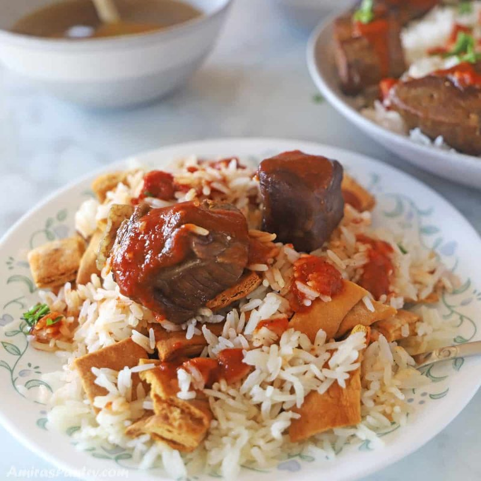

# Fattah Bil Lahma

*The Egyptian celebration dish: layered toasted bread (aysh baladi), rice, garlic-vinegar dakka sauce, tomato sauce, slow-braised lamb (or beef) and a drizzle of cooking liquor - assembled in a wide platter and eaten communally. Cooked for Eid al-Adha, weddings, Sham El-Nessim. A dish of celebration through and through.*

**Serves:** 6

**Prep Time:** 30 minutes

**Cook Time:** 2 hours 15 minutes

## Overview
Lamb shoulder simmers in a spiced stock for 90 minutes until tender. Meanwhile, basmati rice cooks pilaf-style. Pieces of baladi bread (or pita) crisp in the oven. A dakka sauce: garlic, vinegar, coriander, butter, all sizzled briefly. A tomato sauce reduces. Layer: bread → rice → dakka → tomato sauce → shredded meat → ladles of cooking liquor.

## Ingredients

### Lamb
- 1.2 kg lamb shoulder (cut into 5 cm chunks)
- 2 tablespoons vegetable oil
- 1 onion (large, halved)
- 4 cardamom pods (bruised)
- 1 cinnamon stick
- 2 bay leaves
- 8 black peppercorns
- 1 teaspoon ground cumin
- 1 ½ teaspoons salt
- 2 litres water

### Bread layer
- 4 pita breads (large, or 8 small aysh baladi, cut into 4 cm squares)
- 2 tablespoons olive oil

### Rice
- 300 g basmati rice (rinsed; soaked 20 minutes)
- 2 tablespoons ghee
- 1 teaspoon salt
- 600 ml reserved cooking liquor (from the lamb)

### Tomato sauce
- 2 tablespoons vegetable oil
- 4 garlic cloves (crushed)
- 1 (400 g) tin chopped tomatoes
- 1 tablespoon tomato puree
- 1 teaspoon ground cumin
- ½ teaspoon chilli flakes
- ½ teaspoon salt

### Dakka (garlic-vinegar sizzle)
- 4 tablespoons unsalted butter (or ghee)
- 8 garlic cloves (very finely chopped)
- 3 tablespoons white vinegar
- 1 teaspoon ground coriander

### To finish
- 200 ml cooking liquor (extra)
- 3 tablespoons fresh parsley (chopped)
- Lemon wedges

## Method

### Stage 1 - Lamb
1. Heat oil in a wide pot; brown the lamb in batches.
1. Add onion, cardamom, cinnamon, bay, peppercorns, cumin, salt, water.
1. Simmer covered 1 hour 30 minutes to 1 hour 45 minutes until tender. Strain; reserve 1 litre of the cooking liquor. Shred the meat into bite-sized pieces.

### Stage 2 - Toast bread
1. Heat oven to 200°C.
1. Toss bread pieces with olive oil; spread on a tray.
1. Bake 10 minutes until crisp and gold.

### Stage 3 - Rice
1. Heat ghee in a heavy pot.
1. Drain the soaked rice; toast 1 minute in ghee.
1. Pour in 600 ml of reserved cooking liquor; add salt.
1. Bring to a boil; reduce heat to lowest; cover; cook 15 minutes.
1. Rest 5 minutes; fluff.

### Stage 4 - Tomato sauce
1. Heat oil; add garlic; cook 30 seconds.
1. Add cumin and Aleppo pepper; toast 10 seconds.
1. Stir in tomato and tomato puree; reduce 8 minutes to a thick sauce.
1. Season with salt.

### Stage 5 - Dakka
1. In a small pan, melt the butter over medium heat.
1. Add chopped garlic; sizzle 30-40 seconds - just gold, not brown.
1. Stand back; pour in vinegar (it spits).
1. Add coriander; sizzle 5 seconds. Off the heat.

### Stage 6 - Assemble
1. In a wide warm shallow platter, layer:
   1. Toasted bread (a single layer covering the base)
   1. Ladle of dakka (about half)
   1. Hot rice spread evenly
   1. Tomato sauce drizzled across
   1. Shredded lamb on top
   1. The remaining dakka over everything
   1. Ladle 200 ml of warm cooking liquor over the whole platter

### Stage 7 - Serve
1. Scatter parsley; lemon wedges alongside. Eat immediately, family-style.

## Notes
- **Order matters:** Bread under everything; rice in the middle; meat on top. Eat down through the layers.
- **Dakka is the signature:** Don't skip the garlic-vinegar-butter step. The sour-sharp bite cuts the richness of the lamb.
- **Make-ahead components:** Lamb, rice, tomato sauce all keep separately. Assemble fresh - the bread softens in storage.

## Storage
- Components keep 3 days separately. Assembled fattah is best eaten same day.
