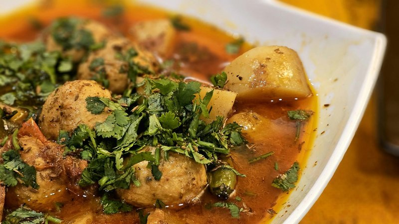

# Kofta Bil Roz

*An Egyptian family dish: spiced beef-and-lamb meatballs baked in a tomato-and-stock sauce over a layer of rice (sometimes vermicelli rice) that cooks underneath, absorbing the meaty juices. Eaten with the meatball on top of the rice, the sauce poured over both. Casual, comforting, weekday.*

**Serves:** 4

**Prep Time:** 25 minutes

**Cook Time:** 50 minutes

## Overview
Mixed beef-lamb mince combines with grated onion, garlic, cumin, allspice, parsley, breadcrumbs and an egg into walnut-sized meatballs. Pan-brown briefly. A tomato sauce cooks: onion, garlic, tomato, cumin, stock. Layer in a baking dish: rice on the bottom, meatballs on top, sauce over the lot, hot stock to cover. Bake covered 35 minutes; uncover 10 minutes more.

## Ingredients

### Meatballs
- 400 g beef mince
- 300 g lamb mince
- 1 onion (large, very finely grated, juices reserved)
- 4 garlic cloves (crushed)
- 50 g dried breadcrumbs
- 1 egg (large)
- 1 ½ teaspoons ground cumin
- 1 teaspoon ground allspice
- ½ teaspoon ground cinnamon
- 1 ½ teaspoons salt
- ½ teaspoon ground black pepper
- 3 tablespoons fresh parsley (chopped)

### Sauce
- 2 tablespoons vegetable oil
- 1 onion (medium, chopped)
- 4 garlic cloves (crushed)
- 1 (400 g) tin chopped tomatoes
- 2 tablespoons tomato puree
- 1 teaspoon ground cumin
- 1 teaspoon ground coriander
- 1 teaspoon salt (to taste)
- ½ teaspoon ground black pepper

### Rice
- 300 g long-grain rice (rinsed)
- 700 ml hot beef stock (or chicken stock)

### To finish
- 3 tablespoons fresh coriander (chopped)
- Lemon wedges

## Method

### Stage 1 - Meatballs
1. Combine all meatball ingredients in a wide bowl; mix thoroughly with hands.
1. Shape into walnut-sized balls (about 30).

### Stage 2 - Brown
1. Heat 1 tablespoon oil in a wide pan over medium-high.
1. Brown the meatballs lightly in batches, 2 minutes per side - they finish cooking in the bake.
1. Set aside.

### Stage 3 - Sauce
1. In the same pan, heat the remaining oil.
1. Soften onion 6 minutes.
1. Add garlic, cumin, coriander; cook 30 seconds.
1. Add tinned tomato and tomato puree; cook 4 minutes.
1. Stir in salt and pepper.

### Stage 4 - Layer
1. Heat oven to 200°C (180°C fan).
1. Spread the rinsed rice in a 28 cm round baking dish.
1. Pour the tomato sauce evenly over the rice.
1. Arrange the browned meatballs on top.
1. Pour the hot stock around the meatballs (the rice should be covered by liquid).

### Stage 5 - Bake
1. Cover tightly with foil.
1. Bake 30 minutes.
1. Uncover; bake 10-15 more minutes until rice is tender and the meatballs are deeply browned.

### Stage 6 - Rest
1. Rest 10 minutes - the rice continues to absorb.

### Stage 7 - Serve
1. Scatter coriander; serve with lemon wedges.

## Notes
- **Grated onion juices:** They keep the meatballs juicy. Don't squeeze the onion dry - add the juices to the bowl.
- **Don't fully cook the meatballs first:** Light browning gives flavour; finishing them in the bake keeps them tender.
- **Rice ratio:** 300 g rice + 700 ml liquid (stock + the moisture from the sauce). Adjust if your sauce is wetter or drier.

## Storage
- Refrigerate 3 days; reheat covered with a splash of water.
- Freezes 2 months.
