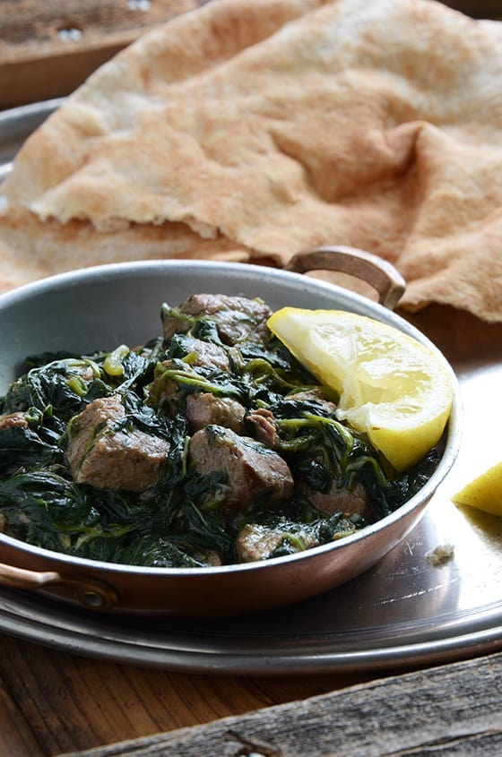

# Molokhia with Meat

*The signature Egyptian green soup-stew: finely-chopped molokhia leaves (Jew's mallow, related to jute) simmered in a meaty stock - usually rabbit, chicken or beef - and finished with sizzled coriander-garlic butter (taqliya) poured in hot at the end. The leaves give the soup its characteristic mucilaginous texture (loved in Egypt, alarming elsewhere). Eaten over rice or with bread, with a wedge of lemon.*

**Serves:** 4

**Prep Time:** 15 minutes

**Cook Time:** 1 hour 15 minutes

## Overview
Bone-in chicken or beef simmers in stock 45-60 minutes with cardamom, bay and an onion to make a clear broth. Frozen chopped molokhia (or fresh chopped fine) goes in for the last 20 minutes - barely simmered, never boiled (over-boiling kills the texture). A taqliya of butter, garlic and ground coriander sizzles separately; poured hot into the pot at the end with a dramatic hiss. Serve over rice with lemon and bread.

## Ingredients

- 4 bone-in chicken thighs and drumsticks (or 500 g beef shin in chunks)
- 1.4 litres water or stock
- 1 small onion (halved)
- 4 cardamom pods (bruised)
- 2 bay leaves
- 1 cinnamon stick
- 1 teaspoon salt (to taste)
- 1 teaspoon ground black pepper
- 500 g frozen chopped molokhia (defrosted) - or 800 g fresh molokhia leaves, finely chopped

### Taqliya (the sizzle)
- 4 tablespoons unsalted butter or ghee
- 8 garlic cloves (very finely chopped)
- 2 tablespoons ground coriander
- 1 teaspoon Aleppo pepper or chilli flakes
- 1 teaspoon dried mint (optional)

### To serve
- 4 servings cooked white rice
- Lemon wedges
- Egyptian flatbread or pita

## Method

### Stage 1 - Stock and meat
1. Place chicken (or beef) in a wide pot with water, halved onion, cardamom, bay, cinnamon, salt, pepper.
1. Bring to a simmer; skim scum.
1. Cover; cook 45 minutes (chicken) or 1 hour 15 minutes (beef) until tender.
1. Lift the meat onto a tray. Strain the broth; return it to the pot.

### Stage 2 - Molokhia
1. Bring the strained broth to a low simmer (not boiling).
1. Add the molokhia.
1. Cook on the lowest heat 15-20 minutes - barely a tremor on the surface.
1. Stir occasionally with a wooden spoon. The broth thickens slightly and turns deep green.

### Stage 3 - Taqliya
1. In a small pan, melt the butter over medium heat.
1. Add chopped garlic; sizzle 30 seconds until just gold (not brown).
1. Stir in ground coriander and Aleppo pepper; sizzle 5 seconds.
1. Stir in dried mint (if using).

### Stage 4 - The sizzle
1. Standing back, pour the hot taqliya straight into the molokhia pot. It will hiss dramatically.
1. Stir gently to combine.

### Stage 5 - Combine
1. Return the cooked meat (whole pieces or shredded - your choice).
1. Warm through 3 minutes.

### Stage 6 - Serve
1. Spoon rice into deep bowls.
1. Ladle molokhia over.
1. Serve with lemon wedges and bread for scooping.

## Notes
- **Don't boil the molokhia:** Hard boiling breaks the texture and loses the green colour. Low simmer only.
- **Frozen molokhia:** Sold at Middle Eastern shops in 500 g bags; finely chopped already. Saves enormous prep time. Defrost before adding.
- **The taqliya sizzle:** The signature theatre of the dish. Pour hot, listen for the hiss. The sound says "ready".

## Storage
- Refrigerate 3 days. Reheat gently; don't boil.
- Freezes 2 months.
