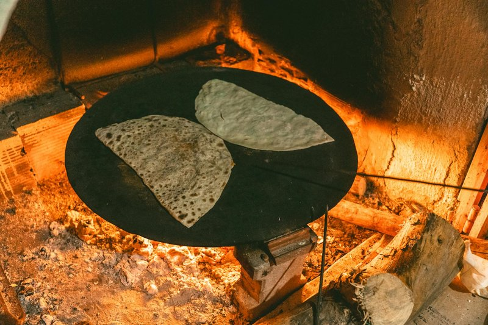

# Aysh Baladi

*The Egyptian everyday bread: a wholemeal pita-style flatbread baked at extreme heat so it puffs into a hollow round, then deflates into a perfect pocket. Eat with every meal - torn for scooping ful, kofta or tahina; cut into halves stuffed with falafel or eggs. "Aysh" means "life"; the name says it.*

**Serves:** 4 (makes 6 breads)

**Prep Time:** 15 minutes (plus 1 hour 30 minutes rising)

**Cook Time:** 12 minutes (with a hot stone)

## Overview
Aysh baladi is the bread Egyptians eat with every meal, a wholemeal flat round that puffs dramatically in the oven and deflates into a hollow pocket as it cools, ready to be torn and stuffed. The dough is the simplest possible: half plain flour, half wholemeal, yeast, salt and warm water, kneaded soft and rested for an hour. You divide it into six portions, roll each into a thin disc about eighteen centimetres across, and let them rest for another twenty minutes so the gluten relaxes. Bake at maximum heat on a preheated stone for three to four minutes; the discs puff up like balloons and collapse as they cool, leaving the pita-style pocket inside. Eat the day they're baked, warm if possible.

## Ingredients

- 300 g wholemeal flour (or 200 g wholemeal + 100 g rye for darker bread)
- 200 g plain white flour
- 1 sachet (7 g) fast-action yeast
- 1 ½ teaspoons salt
- 1 tablespoon caster sugar
- 1 tablespoon olive oil
- 320 ml warm water

## Method

### Stage 1 - Dough
1. Whisk both flours, yeast, salt, sugar.
1. Add olive oil and warm water; mix to a soft dough.
1. Knead 10 minutes until smooth and elastic.
1. Cover; rise 1 hour until doubled.

### Stage 2 - Heat oven
1. Place a baking stone or upturned heavy tray on the top oven rack.
1. Heat oven to maximum (250°C+) for 30 minutes.

### Stage 3 - Shape
1. Knock back the dough; divide into 6 portions.
1. Roll each into a tight ball; cover; rest 10 minutes.
1. Roll each ball into an 18 cm disc, 3-4 mm thick.
1. Place on a lightly floured tea-towel-covered surface; cover; rest 20 minutes.

### Stage 4 - Bake
1. Slide one bread onto the hot stone using a peel or back of a tray (sprinkle with cornmeal or flour first to prevent sticking).
1. Bake 3-4 minutes - the bread should puff dramatically into a balloon.
1. If your oven has a grill, briefly hit the top under the grill to colour.
1. Lift off; the bread deflates as it cools, leaving a pocket.

### Stage 5 - Stack
1. Stack baked breads under a clean tea towel - keeps them soft.

### Stage 6 - Serve
1. Eat warm. Tear for scooping or split open and fill with falafel, egg or salata baladi.

## Notes
- **Maximum heat is the trick:** Below 230°C the dough won't puff into a pocket. Pre-heat the stone for at least 30 minutes.
- **Thin enough:** 3-4 mm. Too thick and they don't puff; too thin and they crack.
- **Don't open the oven during the puff:** Cool air kills the puff. Watch through the glass.

## Storage
- Best fresh, eaten warm.
- Keep wrapped in a tea towel 24 hours.
- Freeze 1 month.
