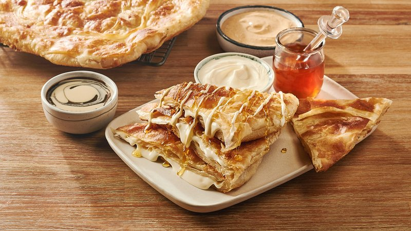

# Feteer Meshaltet

*Egypt's pillowy pastry-bread: a simple flour-and-water dough stretched paper-thin, folded with ghee into many layers, then baked. Eaten with honey.*

**Serves:** 4 (makes 2 layered breads)

**Prep Time:** 40 minutes (plus 30 minutes resting)

**Cook Time:** 20 minutes

## Overview
A simple dough of flour, salt, oil, water rests for 30 minutes. Two portions; each portion rolls and stretches paper-thin on an oiled surface (similar to filo or strudel). Drizzles of melted ghee between thin layers; folded in thirds, rolled flat, folded again, baked at 220°C until deeply gold and crisp at the edges.

## Ingredients

- 500 g plain flour
- 1 teaspoon salt
- 2 tablespoons vegetable oil
- 300 ml warm water (approximate)
- 200 g ghee (or unsalted butter, melted)
- Extra oil for stretching

### To serve
- Honey, molasses (asal aswad) or thick cream for sweet
- Or eat plain alongside savoury dishes

## Method

### Stage 1 - Dough
1. Whisk flour and salt.
1. Add oil and warm water; mix to a soft, slightly sticky dough.
1. Knead 10 minutes until very smooth and elastic.
1. Cover; rest 30 minutes.

### Stage 2 - Divide
1. Cut the dough in half; cover one half.

### Stage 3 - Stretch
1. Oil a wide work surface generously.
1. Press the first dough half into a flat round; oil the top.
1. With oiled hands, gently stretch outwards from the centre, rotating, until the dough is paper-thin and large (40-50 cm round) - you should see your hand through it.
1. Don't worry about small holes.

### Stage 4 - Fold and layer
1. Drizzle 3 tablespoons of melted ghee across the surface.
1. Fold in thirds (one long edge to the centre, the other long edge over it) into a long rectangle.
1. Drizzle 1 more tablespoon of ghee.
1. Fold the rectangle in thirds the other way into a square.
1. Press lightly to a 18 cm square.

### Stage 5 - Second piece
1. Repeat for the second half of dough.

### Stage 6 - Bake
1. Heat oven to 220°C (200°C fan).
1. Place each square on a lined baking tray.
1. Brush with melted ghee.
1. Bake 18-22 minutes until deep gold and crisp at the edges.

### Stage 7 - Serve
1. Eat warm. Tear into pieces; drizzle with honey or molasses; or eat plain alongside a savoury dish.

## Notes
- **Stretch don't roll:** Feteer is built on a strudel-style stretch. A rolling pin won't get it thin enough; oiled hands will.
- **Ghee not butter alone:** Ghee gives the flaky layers their proper character. Butter works but the flavour is shallower.
- **Tear, don't slice:** The point is the layers - pull apart to expose them.

## Storage
- Best fresh, eaten warm.
- Keep wrapped 24 hours; reheat at 200°C 4 minutes.
