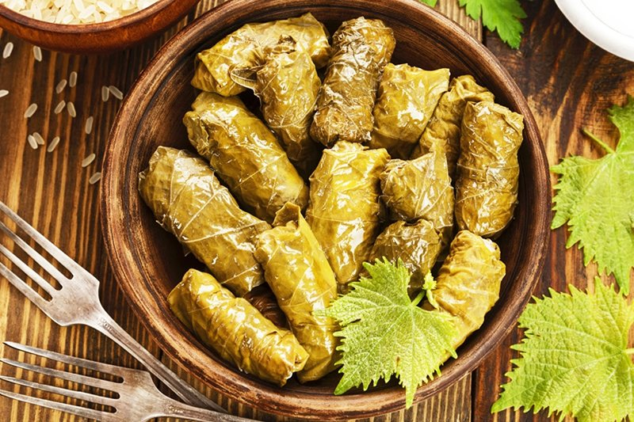

# Mahshi Koromb

*Stuffed cabbage rolls Egyptian-style: blanched cabbage leaves wrapped around a herbed rice-and-meat filling (or all-rice for vegetarian), packed tight in a pot with garlic and tomato, slow-simmered until the rolls are soft and the cabbage has absorbed the flavours. A Friday-lunch staple, made by the dozen.*

**Serves:** 6

**Prep Time:** 1 hour

**Cook Time:** 1 hour 15 minutes

## Overview
Mahshi koromb is the cabbage-roll dish that anchors Egyptian Friday lunches across the country, tight bundles of rice and herbs and minced meat tucked inside softened cabbage leaves and stewed in tomato-garlic liquor. You core a large cabbage and blanch it whole, separating the leaves as they soften. The filling is short-grain rice mixed raw with beef mince, chopped onion, parsley, dill, mint (both fresh and dried), cumin, allspice, tomato puree, salt, pepper and a generous slick of olive oil. Each leaf wraps around a tablespoon of filling into a tight cigar. The rolls pack close in a wide pot lined with sliced tomato on the bottom, get covered with a garlic-tomato cooking liquid almost to the top, and weight down with a plate. Cook covered on the lowest heat for an hour. Serve with lemon wedges; eat with your fingers.

## Ingredients

### Cabbage
- 1 large head white cabbage (1.2-1 ½ kg)
- 1 tablespoon salt (for blanching)

### Filling
- 300 g short-grain rice (rinsed; not pre-cooked)
- 400 g beef mince (or all rice for vegetarian)
- 1 onion (large, very finely chopped)
- 4 garlic cloves (crushed)
- 2 fresh tomatoes (very finely diced)
- 3 tablespoons tomato puree
- 4 tablespoons fresh parsley (chopped)
- 3 tablespoons fresh dill (chopped)
- 3 tablespoons fresh mint (chopped)
- 1 teaspoon dried mint
- 1 ½ teaspoons ground cumin
- 1 teaspoon ground allspice
- 1 ½ teaspoons salt
- 1 teaspoon ground black pepper
- 100 ml olive oil

### Cooking liquid
- 6 garlic cloves (crushed)
- 1 tablespoon tomato puree
- 2 tablespoons olive oil
- 1 teaspoon salt
- 1 lemon (juice)
- 1 litre hot water (or beef stock)

### Base
- 2 tomatoes (medium, sliced, line the pot)

## Method

### Stage 1 - Cabbage prep
1. Cut the core out of the cabbage with a sharp knife.
1. Bring a large pot of salted water to a boil.
1. Submerge the whole cabbage; cook 5 minutes.
1. Lift out; cool slightly; peel off the outer leaves one by one (return to the boil if inner leaves are tough - 2 more minutes).
1. Trim the thick central rib from each leaf flat with a knife.
1. Cut very large leaves in half down the middle.

### Stage 2 - Filling
1. Combine all filling ingredients in a wide bowl; mix thoroughly.

### Stage 3 - Roll
1. On a flat surface, lay a cabbage leaf inside-up.
1. Place 1 generous tablespoon of filling at the trimmed (core) end.
1. Fold in the sides; roll up tight away from you into a 8-10 cm cylinder.

### Stage 4 - Pack
1. Line the bottom of a wide heavy pot with the sliced tomato.
1. Arrange the rolls seam-side down in tight concentric circles, packed snug.
1. Stack rows if needed.

### Stage 5 - Cooking liquid
1. Whisk the garlic, tomato puree, olive oil, salt, lemon juice with the hot water.
1. Pour over the rolls, should come almost to the top of the rolls but not flooding.

### Stage 6 - Weight and cook
1. Place a heatproof plate directly on top of the rolls to weight them down (stops them unravelling).
1. Cover the pot.
1. Bring to a simmer; reduce to the lowest heat.
1. Cook 1 hour to 1 hour 15 minutes until the rice is tender and the cabbage soft.

### Stage 7 - Rest
1. Rest off the heat 15 minutes (covered).

### Stage 8 - Serve
1. Lift rolls onto a wide platter. Ladle some of the cooking liquor over.
1. Serve with lemon wedges and yogurt.

## Notes
- **Pack tight:** Loosely packed rolls float and unravel. Pack them snugly enough to hold each other in place.
- **Raw rice goes in:** The rice cooks in the steam and the meat juices. Pre-cooked rice gives mushy filling.
- **Weight matters:** The plate on top holds the rolls down so the liquid stays around them. Don't skip.

## Storage
- Refrigerate 4 days; reheat gently with extra cooking liquor.
- Freezes 2 months.
