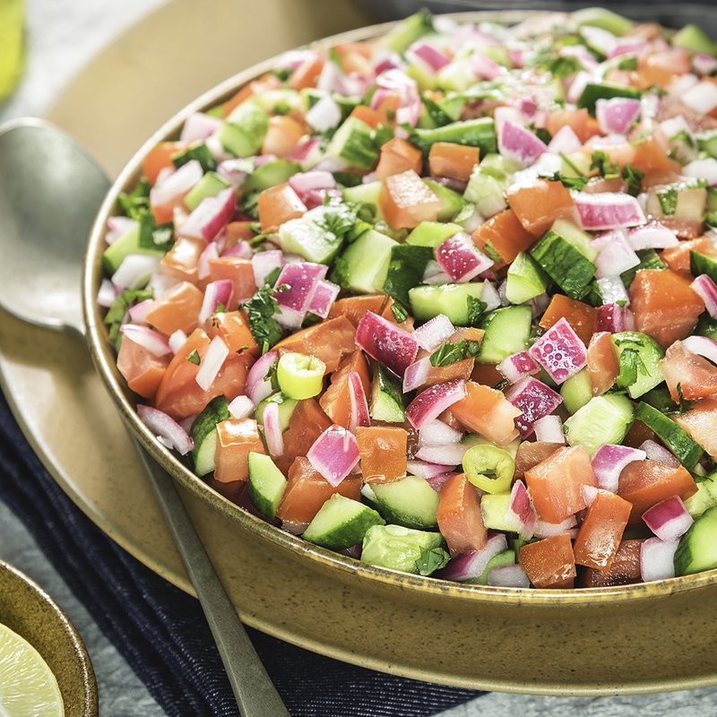

# Salata Baladi

*"Country salad" - Egypt's everyday tomato-cucumber-onion salad with lemon, olive oil, salt and cumin. Served alongside ful, koshari, mezze plates. Crunchy, sharp, very lightly seasoned - the foil to richer dishes.*

**Serves:** 4 as a side

**Prep Time:** 12 minutes

**Cook Time:** 0 minutes

## Overview
Tomato, cucumber, onion and green pepper dice fine. Tossed with lemon, olive oil, salt, ground cumin and parsley. A pinch of dried mint or fresh coriander finishes. Made fresh; eaten within an hour.

## Ingredients

- 4 ripe tomatoes (deseeded, small dice)
- 1 cucumber (large, deseeded, small dice)
- 1 red onion (small, very finely chopped)
- 1 green bell pepper (small, small dice)
- 1 green chilli (small, very finely chopped, optional)
- 4 tablespoons fresh parsley (chopped)
- 2 tablespoons fresh mint (chopped, optional)
- Juice of 1 lemon
- 4 tablespoons olive oil
- 1 teaspoon ground cumin
- ½ teaspoon salt
- ¼ teaspoon ground black pepper

## Method

### Stage 1 - Chop
1. Dice tomato, cucumber, onion, pepper to a similar 5 mm size.
1. Drain off any tomato juice.

### Stage 2 - Combine
1. In a serving bowl combine all the vegetables, chilli (if using) and herbs.

### Stage 3 - Dress
1. In a small bowl whisk lemon juice, olive oil, cumin, salt, pepper.
1. Pour over the salad; toss gently.

### Stage 4 - Rest
1. Let stand 5 minutes for flavours to mingle.

### Stage 5 - Serve
1. Taste; adjust salt and lemon. Serve immediately as part of a wider mezze.

## Notes
- **Deseed cucumber and tomato:** Removes the water that would weep into the dressing.
- **Cumin is the Egyptian signature:** Don't skip. A teaspoon is the right amount - more and it overwhelms.
- **Small dice:** Not minced. 5 mm cubes are right.

## Storage
- Eat fresh. Doesn't keep - softens within hours.
