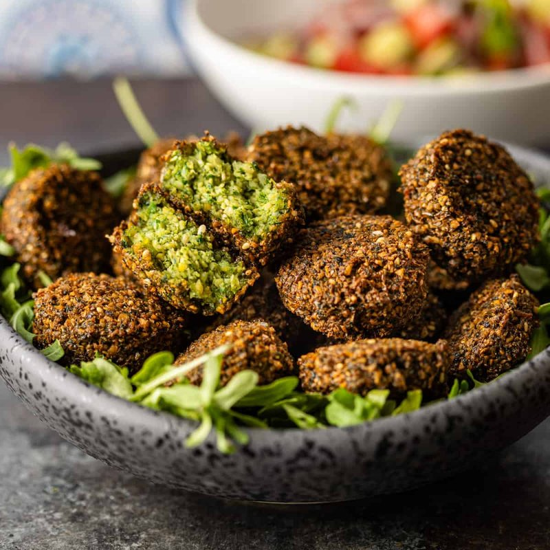

# Ta'amiya

*Egypt's falafel: ground fava beans, parsley, coriander, dill, leek and garlic blitzed to a soft green paste, fried into small darkly crusted patties.*

**Serves:** 6 (makes about 24)

**Prep Time:** 30 minutes (plus 12 hours soaking)

**Cook Time:** 20 minutes

## Overview
Dried split fava beans soak overnight. Blitz with herbs, garlic, onion, leek, ground coriander, cumin and a pinch of baking powder to a soft slightly grainy paste, not smooth purée. Rest for 1 hour. Shape into 5 cm flat discs; dip in sesame seeds; fry at 175°C 4-5 minutes until deep gold.

## Ingredients

- 400 g dried split fava beans (skinless - soaked 12 hours, drained)
- 1 onion (medium, chopped)
- 1 leek (medium, white part only, chopped)
- 8 garlic cloves
- 1 large bunch fresh parsley (40 g, stems and leaves)
- 1 large bunch fresh coriander (40 g, stems and leaves)
- 4 tablespoons fresh dill
- 2 tablespoons ground coriander
- 1 ½ teaspoons ground cumin
- 1 teaspoon ground black pepper
- 1 ½ teaspoons salt
- 1 teaspoon baking powder (added just before frying)
- 1 green chilli (small, optional)

### To finish
- 3 tablespoons sesame seeds (for coating)
- 1 ½ litres vegetable oil for deep frying

### To serve
- [Tahina Salad](tahina-salad.md)
- Aysh baladi (or pita)
- Pickled vegetables
- [Salata Baladi](salata-baladi.md)

## Method

### Stage 1 - Blitz
1. Place the drained fava beans, onion, leek, garlic, all herbs, ground coriander, cumin, pepper, salt and chilli (if using) in a food processor.
1. Blitz to a coarse paste - should hold a shape when squeezed but still grainy.
1. Tip into a bowl. Cover; refrigerate 1 hour.

### Stage 2 - Baking powder
1. Just before frying, sprinkle in the baking powder; mix.

### Stage 3 - Shape
1. Take walnut-sized portions; press flat into 5 cm discs about 1 cm thick.
1. Dip one side in sesame seeds.

### Stage 4 - Fry
1. Heat oil to 175°C in a deep heavy pan.
1. Fry in batches of 5-6, 4-5 minutes total, turning, until deep dark gold all over.
1. Drain on kitchen paper.

### Stage 5 - Serve
1. Eat warm - stuff into pita with tahina, salata, pickles. Or eat as a starter with tahina to dip.

## Notes
- **Fava not chickpea:** Egyptian ta'amiya uses dried split fava beans. Sold in Middle Eastern shops as "split broad beans". Don't substitute chickpeas - that's Lebanese / Israeli falafel, different dish.
- **Don't over-blitz:** The texture should be coarse, with visible bits of herb and bean. A smooth purée gives dense, doughy ta'amiya.
- **Baking powder at the end:** Activates with frying for lightness. Adding earlier and the patties go flat.

## Storage
- Refrigerate uncooked mix 24 hours.
- Cooked: 2 days refrigerated; re-crisp at 200°C 5 minutes.
- Freeze cooked 2 months.
